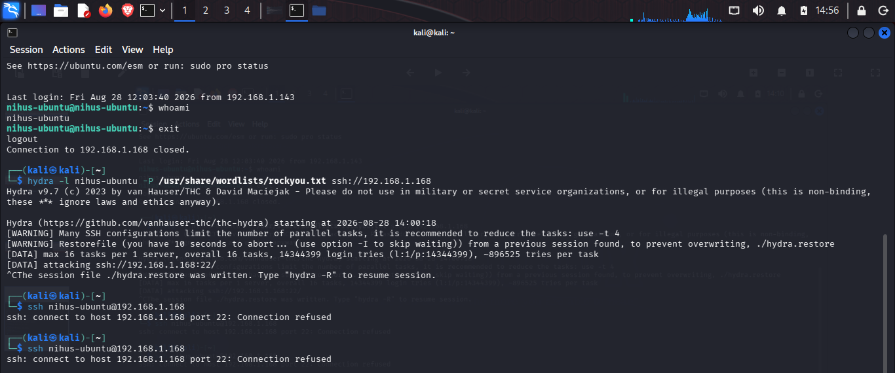
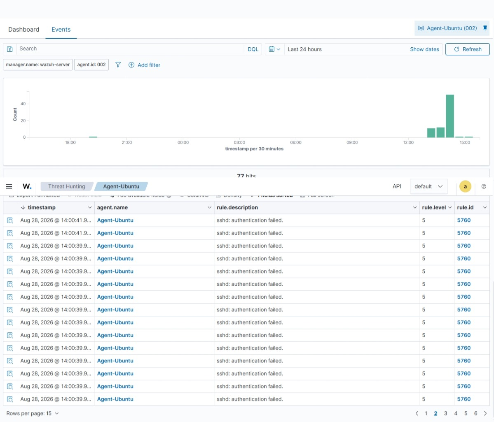
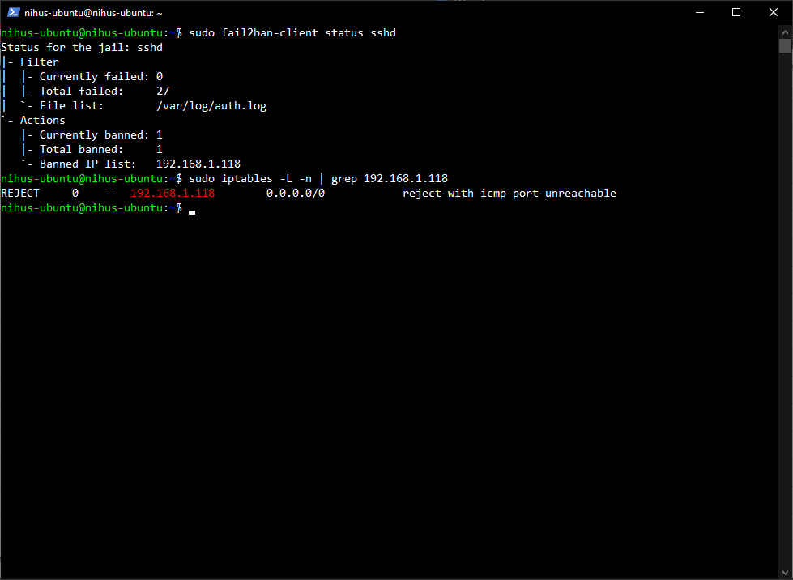

# SSH Brute-Force Detection & Response: Hydra vs. fail2ban + Wazuh

**Date:** 2026-08-28
**Target:** Ubuntu Server (192.168.1.168), hostname `nihus-ubuntu`
**Attacker:** Kali Linux (192.168.1.118)
**Tools:** Hydra, fail2ban, Wazuh (SIEM)

## Objective

Simulate a real-world SSH brute-force attack against a homelab Ubuntu server, confirm that Wazuh detects the malicious activity, and confirm that fail2ban actively blocks the attacking host — demonstrating a full detect-and-respond pair.

## Environment

| Host | Role | IP |
|---|---|---|
| Kali Linux | Attacker | 192.168.1.118 |
| Ubuntu Server (nihus-ubuntu) | Target / fail2ban | 192.168.1.168 |
| Wazuh Manager | SIEM | 192.168.1.146 |

The Ubuntu server runs the Wazuh agent (agent.id `002`, alias `Agent-Ubuntu`) reporting to the Wazuh manager, and has fail2ban installed and configured to protect the `sshd` service. Access to the Ubuntu VM is via SSH, initiated from WSL on the Windows host.

## Attack Simulation

From Kali, a brute-force attack was launched against the Ubuntu server's SSH service using Hydra with the `rockyou.txt` wordlist, targeting the local user `nihus-ubuntu`:

```bash
hydra -l nihus-ubuntu -P /usr/share/wordlists/rockyou.txt ssh://192.168.1.168
```

Hydra began cycling through password guesses. Shortly after, manual SSH connection attempts from Kali to the target started returning `Connection refused` — an early sign the target was actively rejecting the attacking host.



## Detection: Wazuh

While the attack was in progress, the Wazuh Events dashboard (filtered to `agent.id: 002`, Agent-Ubuntu) showed a sharp spike in authentication failure alerts — **77 hits** in total, each logged as:

- **Rule ID:** 5760
- **Rule level:** 5
- **Rule description:** `sshd: authentication failed.`

The event histogram clearly shows the burst of failed logins concentrated in the attack window, correlating directly with the Hydra run.



**Detection rule used:** Wazuh's built-in rule `5760` (part of the default SSHD ruleset), which fires on repeated `authentication failed` entries parsed from `/var/log/auth.log`. This confirms out-of-the-box Wazuh SSH monitoring is sufficient to flag brute-force attempts without custom rule authoring — the existing ruleset already provides real-time visibility into this attack pattern.

## Prevention & Response: fail2ban

fail2ban was configured with the `sshd` jail monitoring `/var/log/auth.log`. After the failed attempts crossed its configured threshold, fail2ban banned the attacking IP automatically:

```bash
sudo fail2ban-client status sshd
```

```
Status for the jail: sshd
|- Filter
|  |- Currently failed: 0
|  |- Total failed:     27
|  `- File list:        /var/log/auth.log
`- Actions
   |- Currently banned: 1
   |- Total banned:     1
   `- Banned IP list:   192.168.1.118
```

The ban was also verified directly at the firewall level:

```bash
sudo iptables -L -n | grep 192.168.1.118
```

```
REJECT     0    --  192.168.1.118        0.0.0.0/0            reject-with icmp-port-unreachable
```



This confirms fail2ban parsed the same failed-login pattern from `auth.log`, counted 27 failures from the Kali host, and inserted a firewall-level `REJECT` rule to block all further traffic from that IP — which is why subsequent SSH attempts from Kali returned `Connection refused`.

## Findings

- Wazuh's default SSHD ruleset (rule 5760) provided immediate, real-time detection of the brute-force attempt with no custom rule needed.
- fail2ban independently detected and actively blocked the same attack at the network layer within the failure threshold (27 attempts), stopping the attack before Hydra could succeed.
- The two tools: Wazuh and fail2ban complement each other — Whle Wazuh provides detection and visibility, fail2ban provides automatic containment — together forming a basic but effective detect-and-respond pair against brute-force attacks.
