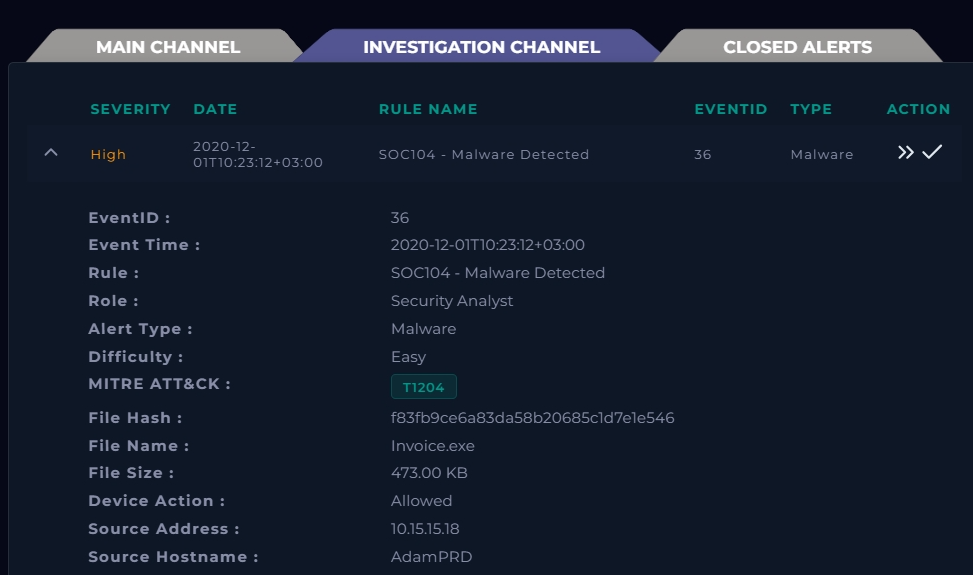
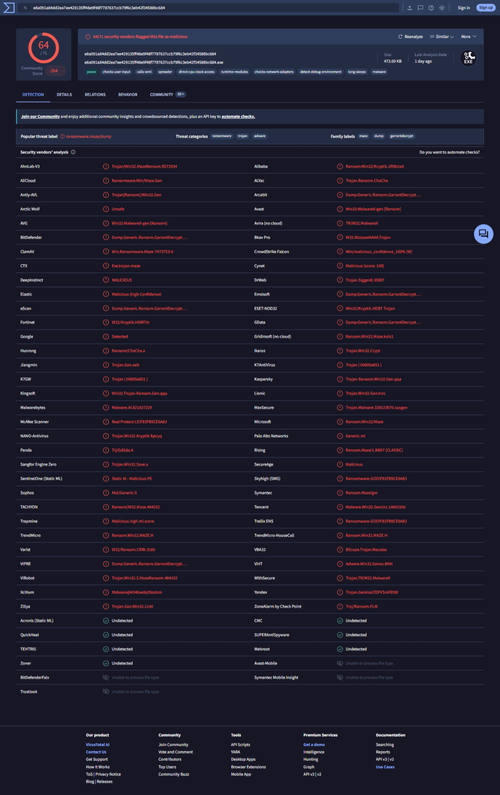
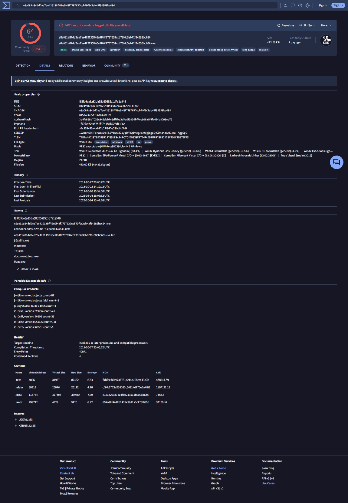
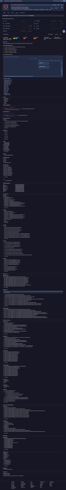
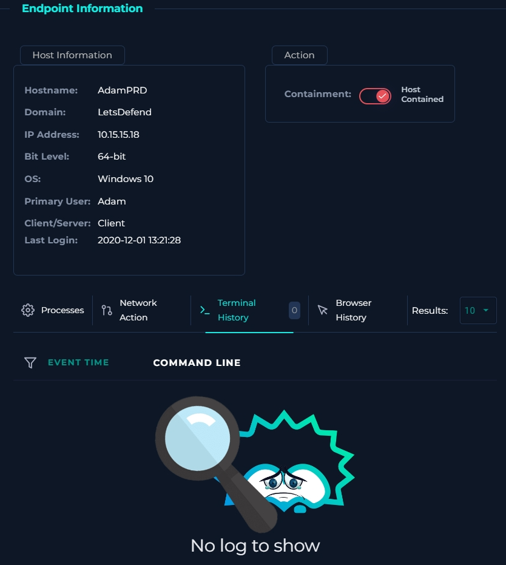
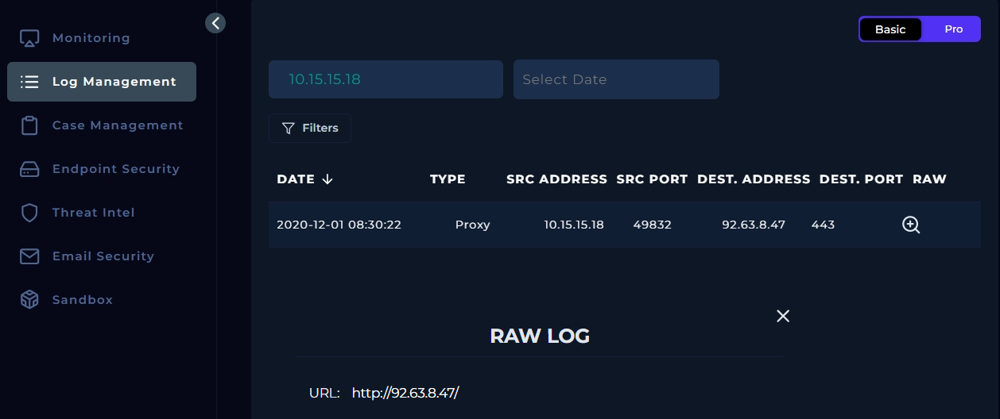
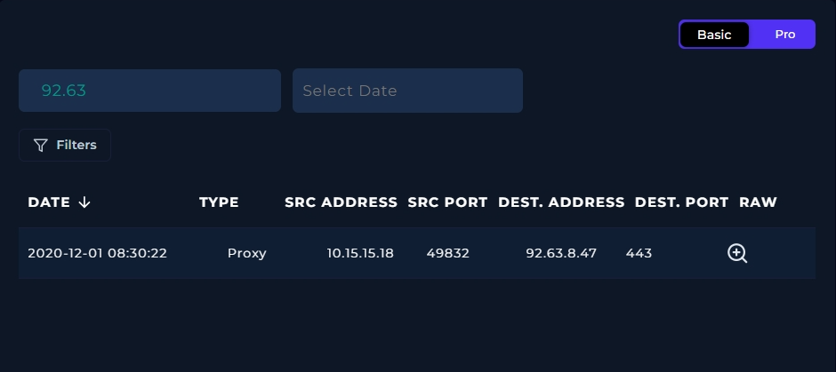
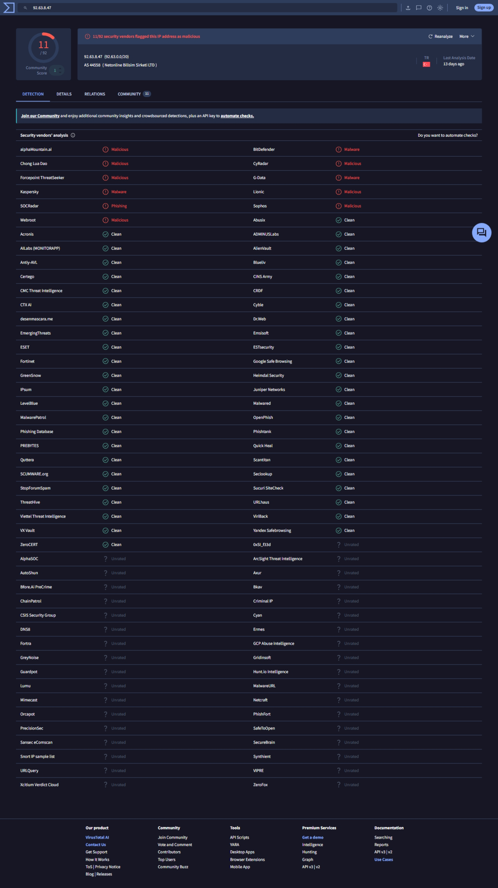
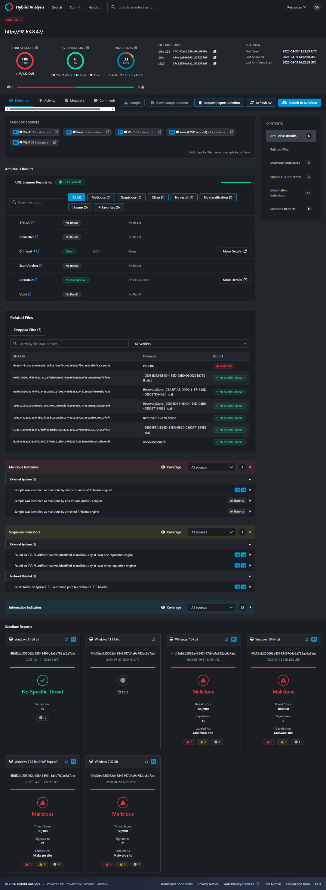
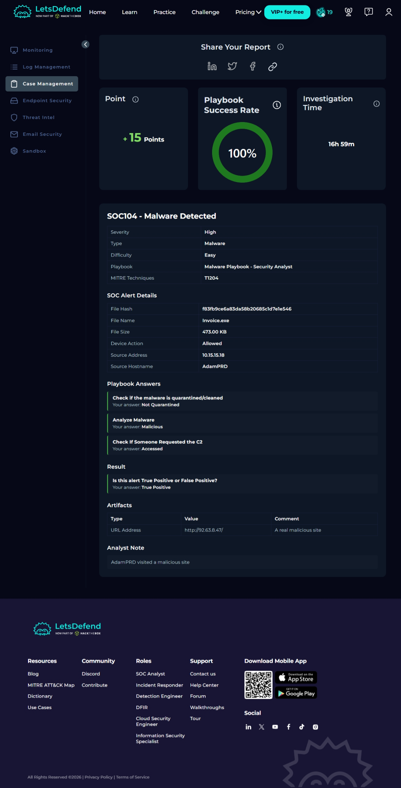

# SOC104 – Malware Triage (Invoice.exe)

**Platform:** LetsDefend | **Severity:** High | **Type:** Malware | **MITRE:** T1204 (User Execution)
**Verdict:** True Positive | **Playbook success:** 100% | **Affected host:** AdamPRD (10.15.15.18)

## 1. Summary

An alert fired for `Invoice.exe` on host **AdamPRD**. The file hash is detected as **Maze ransomware** by 64 of 71 vendors on VirusTotal. The endpoint then made an outbound proxy connection to **92.63.8.47**, an IP flagged as malicious that also appears in the sample's own sandbox traffic. The device action was **Allowed**, so the file was not quarantined. The host was contained. The infection vector could not be determined from the available evidence.

## 2. Alert Details

| Field | Value |
|---|---|
| Rule | SOC104 – Malware Detected |
| Event ID | 36 |
| Event time | 2020-12-01T10:23:12+03:00 |
| File name | Invoice.exe |
| File size | 473.00 KB |
| MD5 | `f83fb9ce6a83da58b20685c1d7e1e546` |
| Source host / IP | AdamPRD / 10.15.15.18 |
| Device action | Allowed |

## 3. Investigation

### 3.1 File analysis (VirusTotal)

The hash was submitted to VirusTotal. **64/71** vendors flag it as malicious, and the popular threat label is `ransomware.maze/dump`. Vendor names include Maze, Kryptik and GarrantDecrypt.

The Details tab shows a 32-bit PE GUI executable compiled on 2019-05-27, first submitted on 2019-05-28. It has been seen under other names, including `maze.exe`. The `.data` section has an entropy of **7.99**, which suggests packed or encrypted content. Its imports are minimal (`USER32.dll`, `KERNEL32.dll`).

- SHA-256: `e8a091a84dd2ea7ee429135ff48e9f48f7787637ccb79f6c3eb42f34588bc684`

The Behavior tab shows detections across ransomware, stealer, spreader, trojan and evader categories. It also shows an IDS hit on the Proofpoint ET rule **"ET MALWARE Maze/ID Ransomware Activity"** and many HTTP, DNS and IP connections made by the sample in sandbox runs. Among them is **TCP 92.63.8.47:80**, which matches the IP seen in AdamPRD's proxy log.

### 3.2 Host check (Endpoint Security)

AdamPRD (Windows 10, 64-bit, user Adam) shows as **Host Contained**. The Processes tab reports no agent installed, and Terminal History (and every other tab) shows "No log to show". No process, command-line or browser telemetry was available, so execution on the host could not be confirmed directly.

### 3.3 Network evidence (Log Management)

Searching logs for 10.15.15.18 returns one proxy entry: AdamPRD connected out to **92.63.8.47:443**, URL `http://92.63.8.47/`.

Searching on the destination address returns only that same entry, so no other host contacted it.

### 3.4 C2 reputation

**VirusTotal (IP):** 11/92 vendors flag 92.63.8.47 as malicious or malware. It sits in AS44558 (Netonline Bilisim Sirketi LTD), Turkey.

**Hybrid Analysis (URL):** `http://92.63.8.47/` has a threat score of **100/100** (malicious). The URL scanner results were 0/6 flagged, but the sandbox verdict was malicious on four of six runs. It also lists a dropped file flagged malicious.

### 3.5 Initial access check

A search for all the IOCs in Email Security returned no results. Nothing in the available evidence shows how `Invoice.exe` reached AdamPRD.

## 4. Timeline

| Time | Event |
|---|---|
| 2020-12-01 08:30:22 | Proxy log: AdamPRD (10.15.15.18:49832) connects to 92.63.8.47:443 |
| 2020-12-01 10:23:12 (+03:00) | SOC104 alert fires for Invoice.exe; device action Allowed |
| After alert | AdamPRD contained during investigation |

Note: the log timestamp does not state a timezone, so its order relative to the alert time is not confirmed.

## 5. Indicators of Compromise

| Type | Value |
|---|---|
| File name | Invoice.exe |
| MD5 | f83fb9ce6a83da58b20685c1d7e1e546 |
| SHA-256 | e8a091a84dd2ea7ee429135ff48e9f48f7787637ccb79f6c3eb42f34588bc684 |
| C2 IP | 92.63.8.47 |
| C2 URL | http://92.63.8.47/ |
| Affected host | AdamPRD (10.15.15.18) |

## 6. Playbook Answers and Verdict

| Question | Answer |
|---|---|
| Check if the malware is quarantined/cleaned | **Not Quarantined** (device action was Allowed) |
| Analyze malware | **Malicious** |
| Check if someone requested the C2 | **Accessed** |
| True Positive or False Positive? | **True Positive** |

Analyst note: *AdamPRD visited a malicious site.*

## 7. Response and Recommendations

- **Done:** AdamPRD contained.
- Block 92.63.8.47 at the proxy and firewall.
- Re-image AdamPRD rather than clean it, and reset Adam's credentials. Maze is known for data theft as well as encryption.
- Hunt for the hash and C2 IP on other hosts (the log search found none for either).
- Establish the delivery vector (email, download or removable media) with endpoint telemetry once available.

## 8. Limitations

- No endpoint telemetry was available (no agent, empty process, terminal and browser history), so execution of `Invoice.exe` is inferred from the alert, the hash reputation and the C2 connection rather than observed.
- The proxy entry shows an `http://` URL with destination port 443, a minor inconsistency worth noting.
- The infection vector is unknown.
- VirusTotal and Hybrid Analysis results were captured later than the 2020 incident, so detection counts reflect current intelligence.
