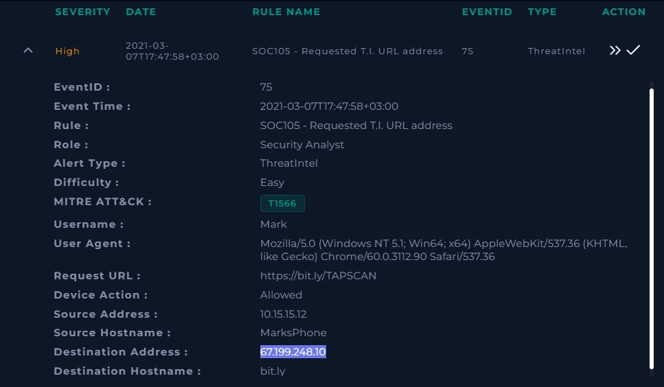
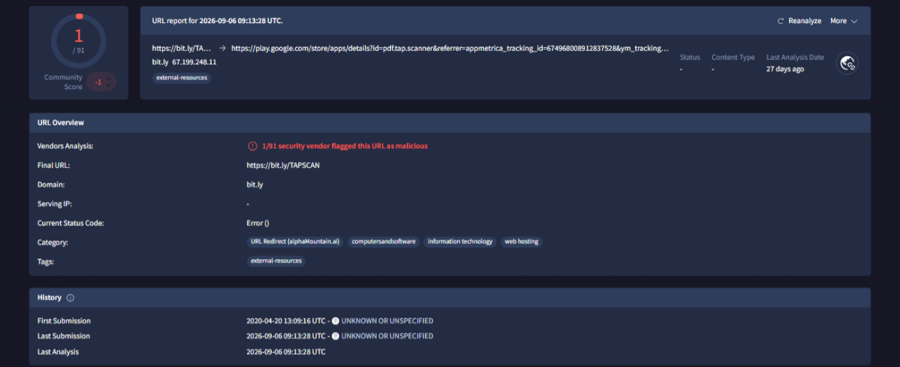
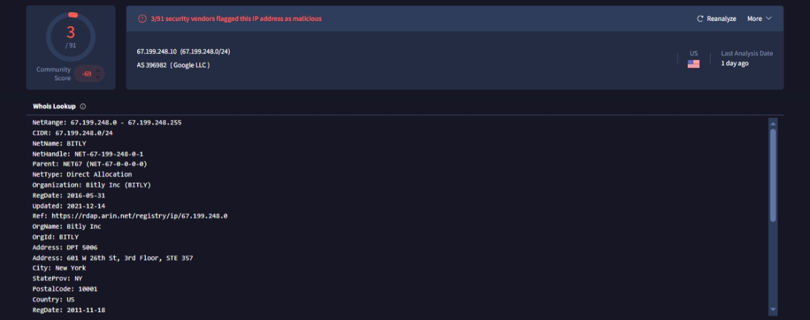
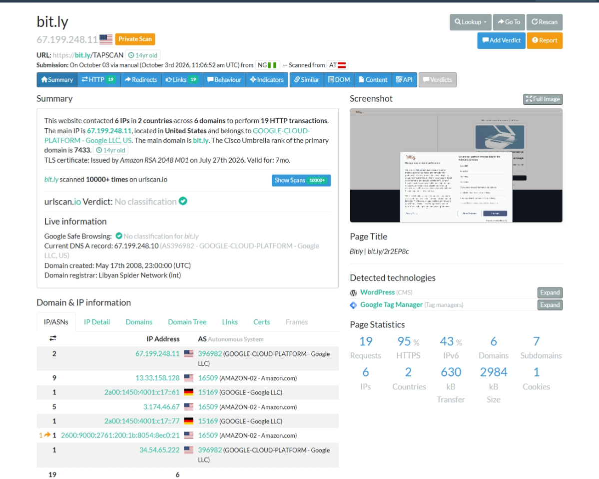
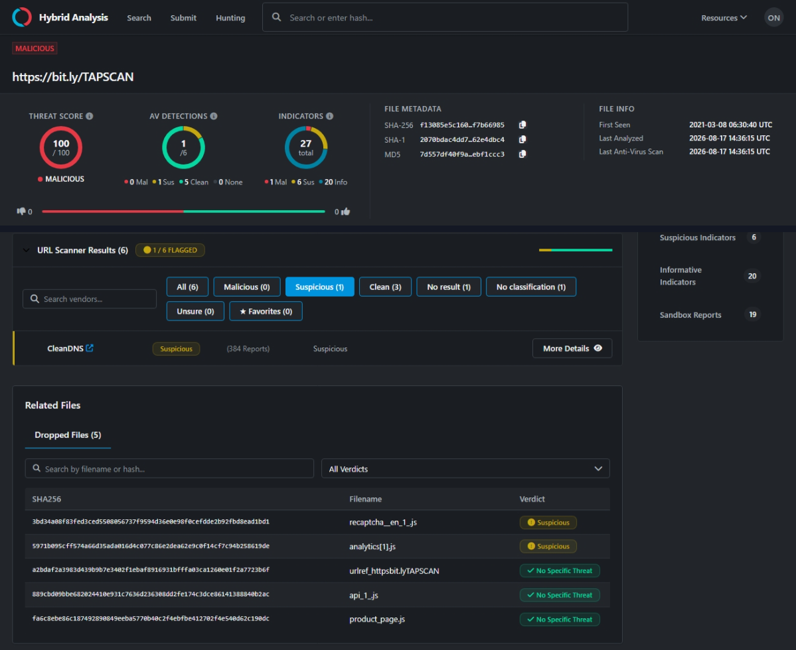
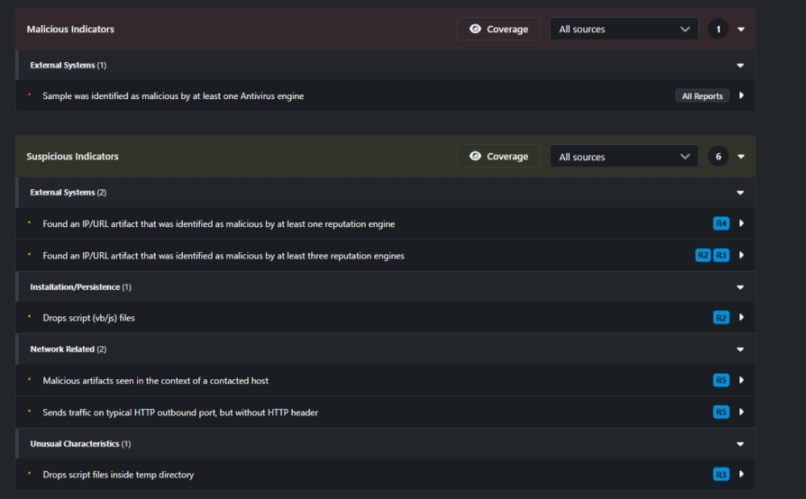
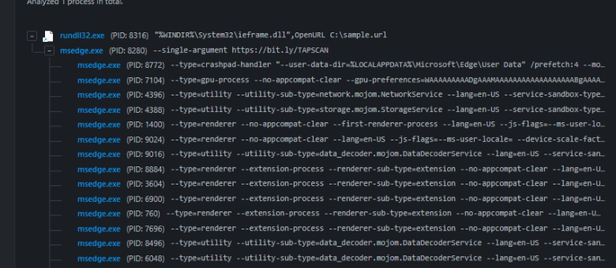
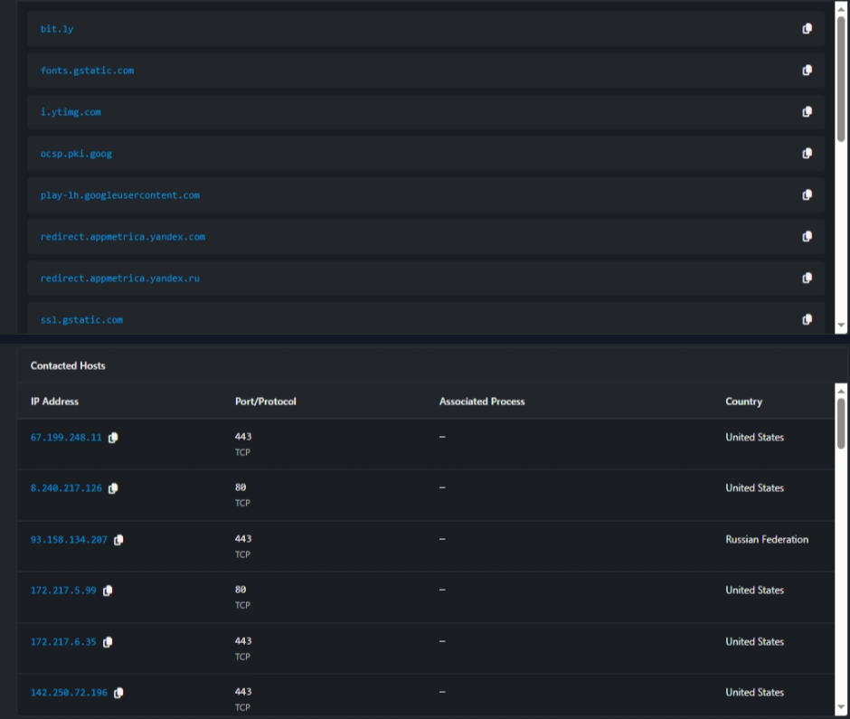
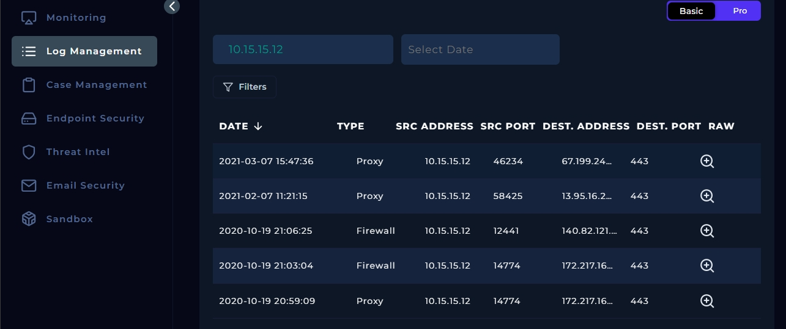
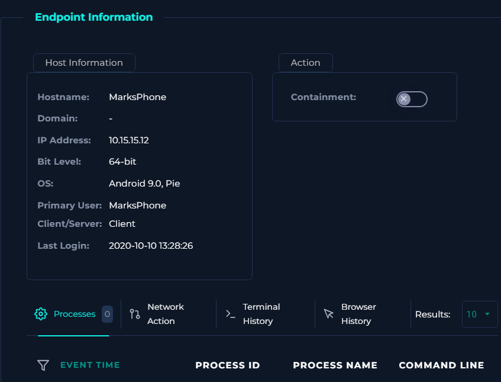

# SOC105 - Requested T.I. URL Address (Bitly Shortlink)

**Platform:** LetsDefend | **Alert type:** ThreatIntel | **Severity:** High | **Event ID:** 75
**Verdict:** False Positive | **MITRE ATT&CK mapping on alert:** T1566 (Phishing)

> A threat-intel rule fired on a shortened URL. The raw scores looked alarming (Hybrid Analysis 100/100, 3/91 on the IP). This write-up shows why they don't hold up once you resolve the link and look at what actually happened on the host.

---

## 1. Alert summary

| Field | Value |
|---|---|
| Event time | 2021-03-07 17:47:58 (+03:00) |
| Rule | SOC105 - Requested T.I. URL address |
| User / host | Mark / MarksPhone (10.15.15.12, Android 9) |
| Requested URL | `hxxps://bit[.]ly/TAPSCAN` |
| Destination | bit.ly (67.199.248.10) |
| Device action | Allowed |
| User-Agent | `Mozilla/5.0 (Windows NT 5.1; Win64; x64) ... Chrome/60.0.3112.90` |

Two things stood out at triage:
- The URL is a **shortener**, so the destination IP says nothing about where the link really goes.
- The user-agent claims Windows NT 5.1 (XP) but the host is an **Android 9** phone. I couldn't explain this, so I recorded it as an anomaly (see Limitations).

## 2. Investigation

### 2.1 Where does the link go? (VirusTotal URL)

The shortlink resolves to a **Google Play Store listing** for a PDF scanner app (`pdf.tap.scanner`), with Yandex AppMetrica tracking parameters in the query string. VirusTotal shows 1/91 vendors flagging the URL, and the URL has been in VT since 2020-04-20.

### 2.2 Why the IP detections are noise (VirusTotal IP)

67.199.248.10 is registered to **Bitly Inc.** in ARIN (NetName BITLY), even though it sits in Google Cloud's ASN. It carries 3/91 detections, but a shortener IP serves millions of unrelated links, so reputation on the IP isn't evidence about this one link.

### 2.3 urlscan.io

urlscan.io returned **"No classification"** and Google Safe Browsing had no flag. The page loads a Bitly consent interstitial, and the 19 HTTP transactions go to ordinary Bitly, Amazon and Google infrastructure.

### 2.4 Hybrid Analysis - why 100/100 is misleading

Hybrid Analysis rates the URL 100/100 "malicious", but the evidence behind that score is thin:

- AV/URL scanners: **1 of 6** flagged it, and that was CleanDNS as "Suspicious" (the other results were clean or no result).
- The 5 "dropped files" are `recaptcha__en_1_.js`, `analytics[1].js`, `api_1_.js`, `product_page.js` and a `.url` shortcut. These are the third-party scripts any modern web page loads.
- The suspicious indicators ("drops script files", "malicious artifact in context of a contacted host") are generic behaviours of a browser rendering a page full of trackers.
- The Windows 11 detonation reported **No Specific Threat**. The 100/100 comes from an older Windows 7 run.

### 2.5 The rundll32.exe process tree

The tree starts with `rundll32.exe "%WINDIR%\System32\ieframe.dll",OpenURL C:\sample.url`, which launches `msedge.exe --single-argument hxxps://bit[.]ly/TAPSCAN`, followed by Edge's normal child processes (GPU, utility, renderer, crashpad).

This is how the sandbox opens a URL sample: it writes a `.url` file and opens it. It is the **harness**, not malware abusing a living-off-the-land binary. It also ran in a Windows VM, whereas Mark's device is Android, so none of it executed on his endpoint.

### 2.6 Network activity

The sandbox contacted bit.ly, Google static and OCSP hosts, YouTube's image CDN, and `redirect.appmetrica.yandex.com/.ru`. One contacted IP (93.158.134.207, port 443) geolocates to Russia. This is consistent with the Yandex AppMetrica domains contacted in the same run, which also match the AppMetrica tracking parameters in the Play Store URL. That points to an analytics redirect and not a C2 server. I did not independently confirm the IP-to-domain mapping for this specific IP in the DNS table.

### 2.7 What happened on the host and in the logs

- **Log Management:** The only traffic to bit.ly is one proxy entry (2021-03-07 15:47:36, 10.15.15.12:46234 -> 67.199.248.10:443). Other entries from this host (2020 - early 2021) go to unrelated destinations. There are no follow-on connections to suspicious hosts.
- **Email Security:** nothing for this URL, so I couldn't identify the delivery vector.
- **Endpoint Security (MarksPhone):** Terminal history, browser history and network action all returned "No log to show", and 0 processes were listed.

## 3. Verdict: False Positive

The shortlink points to a legitimate Google Play listing, reputation on the URL and domain is clean apart from one low-confidence flag, and the high Hybrid Analysis score is explained by generic web-page behaviour in a sandbox. No follow-on activity appears in proxy or firewall logs. No containment was required.

## 4. Limitations

1. **No endpoint telemetry.** "No log to show" means no visibility, not proof the device is clean. The verdict rests on the benign destination, not on endpoint evidence.
2. **Scans were run in 2026; the click was in 2021.** Shortlinks can be repointed. Hybrid Analysis first saw this URL on 2021-03-08 and VirusTotal first saw it in April 2020, which supports a stable destination, but I couldn't confirm the exact 2021 resolution.
3. **Timestamp offset.** The proxy entry (15:47:36) is about 2 hours earlier than the alert (17:47:58 +03:00) on the clock. Allowing for a timezone difference they are about 22 seconds apart, so I treated them as the same request.
4. **Delivery vector unknown.** Email Security had nothing, so I recommend confirming with Mark where he got the link.
5. **User-Agent mismatch (unresolved).** The request's User-Agent claims Windows NT 5.1 with Chrome 60, but the host is an Android 9 phone. The string is also internally inconsistent: NT 5.1 is 32-bit Windows XP, yet it includes `Win64; x64`. I couldn't determine the cause from the data available. Possible explanations include:
   - a spoofed UA or a privacy/VPN tool
   - an app or web view that hard-codes an old desktop UA
   - a proxy rewriting the header
   - a different device behind 10.15.15.12
   - a script or bot

   The User-Agent is client-controlled, so I treated it as low-weight evidence: it doesn't prove malicious activity, and it doesn't prove the request came from the phone. In a production environment I would compare it against other requests from this host, check DHCP and asset records for who held the IP at the time, and confirm the expected browser for the device. With no corroborating malicious activity in the proxy, firewall, or email logs, it did not change the verdict.

## 5. Observables (all benign / informational)

| Type | Value | Note |
|---|---|---|
| URL | `hxxps://bit[.]ly/TAPSCAN` | Requested shortlink |
| Resolved URL | `hxxps://play[.]google[.]com/store/apps/details?id=pdf.tap.scanner` | Google Play listing |
| Domain | `bit[.]ly` | Legitimate shortener |
| IPs | 67.199.248.10, 67.199.248.11 | Registered to Bitly Inc. |
| Host | MarksPhone (10.15.15.12) | Android 9 |
| Sandbox artifacts | `recaptcha__en_1_.js`, `analytics[1].js`, `api_1_.js`, `product_page.js` | Normal third-party scripts |

None of these should be blocked. Blocking Bitly or Google Play infrastructure would break legitimate traffic.

## 6. Closing note

> SOC105 (Event 75): MarksPhone (10.15.15.12, Android 9) requested hxxps://bit[.]ly/TAPSCAN, allowed by proxy. The shortlink resolves to a Google Play listing for the "Tap Scanner" PDF app. VirusTotal: 1/91 on the URL; urlscan.io and Google Safe Browsing: no classification. The Hybrid Analysis score is driven by one scanner and generic script artifacts from a web page, and the rundll32 -> msedge chain is the sandbox's URL-opening harness. No follow-on suspicious connections in proxy/firewall logs; no email or endpoint telemetry available. Anomaly noted: user-agent (Windows NT 5.1) does not match the host OS (Android). 
Verdict: False Positive. No containment required. Recommend confirming with the user that the link was expected.

## 7. Takeaways

- A shortener's IP reputation and a sandbox's headline score are weak evidence on their own. Always resolve the destination first.
- Process names like `rundll32.exe` need context: what spawned it, what it loaded, and where it ran.
- Always document what I couldn't see (missing endpoint logs, unknown delivery vector) alongside what I found.
- Treat client-controlled fields like the User-Agent as hints, not facts. An anomaly is worth recording and following up, but it needs corroboration before it changes a verdict.
- When I can't explain something, I list the plausible causes and what I would check to narrow them down, instead of guessing or ignoring it.

**Tools used:** VirusTotal, urlscan.io, Hybrid Analysis, LetsDefend Log Management / Email Security / Endpoint Security
