# SOC109 – Emotet Malware Detected

**Platform:** LetsDefend (Security Analyst role) | **Severity:** Medium | **Difficulty:** Medium
**Verdict:** True Positive | **MITRE ATT&CK:** T1204 (User Execution, from the alert); T1566.001 and T1203 (observed, see below)

## Summary

An alert fired on host **RichardPRD (172.16.17.45)** for a malicious Word document, `1word.doc`, which VirusTotal identifies as a macro-enabled Emotet downloader. The device action was *Cleaned*.

Investigating beyond the alert reconstructed how the host was most likely compromised:

1. On **2021-01-31 at 13:48**, the user received a phishing email titled "Invoice" with an attachment that VirusTotal tags as an exploit for **CVE-2017-11882** (Equation Editor).
2. At **14:15**, 27 minutes later, the proxy logged `EQNEDT32.EXE`, launched by `excel.exe`, sending a GET for `http://andaluciabeach.net/image/network.exe`. The proxy **allowed** it.
3. The alert itself fired on 2021-03-22, about seven weeks later. The log search for the alert window found no contact with the download server.

Two further findings need follow-up: `JuicyPotato.EXE` (a known privilege-escalation tool) in the host's process list, and scan-like traffic against RichardPRD from another internal host, which the firewall **blocked**.

I deleted the phishing email from the mailbox and contained the endpoint.

## Alert details

| Field | Value |
|---|---|
| Event ID / Rule | 85 / SOC109 – Emotet Malware Detected |
| Event time | 2021-03-22 21:06:16 (+03:00) |
| Host / IP | RichardPRD / 172.16.17.45 |
| File | `1word.doc`, 188.95 KB |
| MD5 | `349d13ca99ab03869548d75b99e5a1d0` |
| Device action | Cleaned |

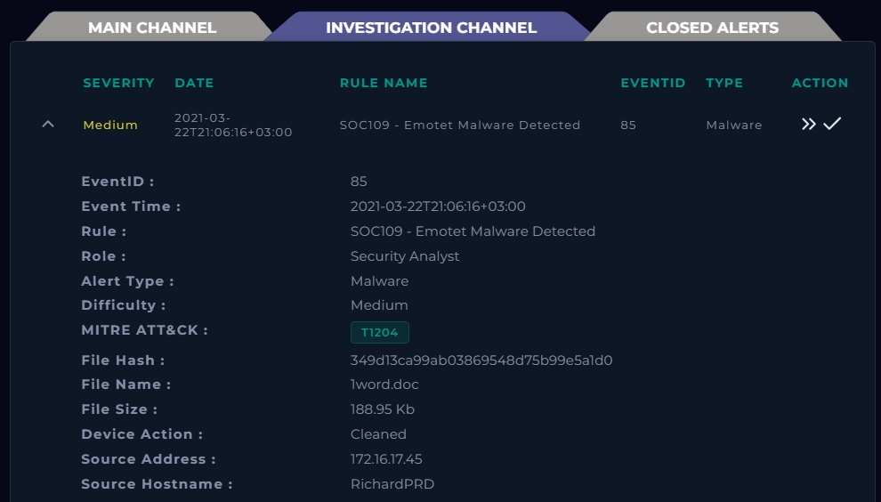

## Investigation

### 1. Alert file analysis (VirusTotal)

The hash of `1word.doc` was submitted to VirusTotal. The SHA-256 on the report matches the MD5 from the alert.

- **51 of 62** vendors flagged the file as malicious.
- Popular threat label: `trojan.w97m/emotet`. Categories: trojan, downloader, dropper. Family labels: w97m, emotet, emodldr.
- Behavior tags include `macros`, `auto-open`, `obfuscated`, `executes-dropped-file`, `calls-wmi`, `long-sleeps` and `detect-debug-environment`.
- First submission to VirusTotal: 2020-09-02.

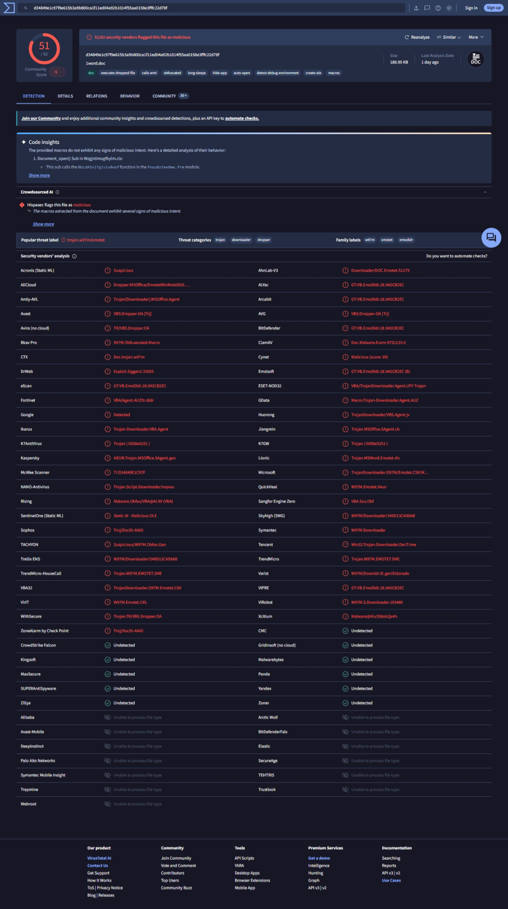
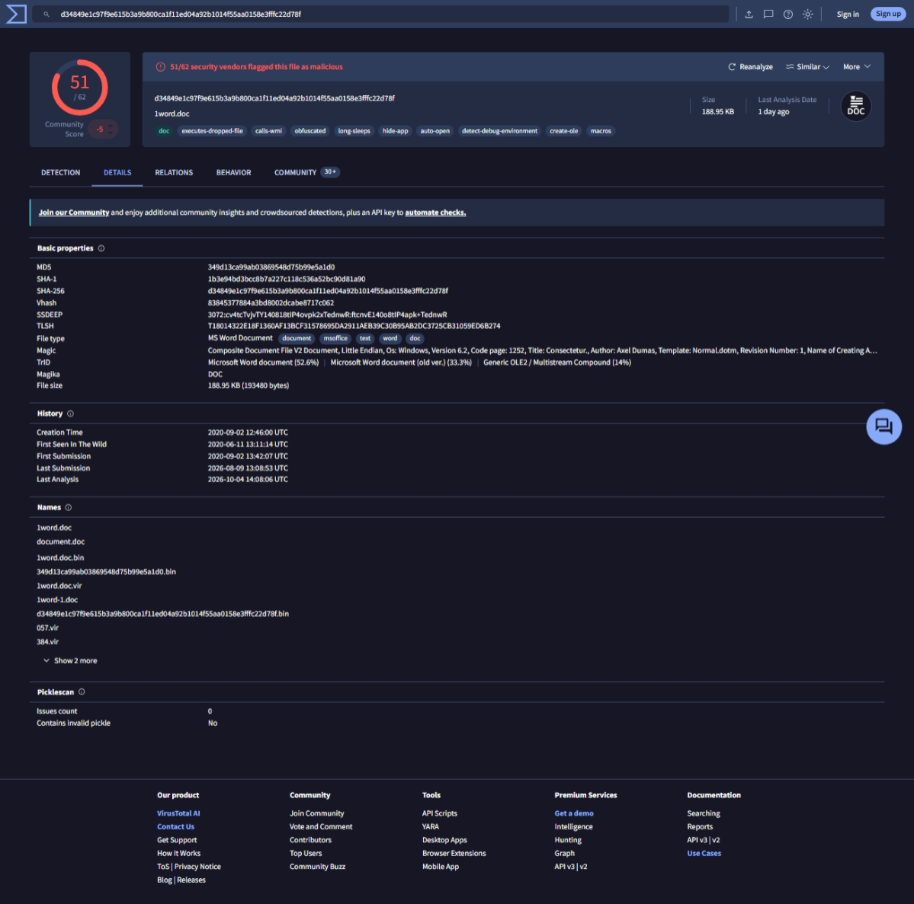

**Conclusion:** `1word.doc` is malicious (Emotet downloader).

### 2. Delivery: phishing email

In email security, I found a message to the host's user, `richard`:

| Field | Value |
|---|---|
| From | accounting@cmail.carleton.ca |
| To | richard@letsdefend.io |
| Subject | Invoice |
| Sender IP | 49.234.43.39 |
| Date | 2021-01-31 13:48:30 |
| Action | Deleted |

The body is a generic message ("Dear customer") about an invoice for shopping the recipient never mentioned, which is typical of a lure sent to many people. The sender is an external address. I haven't verified whether the account was spoofed or compromised.

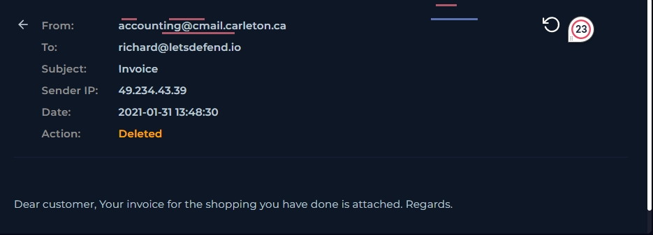

### 3. Attachment analysis (VirusTotal)

I scanned the email's attachment on VirusTotal:

- **37 of 62** vendors flagged it as malicious.
- Tagged **`cve-2017-11882`** and `exploit`. Many vendors name the CVE in their detection (for example Microsoft, Fortinet, AhnLab and AliCloud).
- Popular threat label: `trojan.abphisher/adwh`. Categories: trojan, phishing, downloader.
- Size: 2.12 MB. VirusTotal lists the file name as ending in `.xlsx`, while classifying the file type as PPT.

This attachment is a **different file** from `1word.doc` (different hash), so it explains the infection chain but not how `1word.doc` reached the host.

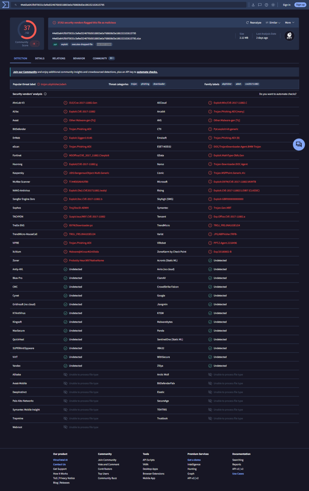

**Conclusion:** the email carried a CVE-2017-11882 exploit document.

### 4. Process chain (proxy log)

The proxy log entry of **2021-01-31 14:15:45** shows `EQNEDT32.EXE` (Equation Editor) launched by `excel.exe`, issuing a **GET** request to `http://andaluciabeach.net/image/network.exe`, with device action **Allowed**. An Office application spawning Equation Editor is the typical signature of CVE-2017-11882 exploitation. Together with the attachment's detection and the 27-minute gap after the email, this fits the delivery chain above.

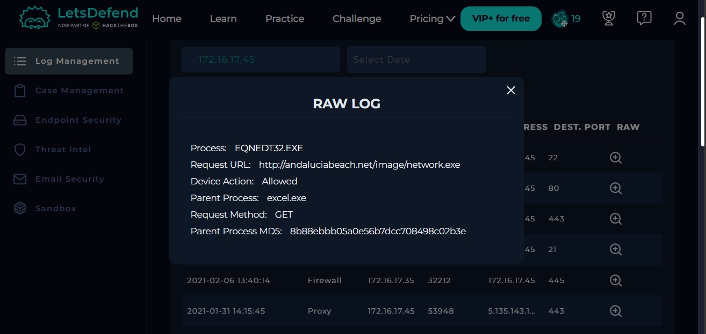

### 5. URL and domain (VirusTotal)

VirusTotal resolves `andaluciabeach.net` to **70.38.21.234**.

- The URL was flagged by **10 of 91** vendors (including BitDefender, ESET, Fortinet, Sophos and Webroot). It is tagged `downloads-pe`.
- The scan dates from 2026-09-10, so it reflects the URL's reputation today, not its state in 2021. Hosting can change over time, and the 2021 proxy log shows a different destination IP (next section).

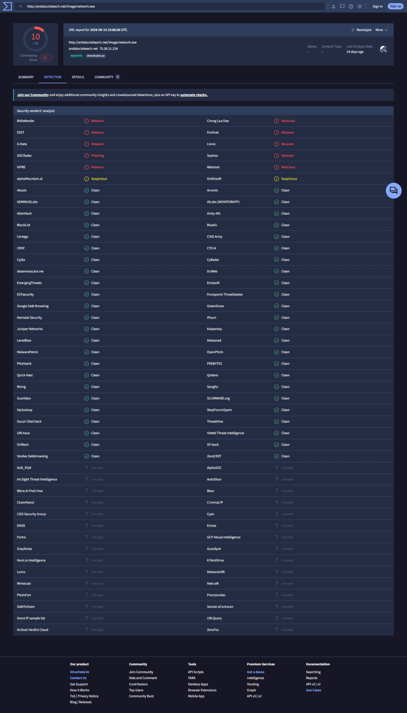

### 6. Contact with the URL's server

Two checks gave different answers, and both belong in the report.

**Around the alert time (2021-03-22):** I searched the logs for 70.38.21.234 and got no results. Nothing shows RichardPRD contacting the URL's server near the alert. For the alert window, the result is **no contact (Not Accessed)**.

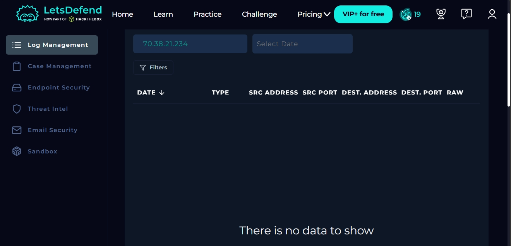

**Earlier, on 2021-01-31 14:15:45:** searching the logs by the host's IP (172.16.17.45) turns up a proxy entry from RichardPRD to **5.135.143.133** on port 443. The raw log of that entry is the one in section 4: a GET for the malicious URL, action *Allowed*. The destination IP differs from today's resolution of the domain, which explains why the 70.38.21.234 search found nothing.

The log has no response code or byte count, so I can't confirm the download succeeded. Given the phishing email and the exploit tag, I consider this the initial compromise.

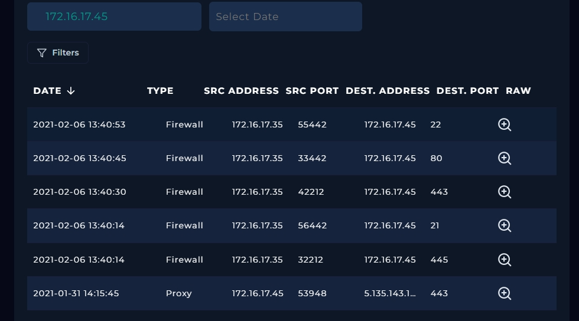

### 7. Endpoint review

RichardPRD (Windows 10, user `richard`) was contained. Its process list includes `EXCEL.EXE`, `notepad.exe`, `outlook.exe`, `EQNEDT32.EXE`, `ccsvchst.exe` and `JuicyPotato.EXE`. No event times or command lines were available. `outlook.exe` is consistent with the email delivery route.

**`JuicyPotato.EXE`** is a known local privilege-escalation tool. Its presence on a user workstation is suspicious and should be investigated.

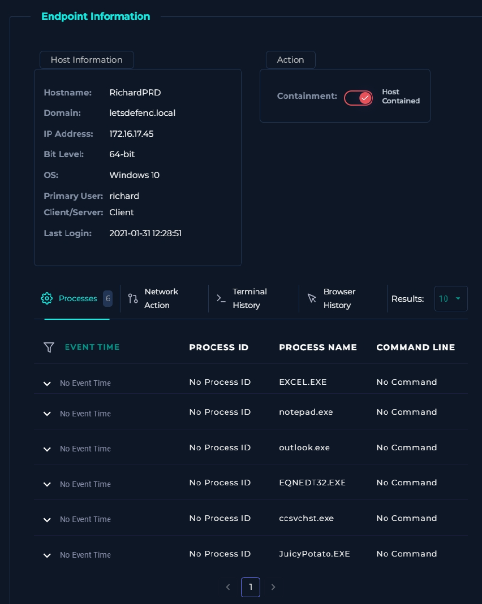

### 8. Related observation: scan-like internal traffic

The firewall logged five connections from **172.16.17.35** to RichardPRD (172.16.17.45) on **2021-02-06**, between 13:40:14 and 13:40:53. Every entry has the firewall action **Blocked**.

| Time | Dest. port | Service |
|---|---|---|
| 13:40:14 | 21 | FTP |
| 13:40:14 | 445 | SMB |
| 13:40:30 | 443 | HTTPS |
| 13:40:45 | 80 | HTTP |
| 13:40:53 | 22 | SSH |

Five different service ports probed in under 40 seconds, each from a different source port, looks like port scanning or service enumeration. The firewall stopped it, but the source host still needs checking: 172.16.17.35 may be compromised or misused. The scan took place between the phishing email and the alert, and nothing in the evidence ties it directly to the Emotet infection.

## Timeline

| Date (UTC+3) | Event |
|---|---|
| 2021-01-31 12:28 | Last recorded login on RichardPRD |
| 2021-01-31 13:48 | Phishing email "Invoice" delivered to richard@letsdefend.io |
| 2021-01-31 14:15 | Proxy allows GET for `network.exe` from `EQNEDT32.EXE` (parent `excel.exe`) to 5.135.143.133:443 |
| 2021-02-06 13:40 | 172.16.17.35 probes RichardPRD on ports 21, 445, 443, 80, 22; all blocked by the firewall |
| 2021-03-22 21:06 | SOC109 alert: `1word.doc` detected on RichardPRD, file cleaned |

## Response actions

- Deleted the phishing email from the mailbox.
- Contained RichardPRD.

## Verdict

**True Positive.** `1word.doc` is a confirmed malicious Emotet downloader. The most likely compromise route is the phishing email of 2021-01-31 carrying a CVE-2017-11882 exploit, followed by an allowed request for the payload URL 27 minutes later. How `1word.doc` itself reached the host is not established.

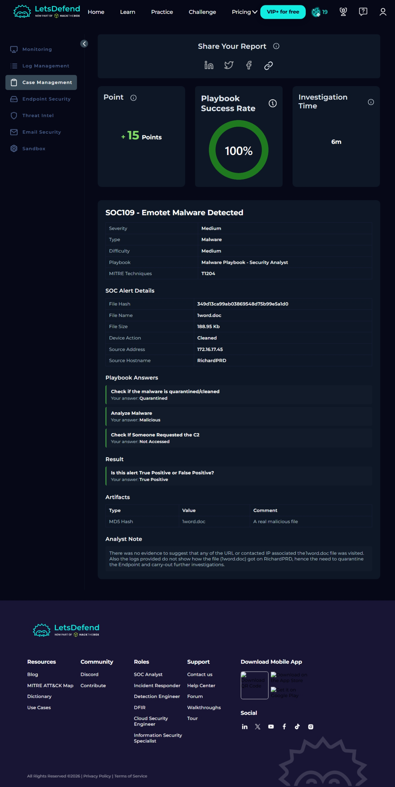

## Indicators of compromise

| Type | Value |
|---|---|
| MD5 (alert file) | `349d13ca99ab03869548d75b99e5a1d0` |
| SHA-1 (alert file) | `1b3e94bd3bcc8b7a227c118c536a52bc90d81a90` |
| SHA-256 (alert file) | `d34849e1c97f9e615b3a9b800ca1f11ed04a92b1014f55aa0158e3fffc22d78f` |
| SHA-256 (email attachment) | `44e65a641fb970031c5efed324676b5018803e0a768608d3e186152102615795` |
| Sender address | `accounting[@]cmail[.]carleton[.]ca` |
| Sender IP | `49.234.43[.]39` |
| URL | `hxxp://andaluciabeach[.]net/image/network.exe` |
| Domain | `andaluciabeach[.]net` |
| IP (2021 proxy log) | `5.135.143[.]133` |
| IP (VirusTotal, 2026) | `70.38.21[.]234` |
| Suspicious process | `JuicyPotato.EXE` on RichardPRD |
| Internal source of scan | 172.16.17.35 |

## Recommendations

1. Keep RichardPRD isolated until it is rebuilt or fully verified. Reset the credentials of user `richard`.
2. Search all mailboxes for other messages from this sender or IP, and for the attachment hash. Block the sender address and IP.
3. Pull the proxy response code and bytes transferred for the 2021-01-31 request, and review all other traffic to 5.135.143.133.
4. Investigate `JuicyPotato.EXE`: when it appeared, who ran it, and whether it succeeded.
5. Establish how `1word.doc` reached the host. The email attachment is a different file, so check later emails, downloads and files dropped by the payload.
6. Investigate 172.16.17.35 for scanning and other activity, and check which hosts it touched.
7. Block the URL, domain and both IPs at the proxy and DNS level. Hunt for both file hashes across the estate.
8. Check RichardPRD for persistence mechanisms (scheduled tasks, run keys, services).
9. Patch Office against CVE-2017-11882, or remove Equation Editor, and remind users about unexpected invoice emails.

## Limitations

- The VirusTotal domain resolution is from 2026. In 2021 the domain pointed to a different IP, so searching for the current IP alone misses the older traffic.
- The proxy log has no response code or byte count, so a successful download can't be confirmed.
- The endpoint process list has no timestamps or command lines.
- I did not check the sender IP's reputation or the sender domain's mail authentication records.

## Lessons learned

My first conclusion was that the server had been contacted. I had assumed the firewall entries were traffic returning from the malicious site. They were actually blocked internal host-to-host connections. To check contact with an external server properly, I should:

1. Identify the server's IP through DNS or VirusTotal, and remember it may differ from the IP used in the past.
2. Search the logs by IP and by the affected host.
3. Check the direction of the traffic (host to server, not the reverse).
4. Compare timestamps against the alert time, and note any earlier activity separately rather than discarding it.

I also learned to check email security early. The delivery vector was not in the alert, but the process list (`outlook.exe`) and the same-day timing pointed to it.
