# SOC114: Malicious Invoice Attachment (Phishing Alert)

**Platform:** LetsDefend | **Alert:** SOC114 (EventID 45) | **Severity:** High | **Type:** Exchange | **Verdict:** True Positive

## Summary

A phishing email with the subject "Invoice" and an attachment was delivered to `richard@letsdefend.io`. My first playbook answer was that the attachment was **not opened**, which was wrong. After finding the correct endpoint (**RichardPRD**, `172.16.17.45`), proxy and process data showed that Excel was used to open the attachment, Excel spawned `EQNEDT32.EXE` (Equation Editor), and that process downloaded an executable from an external domain. The host was contained and the email was deleted from the mailbox.

## Alert details

| Field | Value |
|---|---|
| Rule | SOC114 - Malicious Attachment Detected - Phishing Alert |
| Alert time | 2021-01-31 15:48:30 (+03:00) |
| Sender | accounting@cmail.carleton.ca |
| Recipient | richard@letsdefend.io |
| Subject | Invoice |
| SMTP source | 49.234.43.39 |
| Device action | Allowed (mail delivered) |
| MITRE (as listed on ticket) | T1598.001 |

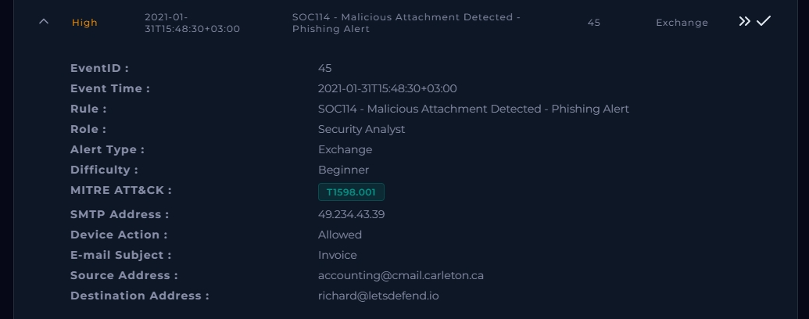

## Investigation

### 1. Confirm delivery

The Exchange log shows the mail arriving from `49.234.43.39` to the mail server `172.16.20.3` on port 25 at 13:48:04. This proves delivery only, not that anyone opened it.

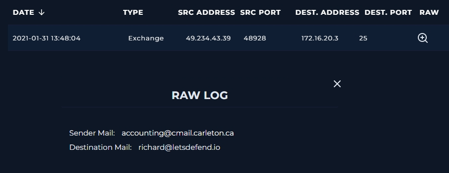

### 2. Find the correct endpoint

My first search used the wrong host (`172.16.17.89`). Its logs were dated 2023-05-31, more than two years after the alert, and showed unrelated activity (RDP from an external IP, `LaZagne.exe`). I discarded them as not related to this alert.

Searching Endpoint Security by name instead surfaced a second Richard machine, **RichardPRD (`172.16.17.45`)**, which matched the alert date.

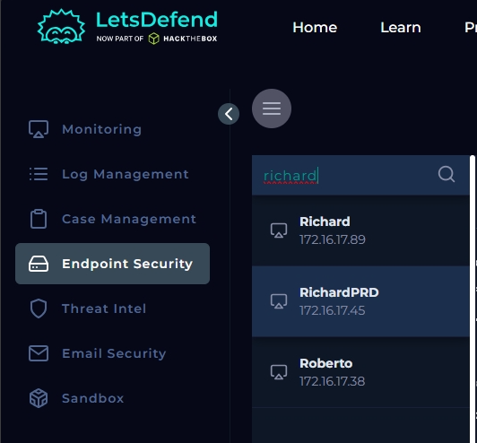
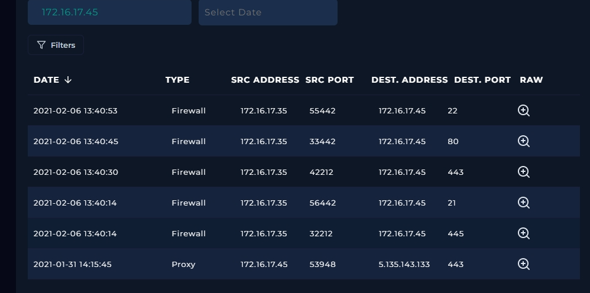

### 3. Proxy log: payload download

At 14:15:45, about 27 minutes after delivery, RichardPRD made this request:

| Field | Value |
|---|---|
| Source | 172.16.17.45:53948 |
| Destination | 5.135.143.133:443 (as logged) |
| Request URL | hxxp://andaluciabeach.net/image/network.exe |
| Method | GET |
| Process | EQNEDT32.EXE |
| Parent process | excel.exe (MD5 `8b88ebbb05a0e56b7dcc708498c02b3e`) |
| Device action | Allowed |

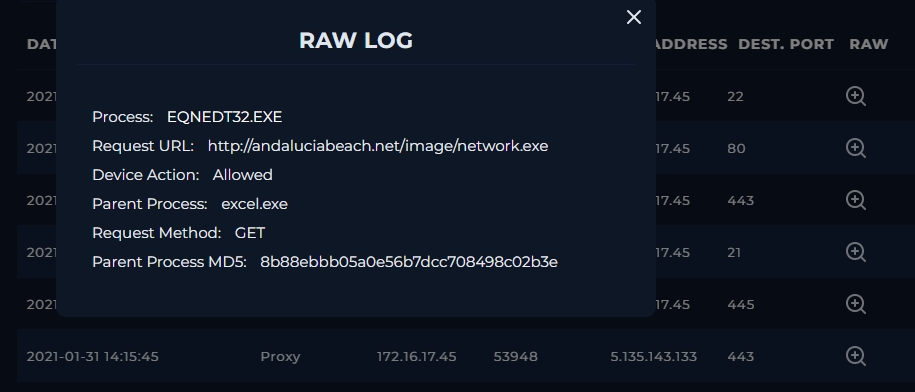

### 4. Endpoint processes

The process list on RichardPRD contains `EXCEL.EXE`, `outlook.exe`, `notepad.exe`, `EQNEDT32.EXE`, `ccsvchst.exe` and `JuicyPotato.EXE`.

- `EXCEL.EXE` and `outlook.exe` fit the attachment being opened from the mailbox in Excel.
- `EQNEDT32.EXE` is the legacy Equation Editor. An invoice spreadsheet has no legitimate reason to launch it, and this parent/child pattern is consistent with exploitation of Equation Editor vulnerabilities such as CVE-2017-11882. I did not extract the document, so this is an assessment, not a confirmed CVE.
- `JuicyPotato.EXE` is a known privilege escalation tool and should not exist on an accounting user's machine. It suggests hands-on-keyboard activity after the initial compromise.
- `ccsvchst.exe` is normally a Symantec security service, so I treated it as likely benign.

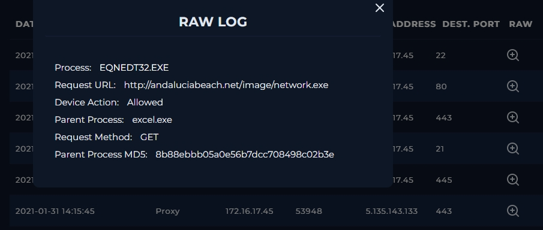

### 5. Network activity from the host

The endpoint's network action list contained 20 connections. The destinations I looked at (`151.101.x.x`, `104.244.42.65`, `185.60.218.35`) appear to be common CDN and social media ranges. I did not verify this further and did not treat them as malicious. The suspicious indicators are the payload domain and its IP.

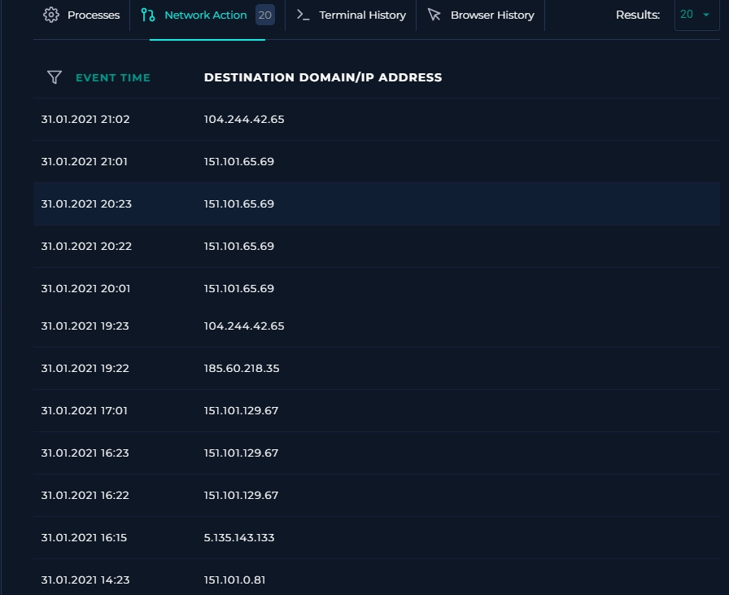

### 6. Sandbox and threat intelligence

Searches for the domain, IP and sender domain in threat intelligence sources returned no results. That is unsurprising for infrastructure from 2021, and it means the proxy log was the deciding evidence, not reputation data.
The lab's built-in sandbox would not run, so I checked the attachment and the payload separately on Hybrid Analysis, a third-party sandbox environment/malware analysis site.

**Attachment sample (as delivered by email):**

| Field | Value |
|---|---|
| Threat score | 100/100, Malicious |
| AV detections | 1/6 |
| SHA-256 | `3ca672bab9b59d83640c01fd50d5a25b1ed7654d5448ffac544d80f5f0dd75b5` |
| SHA-1 | `12dcee6183b1138f6077b7cb1e2e2b7d4759d144` |
| MD5 | `dce3933984aed346beea19bb8a3d1c99` |

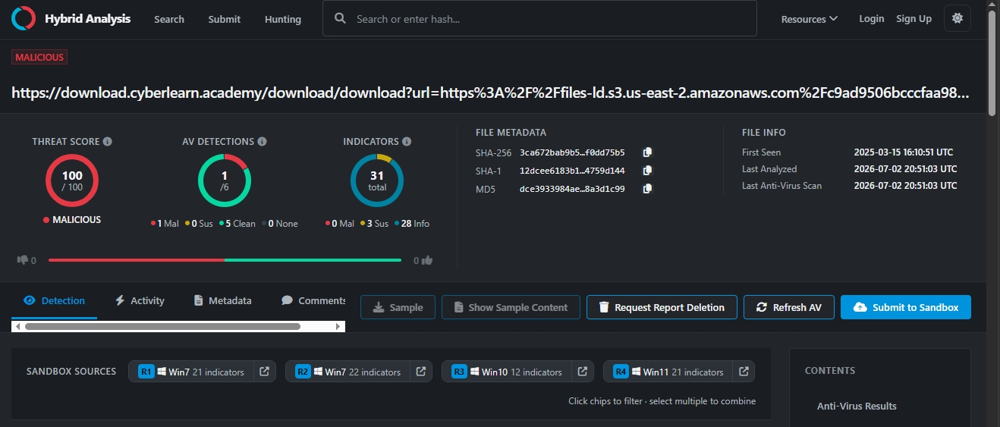

**Payload URL from the proxy log** (`http://andaluciabeach.net/image/network.exe`): searching this exact URL in Hybrid Analysis returned a direct match, confirming the proxy log finding independently of the endpoint data.

| Field | Value |
|---|---|
| Threat score | 100/100, Malicious |
| AV detections | 2/6 (Vipre: malicious, 100%) |
| Indicators | 38 total (4 malicious, 12 suspicious, 22 informational) |
| SHA-256 | `92f557d8f467ea3884dccb68e3bd5de07b945aed1db10e65e6c263f053bd4930` |
| SHA-1 | `fc12748df3eda7870964564a7413d591d30b09de` |
| MD5 | `3305f355691d4cb5876a3bc1e0bd8888` |
| First seen | 2021-02-03 06:16:14 UTC |

Five independent sandbox runs (Win7 and Win10) flagged the URL as a malware site, with threat scores of 88/100, 50/100 and 100/100 across the different environments. The behavior across those runs lines up with what the proxy log already showed:

- GETs/downloads an executable file from a web server
- Drops executable files and writes a PE file header to disk
- Sends outbound traffic on a typical HTTP port without a proper HTTP header, and uses a browser-style User-Agent despite no browser being launched, both consistent with a payload fetched by a non-browser process (matches `EQNEDT32.EXE` making the request instead of a browser)
- Malicious artifacts were seen in the context of this contacted host across multiple reputation engines

This corroborates the "Opened" verdict from an independent source: the URL that `EQNEDT32.EXE` requested from Richard's host is a confirmed malware-distribution link, not a false positive from the proxy log alone.

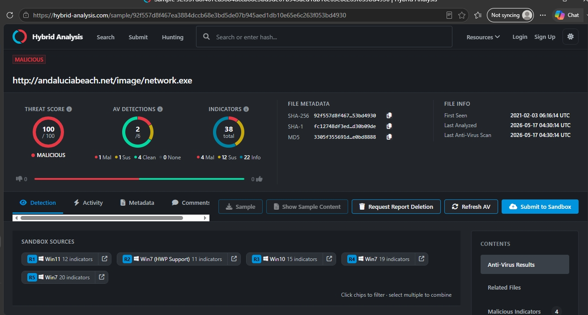

## Timeline

| Time (as logged) | Event |
|---|---|
| 13:48:04 | Mail delivered from 49.234.43.39 to the Exchange server |
| 14:15:45 | RichardPRD: `excel.exe` -> `EQNEDT32.EXE` requests `network.exe` from andaluciabeach.net |
| After 14:15 | `JuicyPotato.EXE` present in the process list |

The alert shows a `+03:00` offset while the log data has none. I ordered events using the logged times as they appear.

## Verdict

**True Positive.** The attachment was opened and led to execution and a payload download. The device action for the proxy request was Allowed, so the download went through.

## Playbook answers

| Question | Final answer |
|---|---|
| Are there attachments or URLs in the email? | Yes |
| Analyze URL/attachment | Malicious |
| Check if mail delivered to user | Delivered |
| Check if someone opened the file/URL | **Opened** (first answered Not Opened) |

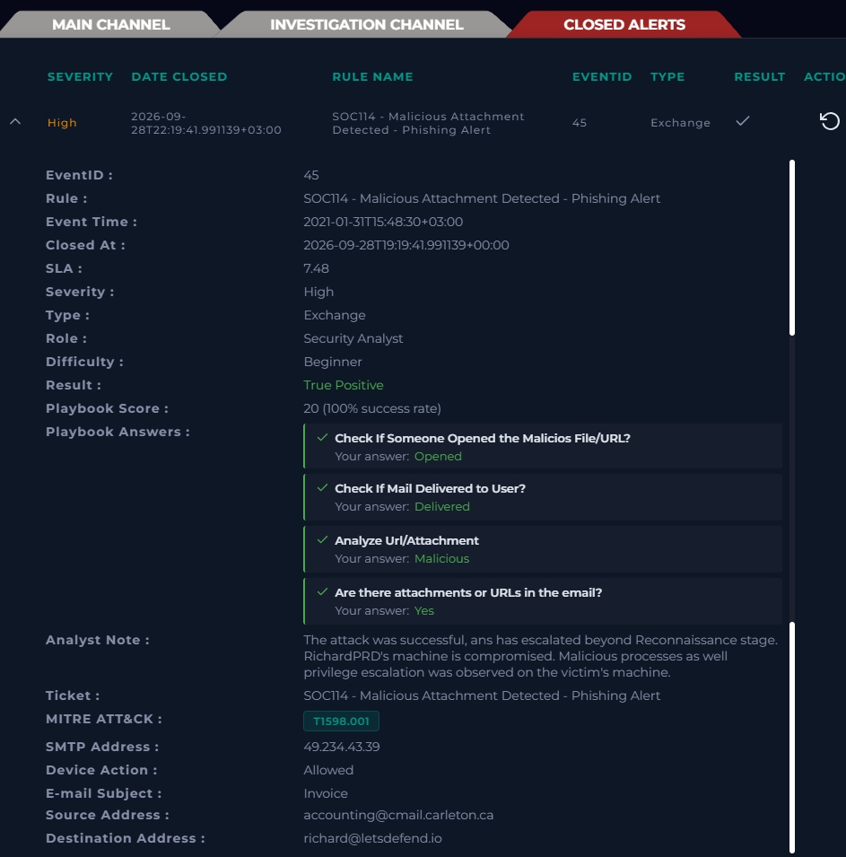

## Response

Performed:
- Contained RichardPRD
- Deleted the email from the mailbox

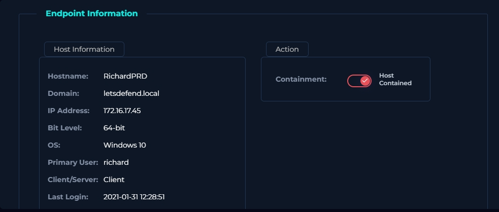
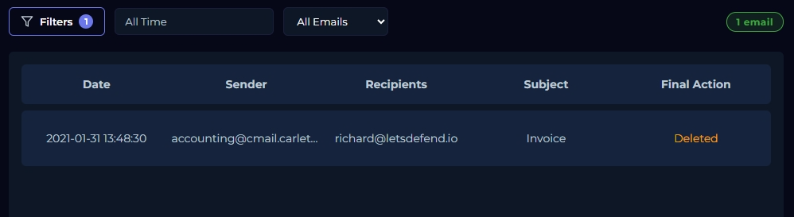

Recommended next steps:
- Block `andaluciabeach.net` and `5.135.143.133` at the proxy/firewall, and `49.234.43.39` at the mail gateway
- Reset Richard's credentials, since `JuicyPotato.EXE` suggests privilege escalation
- Search other mailboxes for mail from `accounting@cmail.carleton.ca`
- Hunt for `network.exe` on RichardPRD and check for lateral movement; reimage the host if compromise is confirmed

## Indicators of compromise

| Type | Value |
|---|---|
| Sender | accounting@cmail.carleton.ca |
| SMTP IP | 49.234.43.39 |
| Payload URL | hxxp://andaluciabeach.net/image/network.exe |
| Payload IP | 5.135.143.133 |
| Attachment SHA-256 | 3ca672bab9b59d83640c01fd50d5a25b1ed7654d5448ffac544d80f5f0dd75b5 |
| Payload (network.exe) SHA-256 | 92f557d8f467ea3884dccb68e3bd5de07b945aed1db10e65e6c263f053bd4930 |
| Excel MD5 (parent process) | 8b88ebbb05a0e56b7dcc708498c02b3e |

## MITRE ATT&CK (analyst mapping)

- T1566.001 Phishing: Spearphishing Attachment
- T1203 Exploitation for Client Execution
- T1105 Ingress Tool Transfer
- T1068 Exploitation for Privilege Escalation (`JuicyPotato.EXE`, suspected)

The ticket lists T1598.001; the behavior I observed maps better to the techniques above.

## Lessons learned

1. "Delivered" is not "opened". Execution has to be proven from endpoint or proxy data.
2. I filtered by one IP initially and got the wrong host. Search endpoints by user or hostname, and check that log dates match the alert date.
3. Pivot on the process tree. An Office application spawning `EQNEDT32.EXE` is a strong signal on its own.
4. Empty threat intel results do not mean clean. Old infrastructure often has no reputation data left.

---
*Part of my [SOC Analyst homelab prep](../README.md) — investigations documented as part of the [LetsDefend SOC Fundamentals path](https://letsdefend.io/).*
