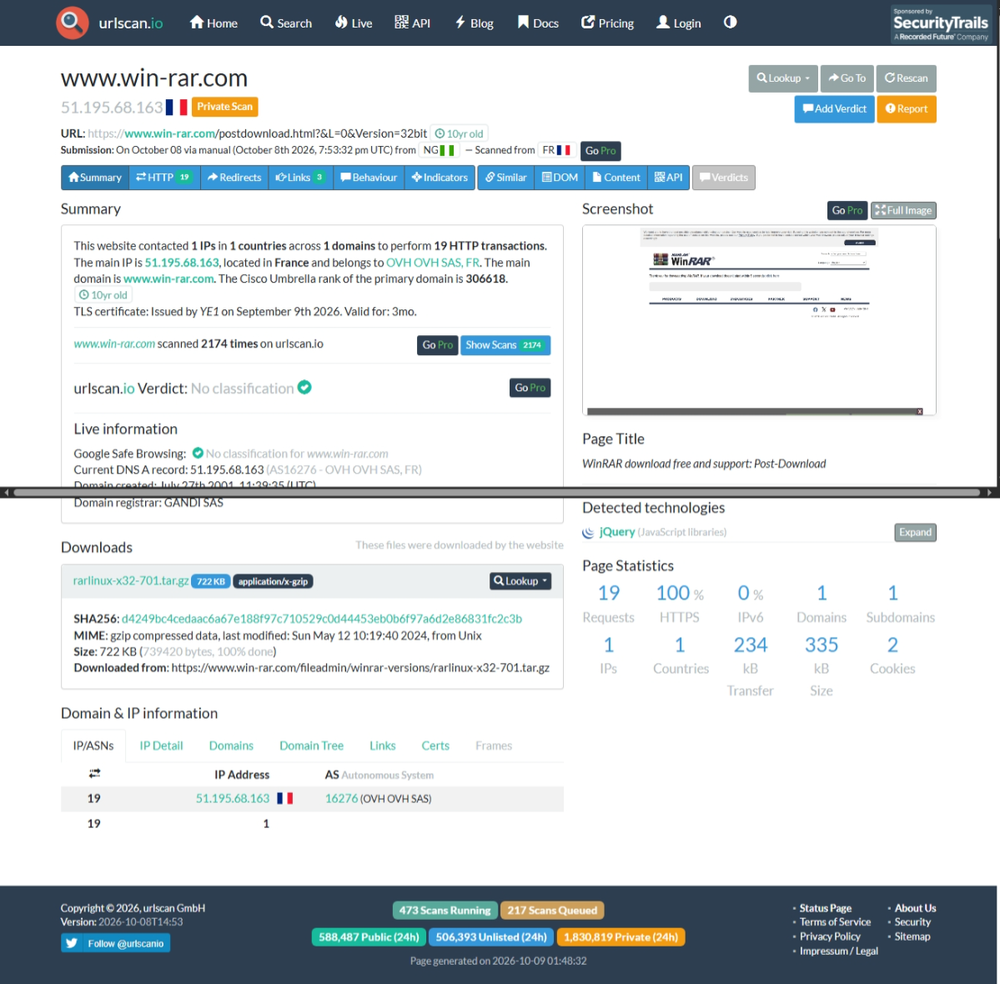
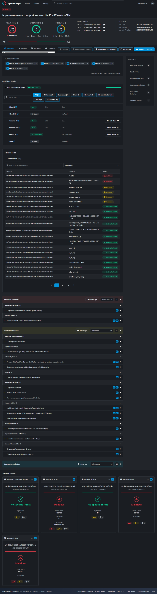
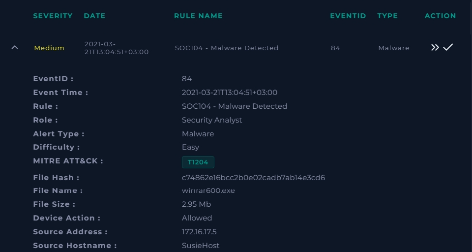
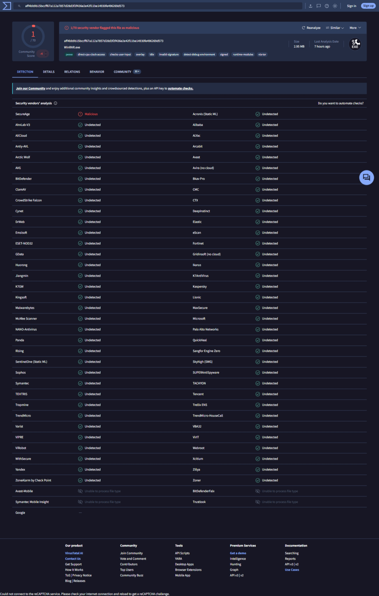
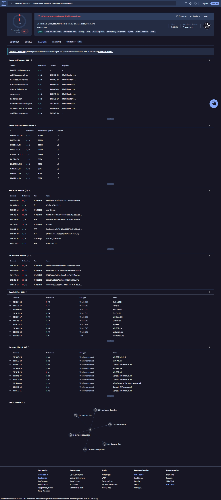
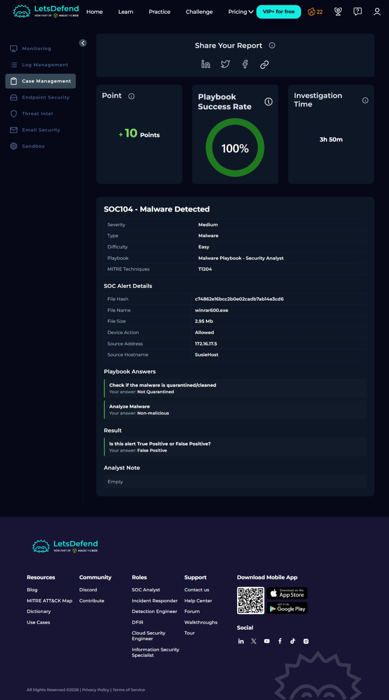

# SOC119 – Proxy – Malicious Executable File Detected (False Positive)

**Platform:** LetsDefend (Investigation Channel)
**Analyst:** Nihus-CyberSec
**Verdict:** False Positive – no escalation, no containment
**Playbook score:** 5 points (100% success rate)
**Related alert:** SOC104 – Malware Detected (EventID 84), same host, raised 2 min 40 s later – see [section 5](#5-related-alert-soc104--malware-detected-eventid-84)

---

## 1. Summary

A proxy rule fired on a request made from `SusieHost` (172.16.17.5) to `https://www.win-rar.com/postdownload.html?&L=0&Version=32bit`, flagging a possible malicious executable download (MITRE T1204 – User Execution).

The rule matched on the *download context* of the URL, not on any malicious content. On investigation:

- The destination is the **official WinRAR vendor domain**.
- The requested resource is an **HTML page** (`postdownload.html`), not an executable.
- The URL and the destination IP both returned **0 detections on VirusTotal**, and urlscan.io gave the site no classification.
- The request was a normal browser `GET` from `chrome.exe`, launched by `explorer.exe` (a user clicking in a browser).
- Elsewhere in the same environment, `WinRAR.exe` itself performs DNS lookups to `notifier.win-rar.com`, which is normal WinRAR update behaviour.
- A second alert on the same host (SOC104, `winrar600.exe`) was a legitimate WinRAR installer (VirusTotal 1/70, single low-confidence engine) and was also closed as False Positive.
- Hybrid Analysis scored the URL 100/100, but that score was discounted as noisy sandbox output (Step 7).

Nothing supported escalating, so the alert was closed as a False Positive with the note *"Site is not malicious"*.

---

## 2. Alert details

| Field | Value |
|---|---|
| Rule | SOC119 – Proxy – Malicious Executable File Detected |
| Event ID | 83 |
| Event time | 2021-03-21T13:02:11+03:00 |
| Severity / Difficulty | Medium / Easy |
| Alert type | Proxy |
| MITRE ATT&CK | T1204 (User Execution) |
| Username | Susie |
| User agent | Chrome – Windows |
| Request URL | `https://www.win-rar.com/postdownload.html?&L=0&Version=32bit` |
| Device action | Allowed |
| Source | 172.16.17.5 (`SusieHost`) |
| Destination | 51.195.68.163 (`win-rar.com`) |

*Figure 1 – SOC119 in the Investigation Channel.*

---

## 3. Investigation

### Step 1 – Read the alert critically

The rule name says "executable file", but the request URL ends in `postdownload.html`. That is the web page a user lands on *after* choosing to download WinRAR, not a `.exe` itself. The `Version=32bit` parameter is consistent with a user picking a build on the official download page. The alert name alone is not evidence of malice, so the next step was to check the URL and destination.

### Step 2 – Log Management: what actually happened on the wire

I searched Log Management for `win-rar.com` and expanded both returned logs.

*Figure 2 – Raw logs for `win-rar.com`. Left: proxy log. Right: OS (Sysmon) log.*

**Proxy log (2021-03-21, 172.16.17.5:43213 → 51.195.68.x:443)** – this is the log that matches the alert:

| Field | Value |
|---|---|
| Process | `chrome.exe` |
| Parent process | `explorer.exe` |
| Request method | GET |
| Device action | Allowed |
| Request URL | `https://www.win-rar.com/postdownload.html?&L=0&Version=32bit` |
| Parent process MD5 | `8b88ebbb05a0e56b7dcc708498c02b3e` |

Chrome started from Explorer and made a plain `GET` over HTTPS (port 443). This is ordinary user-driven browsing.

> The log viewer shows its own timestamp format, so I matched this log to the alert on source IP, URL, method and action rather than on clock time.

**OS log (2023-08-31) – separate host, shown for context only:**

| Field | Value |
|---|---|
| Host / IP | 172.16.17.59 (not `SusieHost`, which is 172.16.17.5) |
| Type | DNS Query (Sysmon Event ID 22) |
| Image | `C:\Program Files\WinRAR\WinRAR.exe` |
| User | Audrey |
| Query name | `notifier.win-rar.com` |
| Query result | `::ffff:51.195.68.173` |

This log belongs to a different machine, user and date, so it is **not** part of the SOC119 incident. It is useful as baseline: WinRAR installed in this environment legitimately contacts `win-rar.com` subdomains that resolve into the same `51.195.68.x` range.

### Step 3 – Endpoint check on SusieHost

| Field | Value |
|---|---|
| Hostname | SusieHost |
| Domain | LetsDefend |
| IP | 172.16.17.5 |
| OS | Windows 10, 64-bit |
| Primary user | Susie2020 |
| Containment | Off |

*Figure 3 – Processes tab.*

*Figure 4 – Browser History tab.*

The Processes and Browser History tabs show **"Agent Down"** with no event time, process ID or command line. In other words, the endpoint agent was not reporting, so there is **no host telemetry at all** for this machine. The other tabs (Network Action, Terminal History) likewise showed nothing; they were not screenshotted because they repeat the same empty/Agent down result.

This matters for the verdict: "no suspicious activity found on the endpoint" is not the same as "the endpoint was checked and was clean". The conclusion therefore rests on the URL and destination analysis below, and the missing telemetry is recorded as a limitation (section 7).

### Step 4 – Analyse the URL on VirusTotal

*Figure 5 – VirusTotal URL report for the `win-rar.com/postdownload.html` page.*

- **Detections: 0 / 92** security vendors.
- Resolved IP: 51.195.68.163, status 200.
- The page redirected to a WinRAR archive hosted under the vendor's own path (`win-rar.com/fileadmin/winrar-versions/…`), with content type `application/x-gzip`.
- Google Safe Browsing, Kaspersky, ESET, Fortinet, BitDefender, Sophos, Phishtank, OpenPhish and others all reported Clean; the remainder were Unrated.

> Note: the full alert URL (including `&L=0&Version=32bit`) was submitted to VirusTotal. The report page only displays the shortened form (`…/postdownload.html?`) once it loads, so the search bar in the screenshot looks truncated.

### Step 5 – Analyse the destination IP on VirusTotal

*Figure 6 – VirusTotal report for 51.195.68.163.*

- **Detections: 0 / 91** security vendors.
- Network: `51.195.0.0/16`, AS16276 (OVH SAS), country FR.
- VirusTotal also notes **9 detected files communicating with this IP address**. OVH is a large shared hosting provider, so this relation reflects the IP's history on shared infrastructure and is not a reputation verdict on the IP itself. I did not open the Relations tab, so it is recorded as an open item rather than ruled out in detail.

### Step 6 – Cross-check the domain on urlscan.io

*Figure 7 – urlscan.io result for `www.win-rar.com/postdownload.html`.*

- Verdict: **no classification**; Google Safe Browsing: no classification.
- IP 51.195.68.163, OVH SAS, France (AS16276) – matches the IP in the alert.
- Domain created **27 July 2001** (registrar Gandi SAS); valid TLS certificate; Cisco Umbrella rank ~306,618; the domain has been scanned 2,174 times on urlscan.io.
- Page title "WinRAR download free and support: Post-Download". The only download the scan recorded was a vendor-hosted archive (`rarlinux-x32-701.tar.gz`, from `win-rar.com/fileadmin/winrar-versions/`).
- This is a current scan (October 2026), so it confirms the site's present reputation, not its state in 2021.

### Step 7 – Hybrid Analysis result (URL) and why I discounted it

Hybrid Analysis scored the post-download URL **100/100 – Malicious**. I did not treat this as evidence of a malicious site, for these reasons:

- **The score measures sandbox behavior, not known-bad reputation.** The URL is opened in a sandbox and every file write, script and network action is counted. A normal download page does all of these.
- **The sandbox verdicts are inconsistent.** Of the five sandbox reports, Win10 64-bit and Win7 32-bit (HWP) say *No Specific Threat*, while Win11 64-bit (100/100) and the two Win7 reports (68/100 and 63/100) say *Malicious*. Inconsistency alone does not prove a page is benign, because genuinely malicious content can behave differently depending on the environment. I therefore treated it as a sign of a noisy score and relied on the stronger evidence in this report.
- **AV and URL-scanner results are clean.** The report itself shows 0 malicious / 0 suspicious AV detections (6 clean), the URL scanners are 0/6 flagged, and urlscan.io has no classification. This contradicts the 100/100 headline score.
- **The triggering indicators are generic.** Of 62 indicators, only 2 are malicious-level ("drops executable files to the Windows system directory" and "malicious artifacts seen in the context of the input URL"); 15 are suspicious (for example "queries process information", "found potential IP address in binary/memory", "detected potential document download lure content in webpage") and 45 are informational. None names a malware family, C2 callback or credential theft.
- **Most related files are page assets.** The dropped-files list is dominated by web resources (`postdownload_1_.htm`, `edge_driver.js`, `wallet-crypto.html`, `bnpl.bundle.js`), which look like third-party content the page loaded rather than payloads.
- **The runs are old.** The sandbox reports date from 2021 to early 2026, so they do not reflect the live site's current state.

**Conclusion:** a high Hybrid Analysis score on its own is low-confidence. It was outweighed by the clean VirusTotal and urlscan.io results, the normal process chain, and the fact that the domain is the official vendor's.

*Figure 8 – Hybrid Analysis report for the post-download URL.*

### Step 8 – Playbook answer and closure

*Figure 9 – Case Management report.*

| Playbook question | My answer |
|---|---|
| Analyze URL Address | Non-malicious |
| Is this alert True Positive or False Positive? | **False Positive** |
| Analyst note | "Site is not malicious" |

Result: playbook success rate **100%**, **+5 points**.

---

## 4. Verdict and reasoning

**False Positive.**

| Evidence | Points to |
|---|---|
| Destination is the official WinRAR vendor domain (registered 2001) | Legitimate |
| Requested resource is an HTML page, not an executable | Rule matched on download context, not a payload |
| VirusTotal URL 0/92, IP 0/91; urlscan.io no classification | No vendor flags it |
| Proxy log: `chrome.exe` ← `explorer.exe`, plain `GET` over 443 | Normal user browsing |
| WinRAR in this environment contacts `win-rar.com` subdomains | Consistent with legitimate WinRAR behaviour |
| Related alert SOC104: file is a WinRAR installer, VirusTotal 1/70 | Legitimate software |
| Hybrid Analysis 100/100 | Discounted: inconsistent across sandboxes, generic indicators, contradicted by every reputation source |

**Why it was not escalated:** there was no malicious indicator, no unusual process chain and no suspicious destination. Escalating or containing `SusieHost` would have spent incident-response effort and disrupted a user over a legitimate software download page.

---

## 5. Related alert: SOC104 – Malware Detected (EventID 84)

The same activity on `SusieHost` also raised a second alert 2 min 40 s after SOC119, this time on the downloaded file itself.

| Field | Value |
|---|---|
| Rule | SOC104 – Malware Detected |
| Event ID | 84 |
| Event time | 2021-03-21T13:04:51+03:00 |
| Severity / Difficulty | Medium / Easy |
| Alert type | Malware |
| MITRE ATT&CK | T1204 (User Execution) |
| File name | `winrar600.exe` |
| File hash (MD5) | `c74862e16bcc2b0e02cadb7ab14e3cd6` |
| File size | 2.95 MB |
| Device action | Allowed |
| Source | 172.16.17.5 (`SusieHost`) |

*Figure 10 – SOC104 alert details.*

**Endpoint:** same host, same result – every Endpoint Security tab shows Agent Down, so execution of the file could not be verified (see Step 3).

**File reputation (VirusTotal, SHA-256 `aff4bb9b15bccff67a112a7857d28d3f2f436e2e42f11be14930fe496269d573`):**

- **1 / 70** vendors flag it. The only detection is SecureAge, a single low-confidence engine; Microsoft, Kaspersky, CrowdStrike, ESET, BitDefender, Sophos, Palo Alto and the other major engines report undetected.
- Identified as **WinRAR.exe**, 2.95 MB, a signed PE.
- **Relations:** the file bundles WinRAR components (`Rar.exe`, `UnRAR.exe`, `WinRAR.exe`, `Uninstall.exe`, `WhatsNew.txt`) and drops Windows shortcuts (`WinRAR.lnk`, `Console RAR manual.lnk`) – normal installer behaviour. Many engines flag files that embed it as a resource; malware commonly packages legitimate tools, so that says nothing against this file. The contacted domains and IPs listed are Microsoft/Akamai and other general infrastructure, consistent with sandbox background traffic.

*Figure 11 – VirusTotal detection tab for the file.*

*Figure 12 – VirusTotal relations tab for the file.*

**Closure on the platform:** closed as **False Positive** with playbook answers *Analyze Malware → Non-malicious* and *Check if the malware is quarantined/cleaned → Not Quarantined* (nothing to quarantine). Playbook success rate 100%, **+10 points**.

*Figure 13 – SOC104 Case Management report.*

**Assessment:** the file is a legitimate WinRAR installer obtained from the vendor's official site in the same browser session that SOC119 flagged. The two alerts describe one benign download, so neither justifies escalation or containment.

---

## 6. IOCs (all benign)

| Type | Value | Assessment |
|---|---|---|
| URL | `https://www.win-rar.com/postdownload.html?&L=0&Version=32bit` | Legitimate vendor download page |
| Domain | `www.win-rar.com` | Official vendor, registered 2001, clean |
| IP | `51.195.68.163` | OVH (FR), 0/91 on VirusTotal |
| File | `winrar600.exe` | WinRAR installer |
| MD5 | `c74862e16bcc2b0e02cadb7ab14e3cd6` | Hash from the SOC104 alert |
| SHA-256 | `aff4bb9b15bccff67a112a7857d28d3f2f436e2e42f11be14930fe496269d573` | VirusTotal 1/70 (SecureAge only) |

---

## 7. Limitations and open items

- **Endpoint agent was down** on `SusieHost`, so host-side behaviour (what was downloaded, whether the installer was run) could not be verified directly.
- The SOC119 alert itself carries no file hash or filename; those come from the related SOC104 alert. Without endpoint telemetry, I cannot confirm that the downloaded file is the one SOC104 reports.
- VirusTotal's **Relations tab for the IP** (9 files communicating with 51.195.68.163) was not reviewed in detail.
- Hybrid Analysis and urlscan.io results are historical or recent scans of the live site, not a snapshot from March 2021.

If the agent comes back online, a quick look at processes and recent downloads on `SusieHost` would close the gap. On the evidence available, neither alert justifies escalation.

**Recommendations**

1. No containment required; leave `SusieHost` uncontained.
2. Restore the endpoint agent on `SusieHost` so future alerts have process and network telemetry.
3. If policy restricts unapproved software, notify the user or IT; otherwise treat the install as allowed.
4. Consider tuning SOC119/SOC104 to reduce noise for known-good installers from vendor domains.

---

## 8. Lessons learned

1. **A rule name is a hypothesis, not a finding.** "Malicious Executable File Detected" turned out to be a normal HTML page on the vendor's own site.
2. **Check the exact URL and destination before deciding.** Reading the request string, the process chain and two VirusTotal reports took minutes and answered the question.
3. **Closing a false positive is part of the job.** Not every alert is an incident, and escalating everything wastes the response team's time.
4. **Separate "found nothing" from "could not look".** With the endpoint agent down, the honest wording is "no host telemetry available", and the verdict leans on network and reputation evidence instead.
5. **Match logs to the alert, not to similar-looking ones.** The OS log came from a different host (172.16.17.59 vs 172.16.17.5), a different user and a different year. It is baseline context, not evidence for this incident.
6. **A scary vendor score is also a hypothesis.** Hybrid Analysis said 100/100, but the indicators were generic, the sandboxes disagreed, and every reputation source said clean. Read what triggered a score before trusting it.
7. **One activity can raise several alerts.** SOC119 (the page visit) and SOC104 (the file) fired minutes apart on the same host. Correlating them by host and URL gave the full picture of one benign download.
