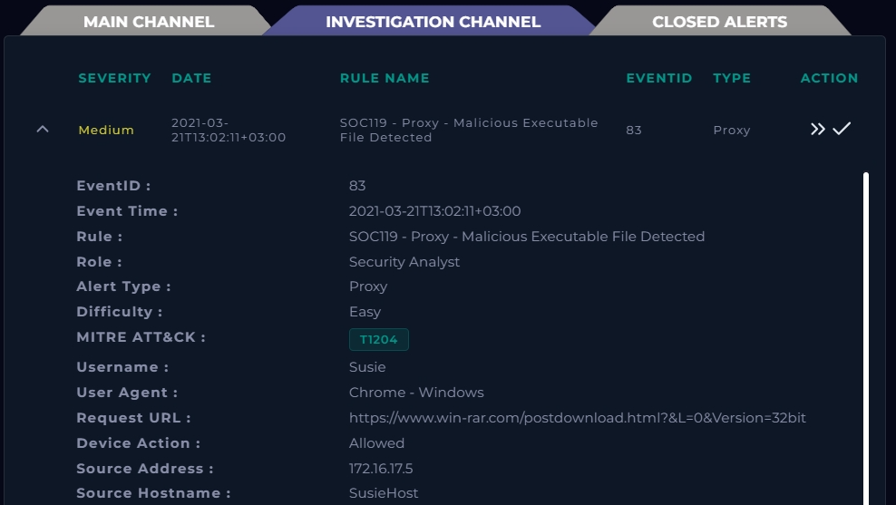
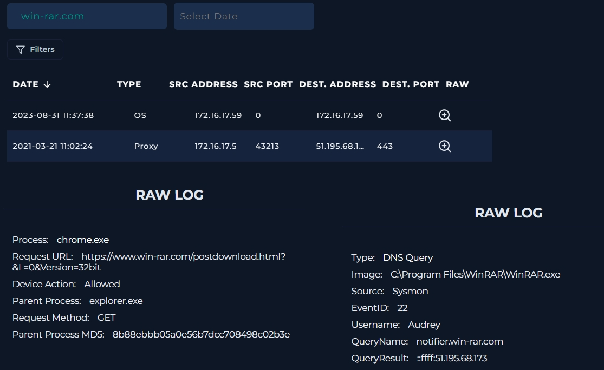
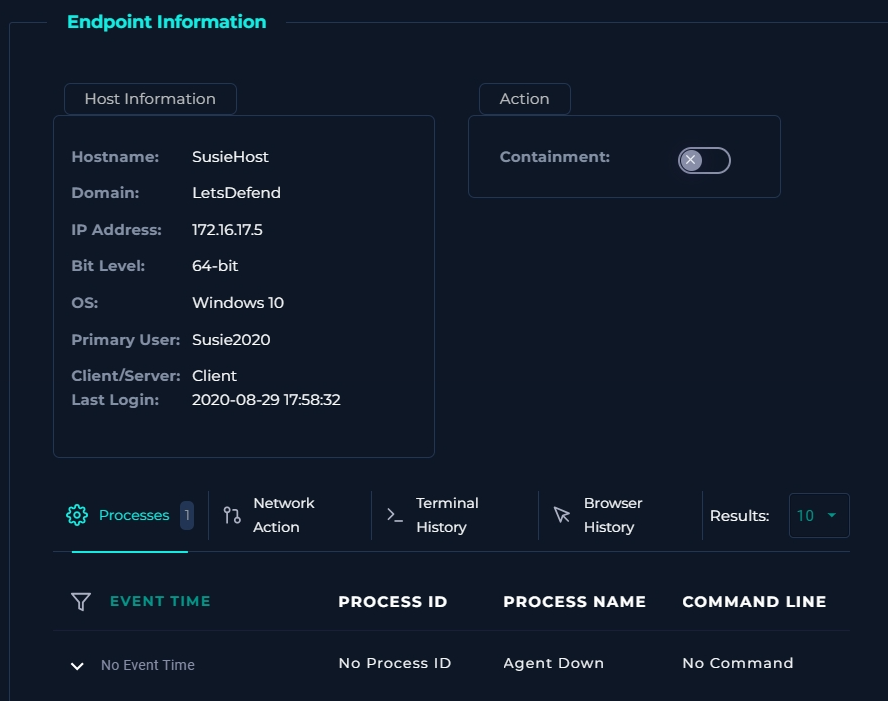
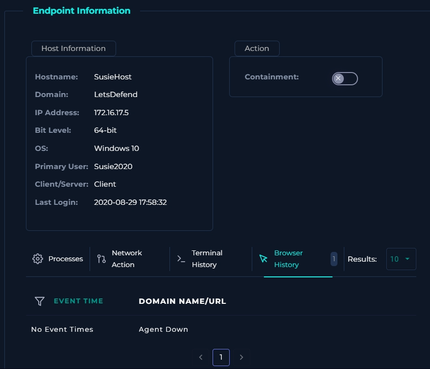
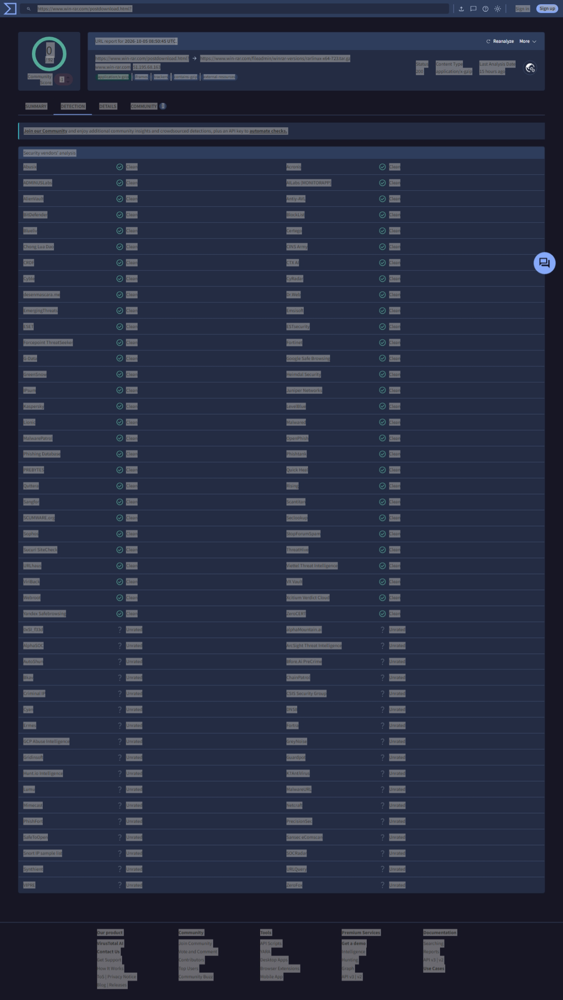
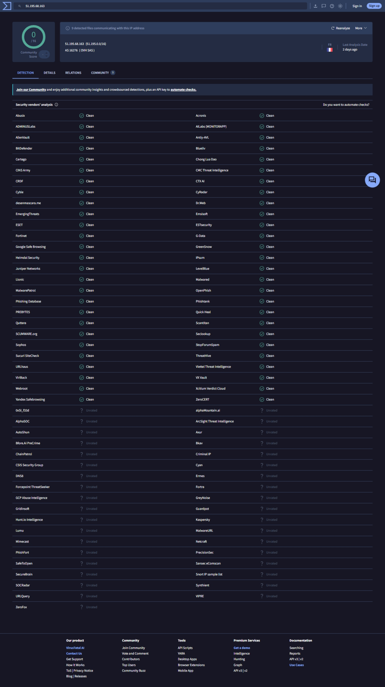
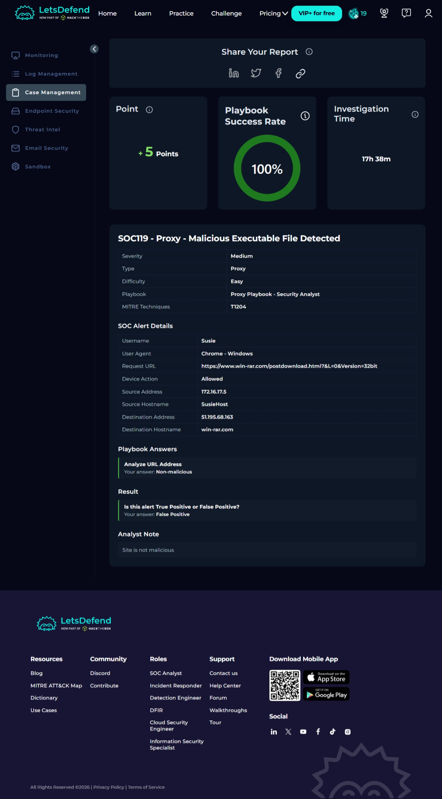
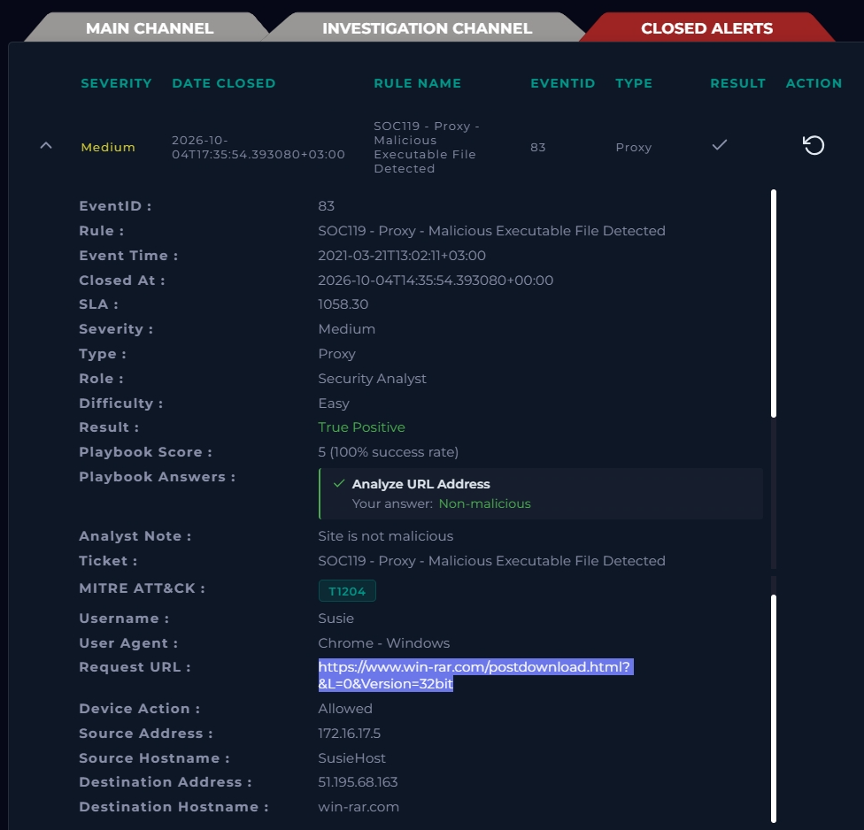

# SOC119 – Proxy – Malicious Executable File Detected (False Positive)

**Platform:** LetsDefend (Investigation Channel)
**Analyst:** Nihus-CyberSec
**Verdict:** False Positive – no escalation, no containment
**Playbook score:** 5 points (100% success rate)

---

## 1. Summary

A proxy rule fired on a request made from `SusieHost` (172.16.17.5) to `https://www.win-rar.com/postdownload.html?&L=0&Version=32bit`, flagging a possible malicious executable download (MITRE T1204 – User Execution).

The rule matched on the *download context* of the URL, not on any malicious content. On investigation:

- The destination is the **official WinRAR vendor domain**.
- The requested resource is an **HTML page** (`postdownload.html`), not an executable.
- The URL and the destination IP both returned **0 detections on VirusTotal**.
- The request was a normal browser `GET` from `chrome.exe`, launched by `explorer.exe` (a user clicking in a browser).
- Elsewhere in the same environment, `WinRAR.exe` itself performs DNS lookups to `notifier.win-rar.com`, which is normal WinRAR update behaviour.

Nothing supported escalating, so the alert was closed as a False Positive with the note *"Site is not malicious"*.

---

## 2. Alert details

| Field | Value |
|---|---|
| Rule | SOC119 – Proxy – Malicious Executable File Detected |
| Event ID | 83 |
| Event time | 2021-03-21T13:02:11+03:00 |
| Severity / Difficulty | Medium / Easy |
| Alert type | Proxy |
| MITRE ATT&CK | T1204 (User Execution) |
| Username | Susie |
| User agent | Chrome – Windows |
| Request URL | `https://www.win-rar.com/postdownload.html?&L=0&Version=32bit` |
| Device action | Allowed |
| Source | 172.16.17.5 (`SusieHost`) |
| Destination | 51.195.68.163 (`win-rar.com`) |

*Figure 1 – SOC119 in the Investigation Channel.*

---

## 3. Investigation

### Step 1 – Read the alert critically

The rule name says "executable file", but the request URL ends in `postdownload.html`. That is the web page a user lands on *after* choosing to download WinRAR, not a `.exe` itself. The `Version=32bit` parameter is consistent with a user picking a build on the official download page. The alert name alone is not evidence of malice, so the next step was to check the URL and destination.

### Step 2 – Log Management: what actually happened on the wire

I searched Log Management for `win-rar.com` and expanded both returned logs.

*Figure 2 – Raw logs for `win-rar.com`. Left: proxy log. Right: OS (Sysmon) log.*

**Proxy log (2021-03-21, 172.16.17.5:43213 → 51.195.68.x:443)** – this is the log that matches the alert:

| Field | Value |
|---|---|
| Process | `chrome.exe` |
| Parent process | `explorer.exe` |
| Request method | GET |
| Device action | Allowed |
| Request URL | `https://www.win-rar.com/postdownload.html?&L=0&Version=32bit` |
| Parent process MD5 | `8b88ebbb05a0e56b7dcc708498c02b3e` |

Chrome started from Explorer and made a plain `GET` over HTTPS (port 443). This is ordinary user-driven browsing.

> The log viewer shows its own timestamp format, so I matched this log to the alert on source IP, URL, method and action rather than on clock time.

**OS log (2023-08-31) – separate host, shown for context only:**

| Field | Value |
|---|---|
| Host / IP | 172.16.17.59 (not `SusieHost`, which is 172.16.17.5) |
| Type | DNS Query (Sysmon Event ID 22) |
| Image | `C:\Program Files\WinRAR\WinRAR.exe` |
| User | Audrey |
| Query name | `notifier.win-rar.com` |
| Query result | `::ffff:51.195.68.173` |

This log belongs to a different machine, user and date, so it is **not** part of the SOC119 incident. It is useful as baseline: WinRAR installed in this environment legitimately contacts `win-rar.com` subdomains that resolve into the same `51.195.68.x` range.

### Step 3 – Endpoint check on SusieHost

| Field | Value |
|---|---|
| Hostname | SusieHost |
| Domain | LetsDefend |
| IP | 172.16.17.5 |
| OS | Windows 10, 64-bit |
| Primary user | Susie2020 |
| Containment | Off |

*Figure 3 – Processes tab.*

*Figure 4 – Browser History tab.*

The Processes and Browser History tabs show **"Agent Down"** with no event time, process ID or command line. In other words, the endpoint agent was not reporting, so there is **no host telemetry at all** for this machine. The other tabs (Network Action, Terminal History) likewise showed nothing; they were not screenshotted because they repeat the same empty/Agent down result.

This matters for the verdict: "no suspicious activity found on the endpoint" is not the same as "the endpoint was checked and was clean". The conclusion therefore rests on the URL and destination analysis below, and the missing telemetry is recorded as a limitation (section 5).

### Step 4 – Analyse the URL on VirusTotal

*Figure 5 – VirusTotal URL report for the `win-rar.com/postdownload.html` page.*

- **Detections: 0 / 92** security vendors.
- Resolved IP: 51.195.68.163, status 200.
- The page redirected to a WinRAR archive hosted under the vendor's own path (`win-rar.com/fileadmin/winrar-versions/…`), with content type `application/x-gzip`.
- Google Safe Browsing, Kaspersky, ESET, Fortinet, BitDefender, Sophos, Phishtank, OpenPhish and others all reported Clean; the remainder were Unrated.

> Note: the full alert URL (including `&L=0&Version=32bit`) was submitted to VirusTotal. The report page only displays the shortened form (`…/postdownload.html?`) once it loads, so the search bar in the screenshot looks truncated.

### Step 5 – Analyse the destination IP on VirusTotal

*Figure 6 – VirusTotal report for 51.195.68.163.*

- **Detections: 0 / 91** security vendors.
- Network: `51.195.0.0/16`, AS16276 (OVH SAS), country FR.
- VirusTotal also notes **9 detected files communicating with this IP address**. OVH is a large shared hosting provider, so this relation reflects the IP's history on shared infrastructure and is not a reputation verdict on the IP itself. I did not open the Relations tab, so it is recorded as an open item rather than ruled out in detail.

### Step 6 – Playbook answer and closure

*Figure 7 – Case Management report.*

| Playbook question | My answer |
|---|---|
| Analyze URL Address | Non-malicious |
| Is this alert True Positive or False Positive? | **False Positive** |
| Analyst note | "Site is not malicious" |

Result: playbook success rate **100%**, **+5 points**.

---

## 4. Verdict and reasoning

**False Positive.**

| Evidence | Points to |
|---|---|
| Destination is the official WinRAR vendor domain | Legitimate |
| Requested resource is an HTML page, not an executable | Rule matched on download context, not a payload |
| VirusTotal URL 0/92, IP 0/91 | No vendor flags it |
| Proxy log: `chrome.exe` ← `explorer.exe`, plain `GET` over 443 | Normal user browsing |
| WinRAR in this environment contacts `win-rar.com` subdomains | Consistent with legitimate WinRAR behaviour |

**Why it was not escalated:** there was no malicious indicator, no payload hash to investigate, no unusual process chain and no suspicious destination. Escalating or containing `SusieHost` would have spent incident-response effort and disrupted a user over a legitimate software download page.

---

## 5. Limitations and open items

- **Endpoint agent was down** on `SusieHost`, so host-side behaviour (what was downloaded, whether anything was executed) could not be verified directly.
- No file hash or downloaded filename was available in the alert or logs, so there was no sample to check.
- Domain registration data (WHOIS / domain age) was not captured.

If the agent comes back online, a quick look at processes and recent downloads on `SusieHost` would close the gap. On the evidence available, the alert does not justify escalation.

---

## 6. Platform note: result label discrepancy

The Case Management report (Figure 7) records my submitted answer as **False Positive** with a 100% playbook score. The Closed Alerts list (Figure 8) shows the same alert with the result label **True Positive**, while still showing the same "Non-malicious" playbook answer and the same analyst note.

*Figure 8 – Closed Alerts view of the same alert.*

I did not change the verdict. It is based on the evidence above, and I am recording the inconsistency. The label in the Closed Alerts view looks like a display issue on the platform, but I have not been able to confirm that.

---

## 7. Lessons learned

1. **A rule name is a hypothesis, not a finding.** "Malicious Executable File Detected" turned out to be a normal HTML page on the vendor's own site.
2. **Check the exact URL and destination before deciding.** Reading the request string, the process chain and two VirusTotal reports took minutes and answered the question.
3. **Closing a false positive is part of the job.** Not every alert is an incident, and escalating everything wastes the response team's time.
4. **Separate "found nothing" from "could not look".** With the endpoint agent down, the honest wording is "no host telemetry available", and the verdict leans on network and reputation evidence instead.
5. **Match logs to the alert, not to similar-looking ones.** The OS log came from a different host (172.16.17.59 vs 172.16.17.5), a different user and a different year. It is baseline context, not evidence for this incident.

---

## 8. Evidence index

| # | File | Shows |
|---|---|---|
| 1 | `images/01-alert-details.png` | Alert fields |
| 2 | `images/02-log-management-raw-logs.png` | Proxy log and OS log for `win-rar.com` |
| 3 | `images/03-endpoint-processes.png` | Endpoint – Processes (Agent Down) |
| 4 | `images/04-endpoint-browser-history.png` | Endpoint – Browser History (Agent Down) |
| 5 | `images/05-virustotal-url.png` | VirusTotal URL report, 0/92 |
| 6 | `images/06-virustotal-ip.png` | VirusTotal IP report, 0/91 |
| 7 | `images/07-case-report-false-positive.png` | Playbook answers, result and analyst note |
| 8 | `images/08-closed-alert-view.png` | Closed Alerts view (label discrepancy) |
