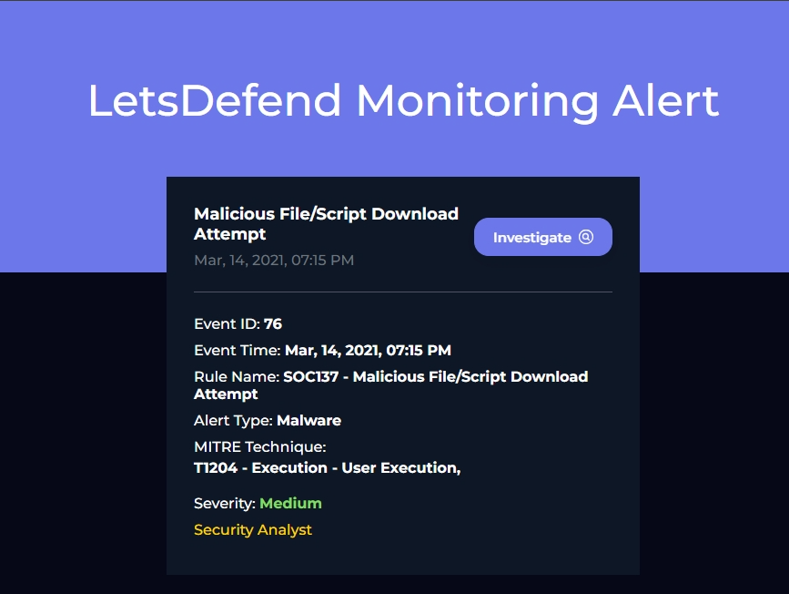
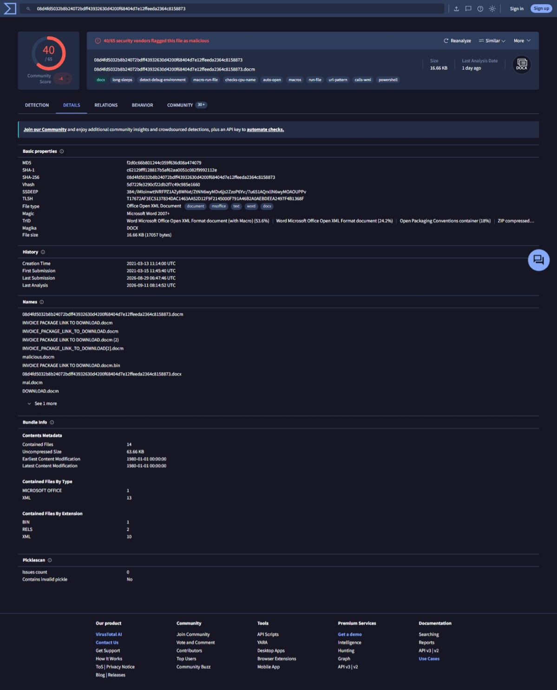
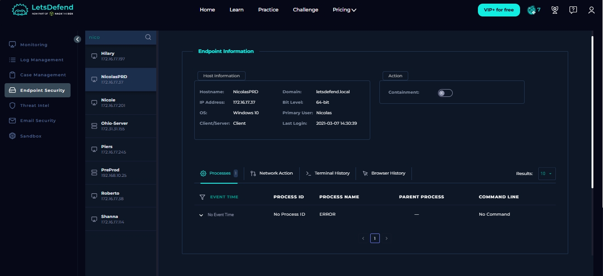
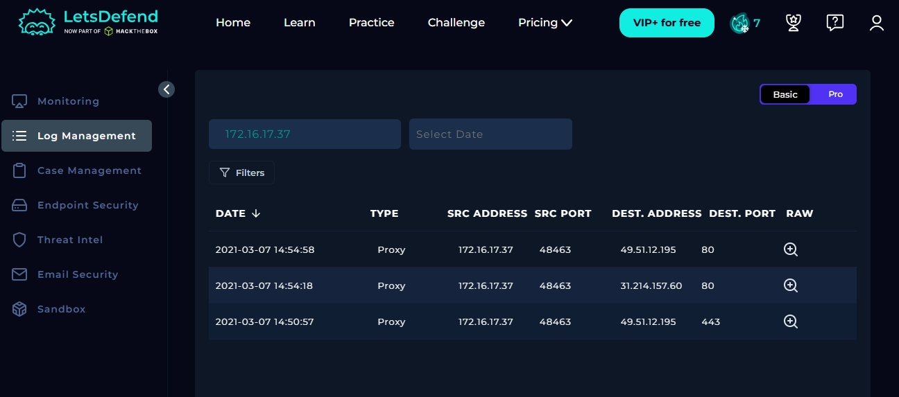
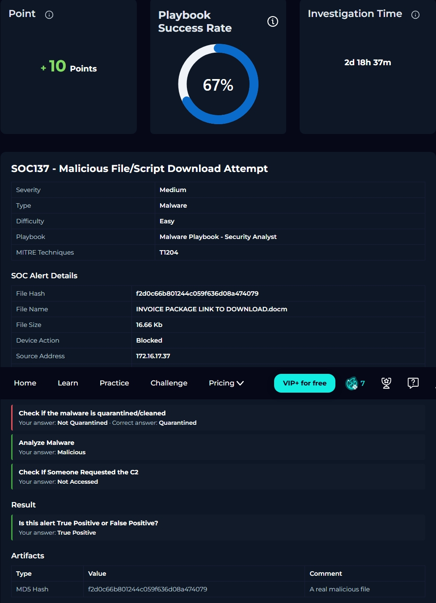

# SOC137 — Malicious File/Script Download Attempt

## 1. Ticket Overview

| Field | Value |
|---|---|
| Event ID | 76 |
| Rule | SOC137 - Malicious File/Script Download Attempt |
| Event Time | 2021-03-14 19:15:52 +03:00 |
| Severity | Medium |
| Type | Malware |
| Role | Security Analyst |
| Difficulty | Easy |
| Source Address | 172.16.17.37 |
| Source Hostname | NicolasPRD |
| File Name | `INVOICE PACKAGE LINK TO DOWNLOAD.docm` |
| File Hash (MD5) | `f2d0c66b801244c059f636d08a474079` |
| File Size | 16.66 KB |
| Device Action | Blocked |
| Result | True Positive |
| Playbook Score | 10 (67% success rate) |

**MITRE ATT&CK Mapping:** T1204 – User Execution (the attack chain relies on a user opening the document and enabling macros to trigger execution)

## 2. Initial Triage

When I opened the alert, it flagged an attempted download of a `.docm` (macro-enabled Word document), disguised as an invoice ("INVOICE PACKAGE LINK TO DOWNLOAD"). I recognized this naming pattern as a common social-engineering lure used to get a target to open a macro-enabled document, so I treated it as worth a full investigation rather than a likely false positive.

The alert showed the device action as **Blocked**, meaning the download was stopped before reaching or executing on the endpoint — but I didn't want to close the ticket on that assumption alone, so I worked through the full playbook to confirm it.

## 3. Investigation Steps

I followed the standard playbook for this alert type and recorded my findings as Analyst Notes:

1. Recorded the alert's core artifacts (hash, filename, source host, source IP).
2. Took the file's MD5 hash and looked it up on **VirusTotal**. It came back flagged as malicious.
3. Checked **Endpoint Security** for the source host (NicolasPRD) for signs of local execution — nothing suspicious in the process list or terminal history.
4. Checked **Log Management** to see if anything had reached out to the file's associated C2 infrastructure. I answered "Not Accessed" — no request to the C2 was found in the logs.
5. Checked whether the malware had been quarantined or cleaned. I answered "Not Quarantined" based on the device action showing "Blocked" — this turned out to be the one playbook answer I got wrong (see Section 7).

## 4. Indicators Found

- **File Hash (MD5):** `f2d0c66b801244c059f636d08a474079` — confirmed malicious via VirusTotal.
- **No local execution artifacts** — Endpoint Security showed nothing suspicious for the source host.
- **No C2 contact observed** — Log Management showed no outbound requests to the file's associated C2 infrastructure.

*Supplementary threat intel (from public research on this file hash, outside this platform's own telemetry):* other sandbox analyses of this same file show the macro spawning a PowerShell download cradle from `WINWORD.EXE`, with known associated C2/infrastructure IPs including `178.175.67.109`. I didn't observe this activity myself in this alert's logs — it's included here only as context for what the file is capable of if it had executed.

## 5. Verdict & Reasoning

I confirmed the file as **malicious** based on the VirusTotal hash lookup, and marked the incident a **True Positive**. The platform's own closure recorded the same result.

No execution or C2 activity was found on my review of Endpoint Security and Log Management, consistent with the download having been stopped before the file could run.

## 6. Response / Recommendation

- Confirm the file's hash/source domain is on a blocklist so future download attempts are caught automatically.
- Verify quarantine/cleanup status directly (e.g., via Endpoint Security's file/quarantine view) rather than inferring it from the "Blocked" device action alone — see Section 7.
- Flag the source host owner (NicolasPRD) for a brief phishing-awareness note, since the lure suggests this arrived via email or a shared link.
- Close as **True Positive**.

## 7. Lessons / Notes

- I scored 10 points (67% success rate) on the playbook — I got the C2 check and malware analysis right, but missed the quarantine/cleanup question. I answered "Not Quarantined" since I couldn't find direct evidence of quarantine anywhere in Endpoint Security or Log Management. The platform's expected answer was "Quarantined."
- **Takeaway:** There's genuinely no direct log/endpoint evidence to confirm quarantine in this alert — I checked and found nothing either. The expected answer appears to rely on treating "Blocked" (a network/perimeter action) as functionally equivalent to "Quarantined" (an endpoint remediation state) for the purposes of this scenario, rather than on any artifact you could point to. In a real environment, I wouldn't make that assumption — I'd insist on a direct quarantine/cleanup log entry from the endpoint tooling before marking a file as remediated, since "blocked at the perimeter" and "removed from the host" are two different guarantees.
- Aside from that, this alert reinforced that a "nothing happened" outcome is still a fully valid investigation — the file was genuinely malicious, and the layered defenses did their job before it could progress further down the kill chain.

