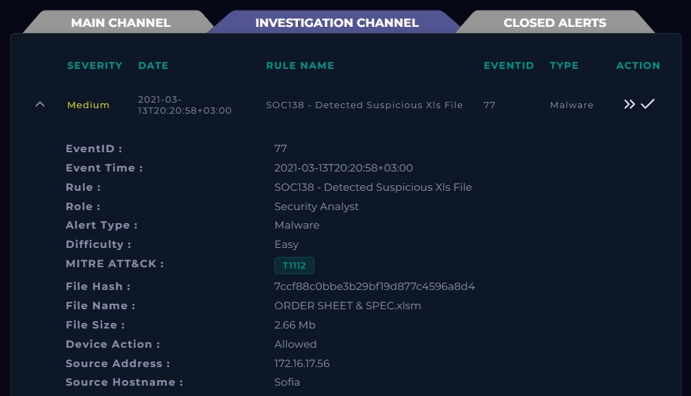
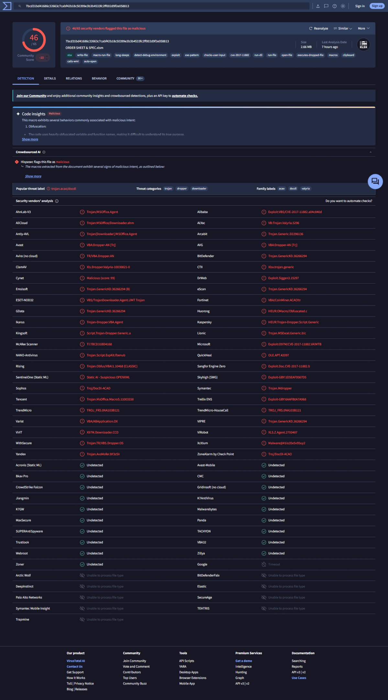
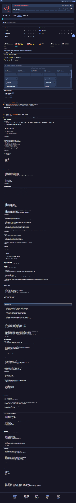
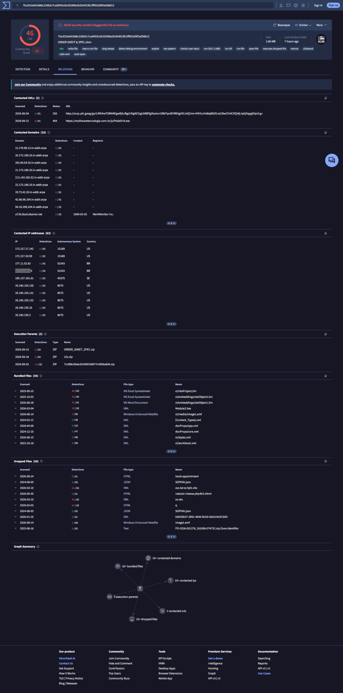
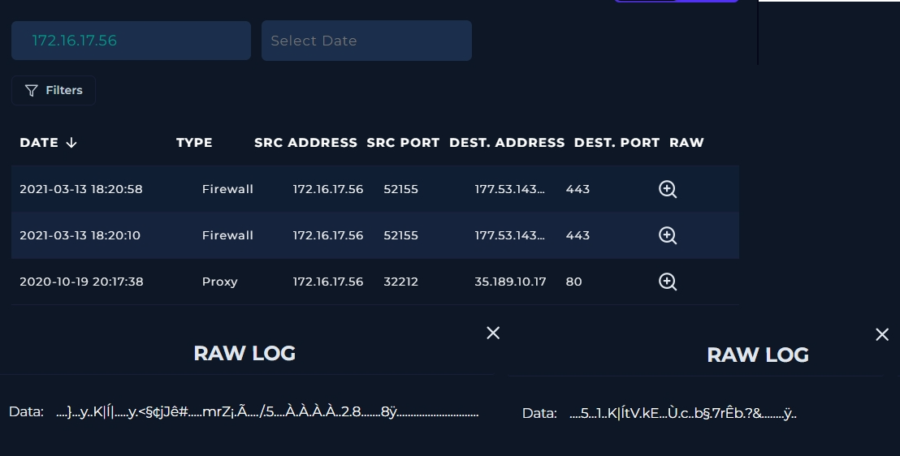
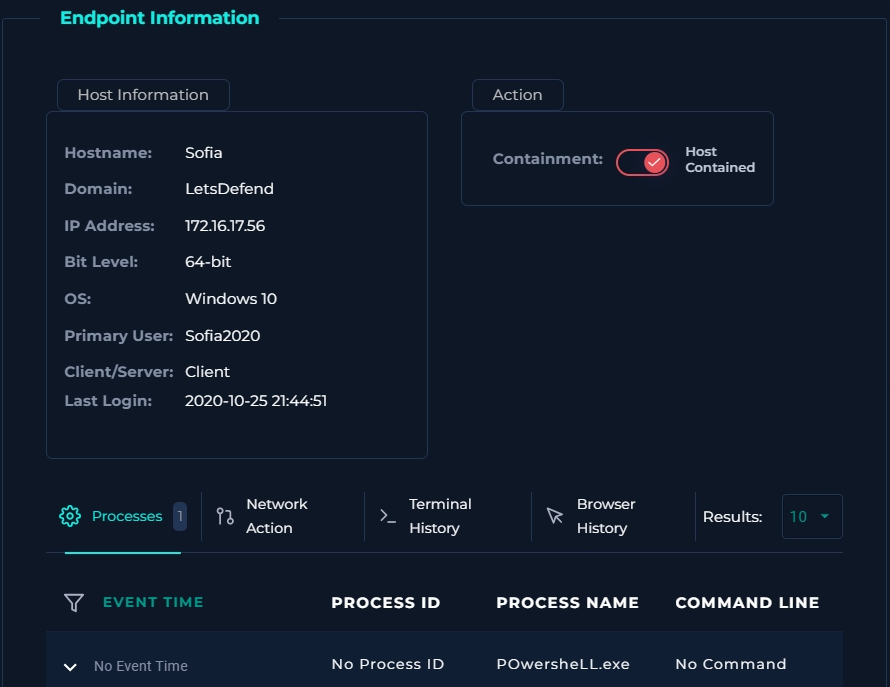
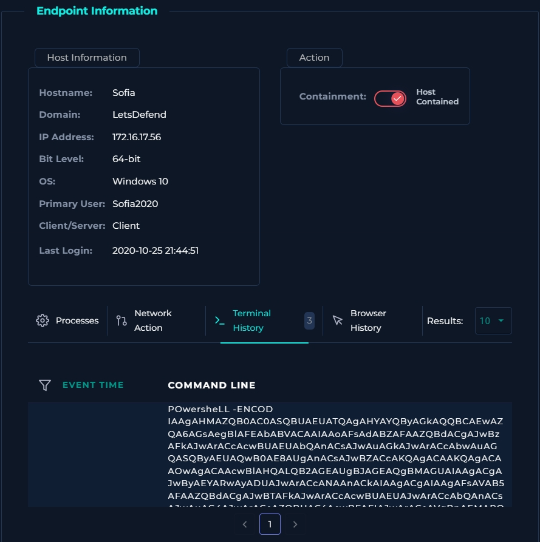
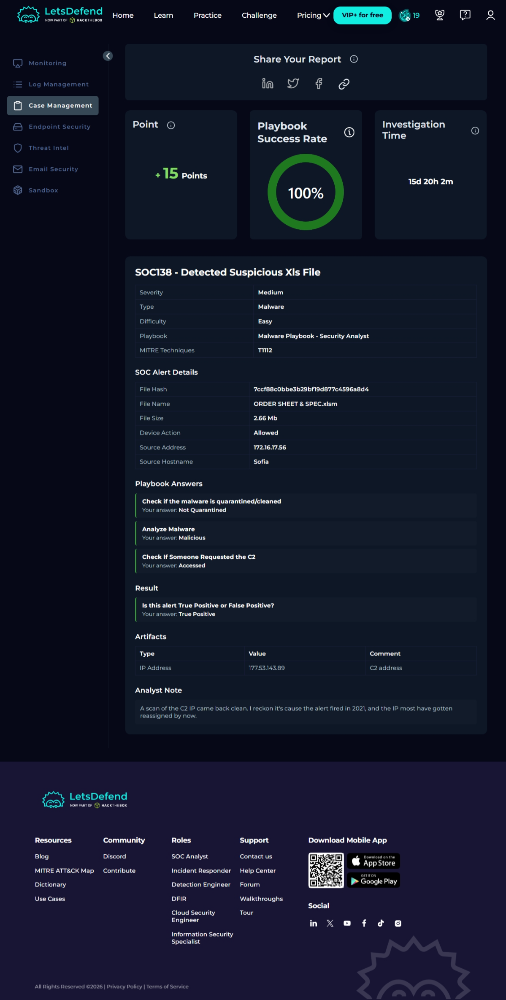
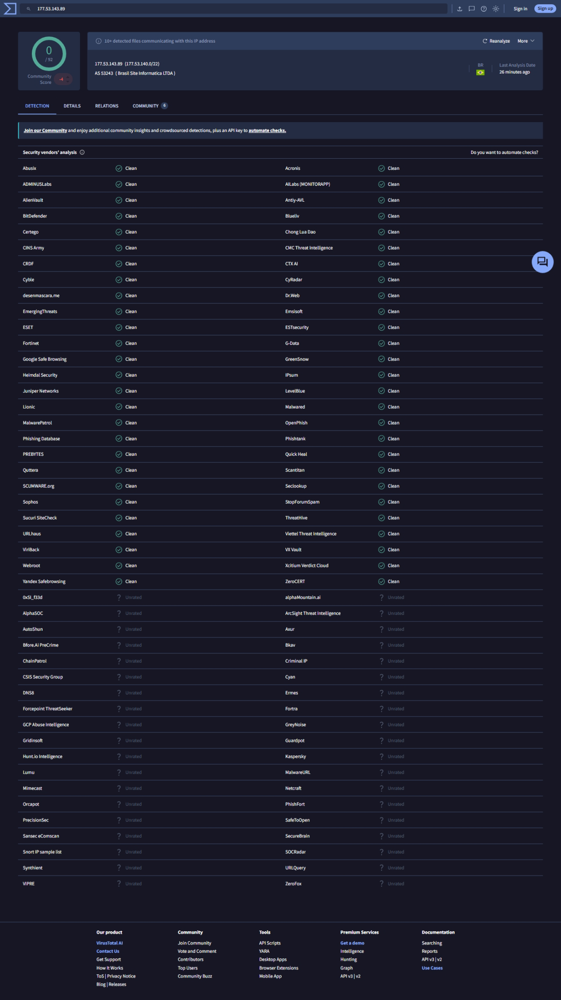
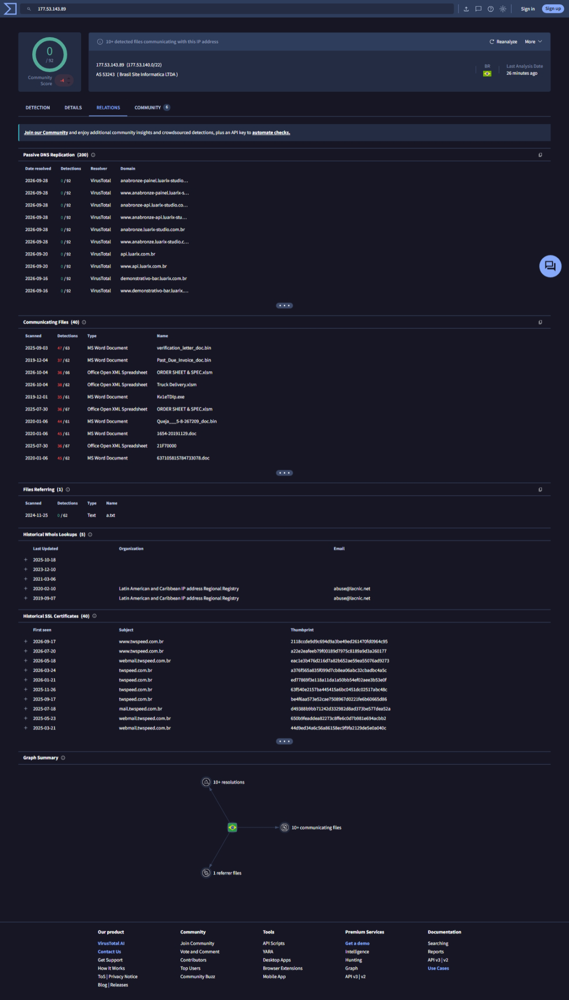

# SOC138 – Detected Suspicious Xls File (LetsDefend Alert #77)

| | |
|---|---|
| **Platform** | LetsDefend (SOC Analyst, Malware Playbook) |
| **Alert / Event ID** | SOC138 / 77 |
| **Severity / Type / Difficulty** | Medium / Malware / Easy |
| **Alert time** | 2021-03-13 20:20:58 (+03:00) |
| **Affected host** | Sofia – 172.16.17.56 – Windows 10 64-bit – user `Sofia2020` |
| **Malicious file** | `ORDER SHEET & SPEC.xlsm` (2.66 MB) |
| **File hash (alert, MD5)** | `7ccf88c0bbe3b29bf19d877c4596a8d4` |
| **C2 address** | `177.53.143.89:443` |
| **Alert-listed MITRE technique** | T1112 – Modify Registry |
| **Verdict** | **True Positive** – macro-enabled Excel dropper, device action *Allowed*, C2 contact, encoded PowerShell on host |
| **Playbook result** | 100% (Not Quarantined / Malicious / Accessed) |

---

## 1. Summary

An alert fired for a suspicious macro-enabled Excel file (`ORDER SHEET & SPEC.xlsm`) on host **Sofia**. The security device **allowed** the file, so it was not quarantined. VirusTotal flags the file as a trojan/dropper/downloader (46/65 vendors) abusing macros and CVE-2017-11882. Firewall logs show Sofia connecting to `177.53.143.x` on port 443 at the time of the alert, and the endpoint's terminal history contains an **obfuscated, Base64-encoded PowerShell command**. I confirmed the C2 contact, marked the alert as a **True Positive**, and **contained the host**.



---

## 2. Investigation

### 2.1 Was the malware quarantined? – **Not Quarantined**

The alert shows **Device Action: Allowed**. The file was not blocked or cleaned, so it reached the user's machine.

### 2.2 Is the file malicious? – **Malicious**

I searched the file on VirusTotal.

- **46 / 65** vendors flag it as malicious. Threat label `trojan.acao/docdl`; categories *trojan, dropper, downloader*; family labels *acao, docdl, valyria*.
- Behaviour tags include `macros`, `auto-open`, `macro-run-file`, `executes-dropped-file`, `run-dll`, `calls-wmi`, `detect-debug-environment`, `long-sleeps`, `checks-user-input`, `clipboard` and **`cve-2017-11882`** (Equation Editor exploit).
- Example vendor names: Microsoft `Exploit:O97M/CVE-2017-11882.VA!MTB`, Kaspersky `HEUR:Trojan-Dropper.Script.Generic`, Symantec `Trojan.Mdropper`, ClamAV `Xls.Dropper.Valyria`, ESET `VBS/TrojanDownloader.Agent.UMT`.



**Sandbox behaviour** (CAPE, DOCGuard, Dr.Web vxCube, Lastline, Tencent HABO, VMRay, Zenbox):

- Sandboxes classify it as *exploit*, *malware*, *evader* and *trojan*.
- Network IDS hits: Snort `MALWARE-CNC DNS Fast Flux attempt` (high), Emerging Threats `TLS Handshake Failure`, and a malicious **JA3 client fingerprint (Tofsee)** from the Abuse.ch SSLBL.
- Observed an HTTP **GET to `https://multiwaretecnologia.com.br/js/Podalir4.exe`**, which looks like a second-stage executable download. That URL now returns **404** and is flagged 8/91, so the payload could not be retrieved.
- VirusTotal-reported techniques include Scripting (T1064), Exploitation for Client Execution (T1203), User Execution (T1204), Obfuscated Files or Information (T1027), Masquerading (T1036), Process Injection (T1055) and Input Capture (T1056).



**Relations tab** ties the file to the alert and shows its structure:

- One of its three *execution parents* is a ZIP named **`7ccf88c0bbe3b29bf19d877c4596a8d4.zip`**, which is the alert's MD5. The file name and size (2.66 MB) also match the alert.
- Bundled files include `xl/vbaProject.bin` (40/63), `xl/embeddings/oleObject1.bin` and `oleObject2.bin` (both flagged, consistent with an embedded OLE/Equation Editor exploit), and `Module2.bas`.
- Dropped files include `xx.vbs` (30/62) and `asc.txt:script1.vbs` (22/62), so the macro drops VBScript.
- Contacted IPs include **`177.53.143.89`** (AS53243, Brazil), which is the C2 address in the alert.



### 2.3 Did anyone request the C2? – **Accessed**

**Firewall logs for 172.16.17.56 (Log Management):**

| Time (log) | Type | Source | Destination | Port |
|---|---|---|---|---|
| 2021-03-13 18:20:58 | Firewall | 172.16.17.56:52155 | 177.53.143.x (truncated in the UI; C2 artifact is 177.53.143.89) | 443 |
| 2021-03-13 18:20:10 | Firewall | 172.16.17.56:52155 | 177.53.143.x | 443 |
| 2020-10-19 20:17:38 | Proxy | 172.16.17.56:32212 | 35.189.10.17 | 80 |



- The two firewall entries share **the same source port (52155)** and are 48 seconds apart, so they most likely belong to one TCP session logged twice.
- The 18:20:58 entry matches the alert's seconds (`20:20:58`). The two-hour difference is a timezone display offset between the alert (+03:00) and the log view.
- The **raw logs** are, left to right, the 18:20:58 entry and the 18:20:10 entry. Both payloads are unreadable binary, which is what TLS-encrypted traffic on port 443 looks like. The C2 conversation is encrypted, so the content can't be recovered from these logs.
- The October 2020 proxy entry to `35.189.10.17:80` predates the alert by five months and nothing in the evidence ties it to this incident. I noted it for completeness only.

Because Sofia connected to the C2 IP after the file was allowed, the answer is **Accessed**.

### 2.4 Endpoint evidence



- Process list (1 entry): **`POwersheLL.exe`** with no process ID, event time or command line recorded. The odd mixed-case spelling is a common trick to dodge simple string matching.
- Terminal history (3 entries): the first is **`POwersheLL -ENCOD <Base64>`**.



**Decoding the visible portion** (the screenshot is truncated; Base64 for `-EncodedCommand` is UTF-16LE):

```powershell
set-ITEM variABLe:kzeQlU  ([tYPe]('sY'+'sTEm'+'.i'+'o.dIrECtOR'+'Y')  )  ;
seT-vaRIaBLe  ('rFG25'+'4')   ([T...
```

- It builds the .NET type name `System.IO.Directory` from split string fragments, and keeps more type references in variables. This is **string-concatenation and random-case obfuscation** to hide `System.IO` calls from signature-based detection.
- A script that sets up file-system objects like this is typical of a downloader preparing to write a payload to disk. The rest of the command could not be viewed (the UI would not scroll), so I can't say what it downloads or runs.

---

## 3. Verdict – True Positive

- Macro-enabled Excel file with a 46/65 detection rate, exploiting CVE-2017-11882 and dropping VBScript.
- Not blocked by the security device (Allowed).
- Host contacted the C2 IP over 443.
- Encoded and obfuscated PowerShell executed on the host.

**Action taken:** host **Sofia (172.16.17.56)** contained.



---

## 4. C2 IP analysis – why a "clean" IP is still the C2

`177.53.143.89` scores **0/92** on VirusTotal (AS53243, Brasil Site Informatica LTDA, Brazil). A clean score is **not** a verdict that the IP is harmless.



The Relations tab shows a different picture:

- **40 communicating files**, many with 35–47 detections: `verification_letter_doc.bin` (47/63), `Past_Due_Invoice_doc.bin` (37/62), `Truck Delivery.xlsm` (38/62), `Kv1eTDlp.exe` (35/61), and **`ORDER SHEET & SPEC.xlsm`**, the same file, scanned again 2026-10-04 (36/66).
- Passive DNS and SSL data (`luarix-studio.com.br`, `luarix.com.br`, `twspeed.com.br`, webmail hostnames) point to **shared hosting**. The IP is a server with many tenants, so reputation engines rarely flag the IP itself.
- The IP is **hard-coded in the sample**: it appears in the file's *Contacted IPs*, so every sandbox run of the file reaches out to it.



### Analyst note – refining my first take

My first reading was that the scan came back clean because the alert is from 2021 and the IP was probably reassigned since. That is plausible, since the IP's current passive DNS shows 2026 hostnames that did not exist in 2021. But:

1. **IP reputation is a point-in-time snapshot.** A 2026 scan cannot tell me who held the IP in March 2021.
2. **Malware has been tied to this IP for years**: communicating files are dated 2019, 2020, 2025 and 2026.
3. **The verdict never depended on the C2 score.** The file is malicious, the host connected to the IP, and encoded PowerShell ran.

The reassignment take is only theory. To test it, I would check historical WHOIS (a record dated **2021-03-06**, one week before the alert, is listed but there was no further details when I expanded it) and passive DNS entries from early 2021.

---

## 5. Indicators of compromise

| Type | Value | Note |
|---|---|---|
| File name | `ORDER SHEET & SPEC.xlsm` | Macro-enabled Excel dropper, 2.66 MB |
| MD5 (alert) | `7ccf88c0bbe3b29bf19d877c4596a8d4` | Also the name of an execution-parent ZIP |
| SHA-256 (VirusTotal) | `7bcd31bd41686c32663c7cabf42b18c50399e3b3b4533fc2ff002d9f2e058813` | 46/65 |
| IP address | `177.53.143.89` | C2, AS53243, Brazil, port 443 |
| URL | `https://multiwaretecnologia.com.br/js/Podalir4.exe` | Second-stage download seen in sandbox (404 now) |
| Process / command | `POwersheLL -ENCOD ...` | Obfuscated, Base64-encoded PowerShell |
| Dropped files | `xx.vbs`, `asc.txt:script1.vbs` | VBScript dropped by the macro |

## 6. MITRE ATT&CK

| Technique | ID | Evidence |
|---|---|---|
| Modify Registry | T1112 | Listed on the alert |
| User Execution: Malicious File | T1204.002 | Macro-enabled Excel file opened by the user |
| Exploitation for Client Execution | T1203 | CVE-2017-11882 tags and vendor detections |
| Command and Scripting Interpreter: PowerShell | T1059.001 | `POwersheLL -ENCOD` in terminal history |
| Obfuscated Files or Information | T1027 | Split-string and mixed-case PowerShell, obfuscated VBA |
| Ingress Tool Transfer | T1105 | `Podalir4.exe` download observed in sandbox |
| Application Layer Protocol: Web Protocols | T1071.001 | HTTPS traffic to the C2 on 443 |

Only T1112 comes from the alert. The rest are my mapping from the evidence above.

## 7. Recommendations

1. Keep Sofia isolated, then reimage. Do not rely on cleaning a host that ran an encoded PowerShell downloader.
2. Block `177.53.143.89` and `multiwaretecnologia.com.br` at the firewall and proxy.
3. Search firewall and proxy logs for other hosts contacting the IP or URL (only Sofia appears in the logs I checked).
4. Find the delivery vector. The Email Security search is not shown in my screenshots, so the arrival path is not established here.
5. Reset credentials for `Sofia2020` as a precaution.
6. Disable Office macros from the internet and patch Equation Editor (CVE-2017-11882).
7. Add a detection for `powershell -enc` / `-encodedcommand` launches from Office parent processes.

## 8. Evidence limits

- The Terminal History tab shows 3 entries, but the lab UI would not scroll, so only the start of the first command is visible and truncated. The other two entries could not be viewed.
- The Network Action and Browser History tabs had no logs for this host, so they add no evidence either way.
- The destination IP in the firewall logs is truncated in the UI; it is matched to the C2 address in the alert.

## 9. What I learned

- A clean reputation score on an IP means little by itself. The IP's *relations* (communicating files, passive DNS, hosting) tell the real story.
- Obfuscated PowerShell can be partly decoded by hand even from a truncated screenshot.
- Pivot from the file to its infrastructure: the sample's contacted IPs confirmed the C2.
