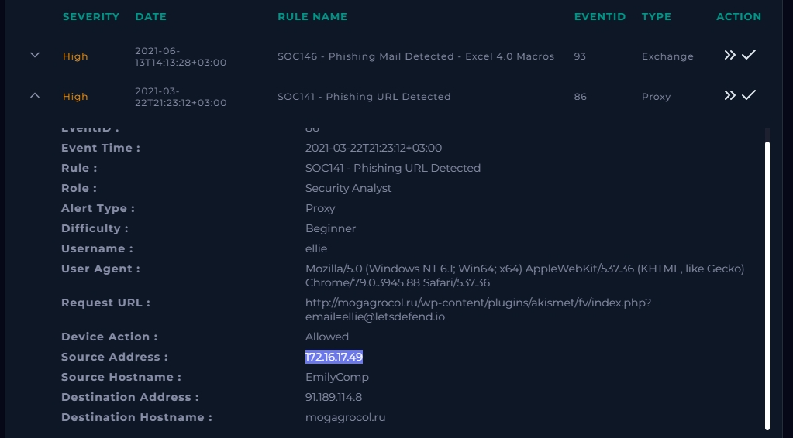
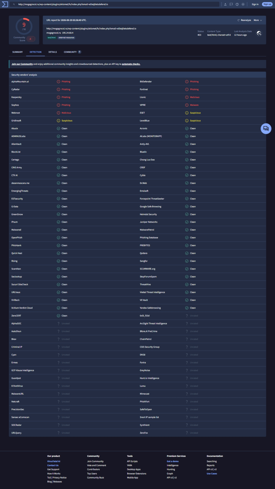
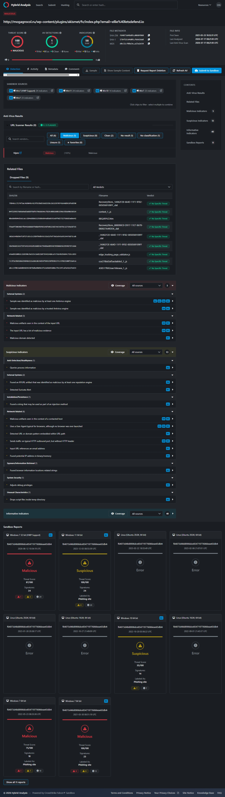
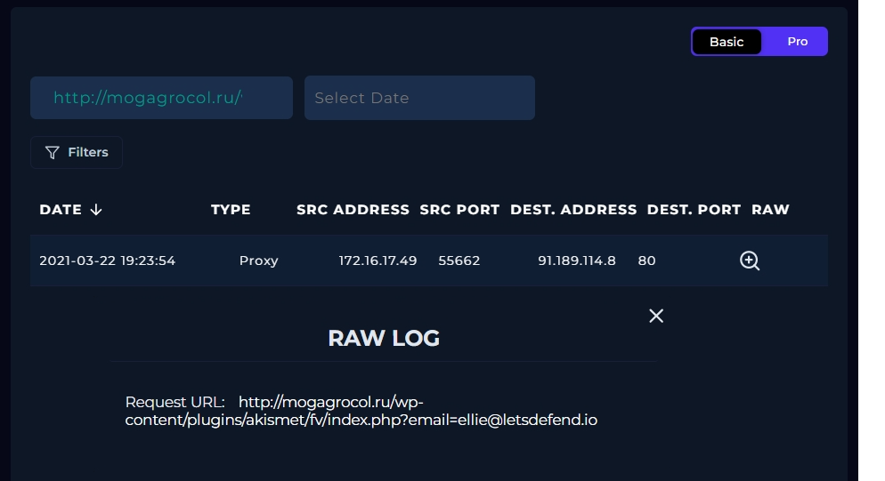
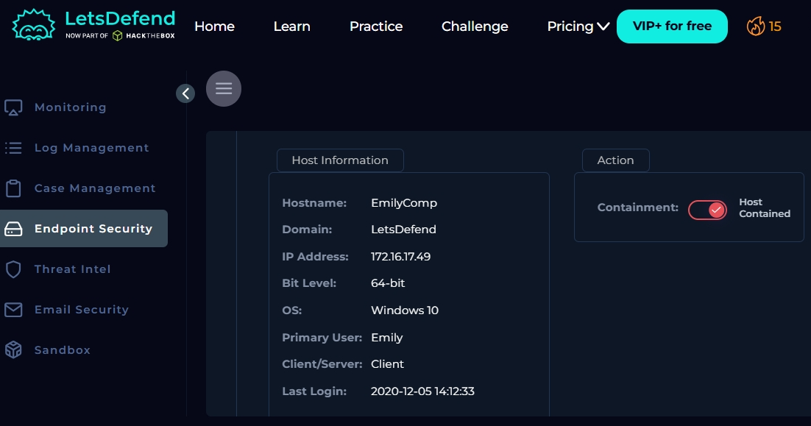

# SOC141 - Phishing URL Detected

**Platform:** LetsDefend (SOC Analyst, Beginner)
**Alert:** SOC141 - Phishing URL Detected (Event ID 86)
**Severity:** High | **Type:** Proxy
**Verdict:** True Positive
**Playbook score:** 10 (100%)
**Analyst:** Nihus-CyberSec

---

## 1. Summary

A proxy alert fired when the workstation **EmilyComp** (172.16.17.49), under the account **ellie**, requested a URL on the domain `mogagrocol.ru`. The URL path imitates the WordPress Akismet plugin directory and carries the user's email address as a query parameter, a common phishing-kit pattern used to pre-fill a fake login page. The proxy **allowed** the request, so the page was loaded from the host.

I analysed the URL with **VirusTotal** and **Hybrid Analysis**. VirusTotal showed 9 of 92 vendors flagging it as malicious or phishing, including Kaspersky, BitDefender, Sophos and Fortinet. Hybrid Analysis returned a **100/100 threat score, verdict Malicious**, with sandbox runs labelling it a phishing site. The alert is a **True Positive**. The host EmilyComp was **contained**.

## 2. Alert Details

| Field | Value |
|---|---|
| Event ID | 86 |
| Rule | SOC141 - Phishing URL Detected |
| Event Time | 2021-03-22 21:23:12 (+03:00) |
| Source Address | 172.16.17.49 |
| Source Hostname | EmilyComp (the computer) |
| Username | ellie (the account) |
| Destination Address | 91.189.114.8 |
| Destination Hostname | mogagrocol.ru |
| Request URL | `http://mogagrocol.ru/wp-content/plugins/akismet/fv/index.php?email=ellie@letsdefend.io` |
| User Agent | Mozilla/5.0 (Windows NT 6.1; Win64; x64) AppleWebKit/537.36 (KHTML, like Gecko) Chrome/79.0.3945.88 Safari/537.36 |
| Device Action | **Allowed** |

> **Note on names:** `ellie` is the user account and the email address in the URL. `EmilyComp` is the hostname of the machine. The browser ran on EmilyComp under ellie's account. In a real environment I would confirm the actual owner of the device through the asset inventory or IT before contacting anyone.

## 3. Investigation

### 3.1 Initial triage of the URL

Observations from the alert alone, before using any tools:

- **Suspicious path.** `/wp-content/plugins/akismet/fv/index.php` looks like a WordPress plugin path, however this is not a known Akismet file path. It rather suggests a phishing kit placed on a compromised WordPress site.
- **Victim email in the query string.** `?email=ellie@letsdefend.io` shows the link was crafted for this user, typical of targeted credential-harvesting emails.
- **Plain HTTP.** No TLS on a page that would be asking for credentials.
- **`.ru` domain** with no business relationship to the company.
- **User agent.** Chrome 79 on Windows NT 6.1 (Windows 7) is an old browser and OS, consistent with a legacy host. Recorded for completeness; not suspicious on its own.

### 3.2 VirusTotal

Submitted the full URL to VirusTotal.

| Item | Result |
|---|---|
| Detection score | **9 / 92** vendors flagged |
| Community score | -3 (9 community comments) |
| Phishing | alphaMountain.ai, BitDefender, CyRadar, Fortinet, Kaspersky, Sophos |
| Malicious | Lionic, Webroot |
| Malware | VIPRE |
| Suspicious | ESET, Gridinsoft, LevelBlue |
| HTTP status on rescan | 403 (the server now refuses the request) |
| Content type | text/html; charset=utf-8 |
| Resolved IP (at time of my scan) | 195.24.68.4 |
| Report time | 2026-09-29 03:26:45 UTC |

Most other vendors returned Clean or Unrated, including Google Safe Browsing, OpenPhish, PhishTank and URLhaus. This is normal for a low-profile phishing page on a compromised site: no single blocklist has it, but several well-known security vendors classify it as phishing or malicious.

The domain resolved to `195.24.68.4` when I scanned it, while the alert shows `91.189.114.8`. This is expected, because the alert is from 2021 and DNS records and hosting change over time. For this investigation the alert IP is the relevant one, and I list both in the IOCs.

### 3.3 Hybrid Analysis

Looked up the URL in Hybrid Analysis.

| Item | Result |
|---|---|
| Verdict | **Malicious** |
| Threat score | **100 / 100** |
| AV detections | 1 / 5 (Vipre flagged Malicious) |
| Indicators | 58 total: 5 malicious, 13 suspicious, 40 informational |
| First seen | 2021-03-23 10:52:11 UTC (one day after the alert) |
| Last analysed | 2026-07-17 08:21:10 UTC |
| Sandbox runs | 11 reports across Windows 7, 10, 11 and Linux |

Sandbox verdicts from the Windows runs ranged from Suspicious to Malicious, with threat scores up to 100/100, and several were labelled **Phishing site**. The Linux runs errored and gave no result.

**Malicious indicators reported:**
- Identified as malicious by at least one antivirus engine, and by a trusted antivirus engine
- Malicious artifacts seen in the context of the input URL
- The input URL has a lot of malicious evidence
- Malicious domain detected

**Notable suspicious indicators:**
- URL or domain pattern embedded within the URL path
- Input URL references an email address
- A Suricata alert was triggered
- Traffic sent on a typical HTTP outbound port but without an HTTP header
- Script files dropped in the temp directory (for example `context_1_.js` and `edge_tracking_page_validator.js` among the 9 dropped files, each with "No Specific Threat" verdicts)
- Queries process information, and looks up browser information locations

These sandbox behaviours describe what happened when the page was detonated in Hybrid Analysis. They show the page's nature but are not proof of what ran on EmilyComp. I did not find evidence of a malware download on the host from this alert.

**Conclusion of threat intelligence:** Both tools agree the URL is malicious and phishing-related.

### 3.4 Did anyone access it?

Playbook question: *Has anyone accessed the IP/URL/Domain?*

- Searched the proxy logs for `mogagrocol.ru` and the destination IP.
- The alert shows **Device Action: Allowed**, and the log confirms a request from 172.16.17.49 (EmilyComp).
- **Answer: Accessed.**

### 3.5 Playbook answers

| Question | Answer |
|---|---|
| Has anyone accessed the IP/URL/Domain? | Accessed |
| Analyze URL Address | Malicious |

## 4. Containment

**EmilyComp (172.16.17.49) was contained** through the LetsDefend Endpoint Security console to prevent further communication and possible lateral movement while the account exposure is assessed.

## 5. Indicators of Compromise (IOCs)

| Type | Value |
|---|---|
| Domain | mogagrocol.ru |
| IP (at alert time) | 91.189.114.8 |
| IP (resolved during my VirusTotal scan) | 195.24.68.4 |
| URL | `http://mogagrocol.ru/wp-content/plugins/akismet/fv/index.php?email=ellie@letsdefend.io` |
| Affected host | EmilyComp (172.16.17.49) |
| Affected user | ellie |

## 6. MITRE ATT&CK Mapping

| Tactic | Technique |
|---|---|
| Initial Access | T1566.002 - Phishing: Spearphishing Link (delivery method not confirmed) |
| Execution | T1204.001 - User Execution: Malicious Link |
| Credential Access | Credential harvesting through a fake login page (suspected, not confirmed) |

## 7. Impact Assessment

- The request was allowed, so the phishing page was loaded from EmilyComp under the account ellie.
- Whether credentials were actually submitted **cannot be confirmed from proxy logs alone**, so ellie's account is treated as potentially compromised.
- No evidence of a malware download or execution on the host from this alert.

## 8. Recommendations

### Done

- Contained EmilyComp (172.16.17.49).

### Recommended follow-up

1. **Block** `mogagrocol.ru` and `91.189.114.8` on the proxy and firewall.
2. **Credentials:** reset the password for `ellie`, revoke active sessions, and review sign-ins for unusual activity.
3. **Email hunt:** Delivery source: search mailboxes for the URL to find how it reached the user, and remove any matching emails.
4. **Scope:** search proxy logs for any other host that requested `mogagrocol.ru`.
5. **User awareness:** inform the user and reinforce phishing-reporting guidance.

## 9. Analyst Note

> SOC141 is a True Positive. User ellie on host EmilyComp (172.16.17.49) accessed the phishing URL http://mogagrocol.ru/wp-content/plugins/akismet/fv/index.php?email=ellie@letsdefend.io, which the proxy allowed. VirusTotal flagged it 9/92 (phishing/malicious by Kaspersky, BitDefender, Sophos, Fortinet and others) and Hybrid Analysis scored it 100/100 Malicious, with sandbox runs labelling it a phishing site. The URL structure suggests a credential-harvesting page on a likely compromised WordPress site. Whether ellie submitted credentials could not be confirmed from proxy logs, so the account is treated as potentially compromised. EmilyComp has been contained.
Recommended: block the domain and IP, reset ellie's credentials and review sign-ins, identify how the link was delivered (search mailboxes for the URL) and remove any matching emails.

## 10. Lessons Learned

- A URL that imitates a legitimate plugin path on a compromised site can slip past reputation lists, so path analysis matters as much as domain reputation. Here, big-name blocklists such as Google Safe Browsing and OpenPhish were clean while several major AV vendors flagged it.
- A victim's email address in the query string is a strong sign of targeted phishing.
- Using two tools gives stronger evidence: VirusTotal for vendor reputation, Hybrid Analysis for sandbox behaviour.
- Rescan results drift over time (different resolved IP, HTTP 403), so record the IOCs from the original alert as well.
- "Allowed" in the proxy log means the investigation must assume user exposure until proven otherwise.

## 11. Tools Used

LetsDefend (Monitoring, Log Management, Endpoint Security, Playbook), VirusTotal, Hybrid Analysis