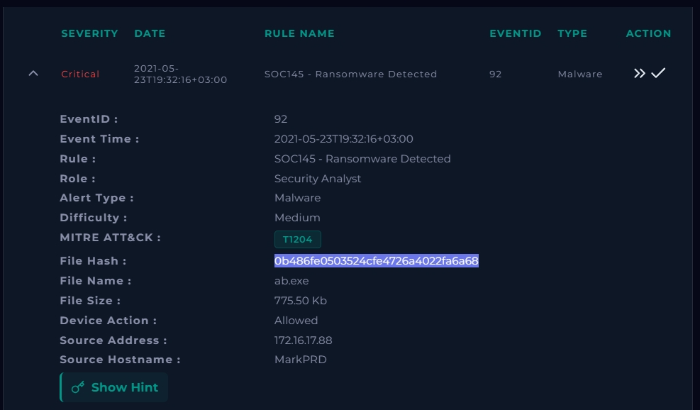
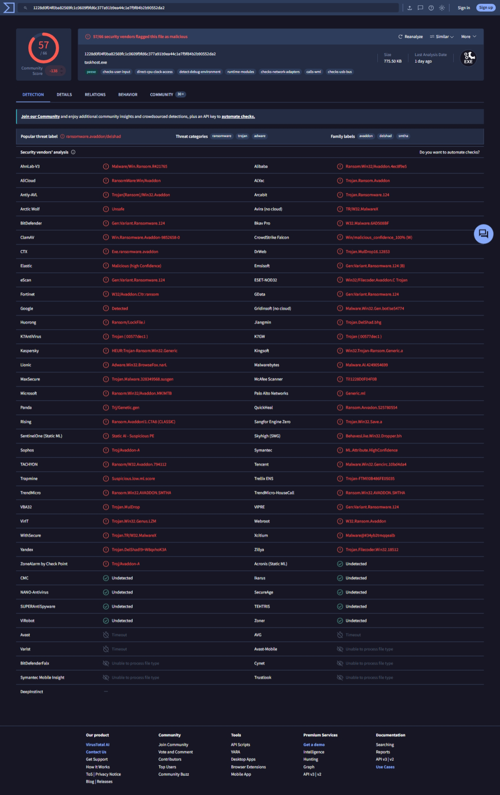
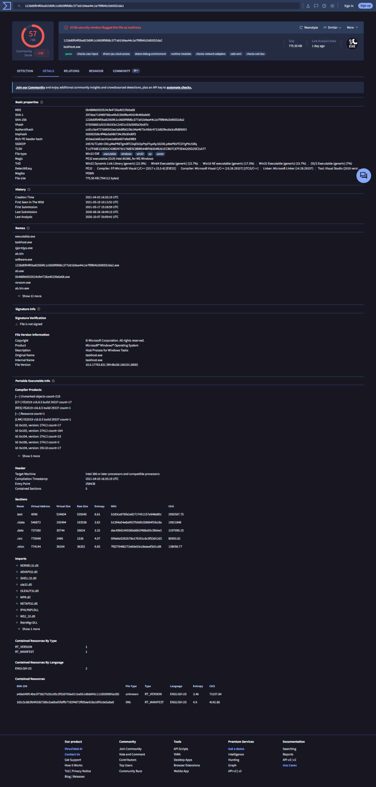
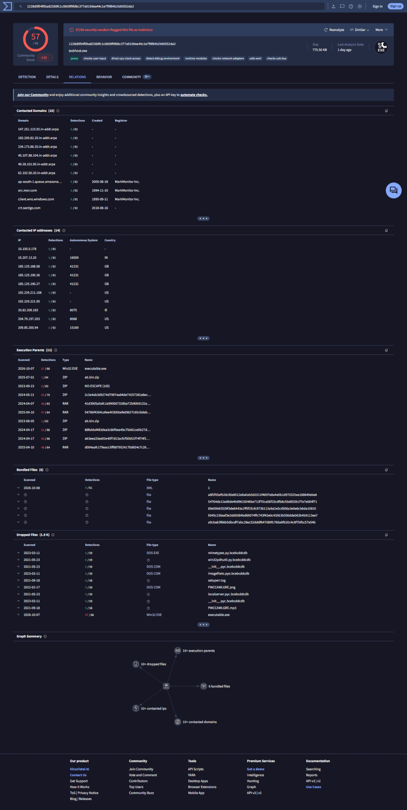
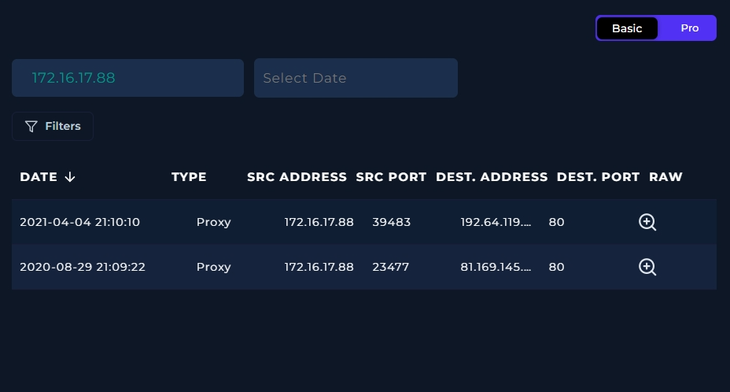
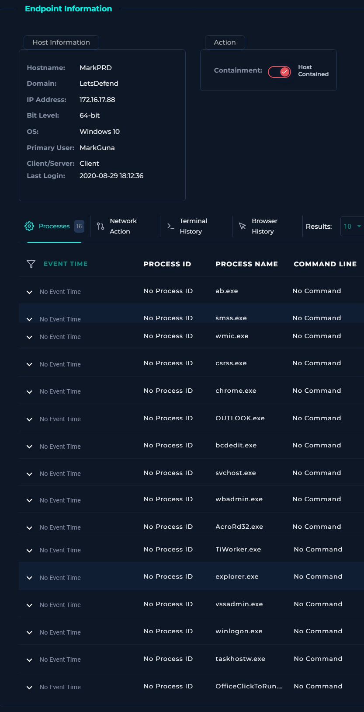
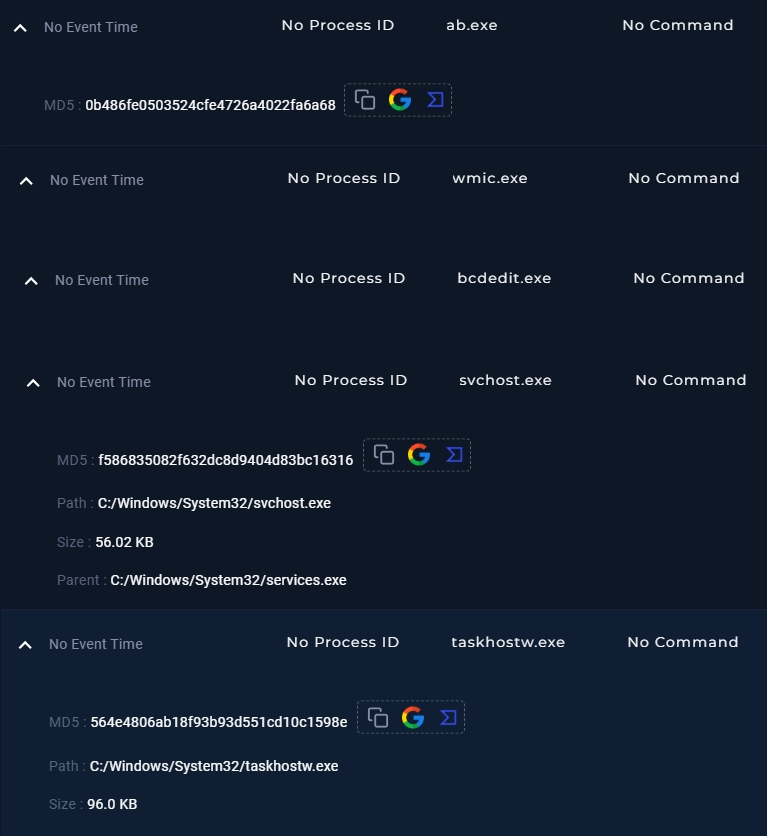
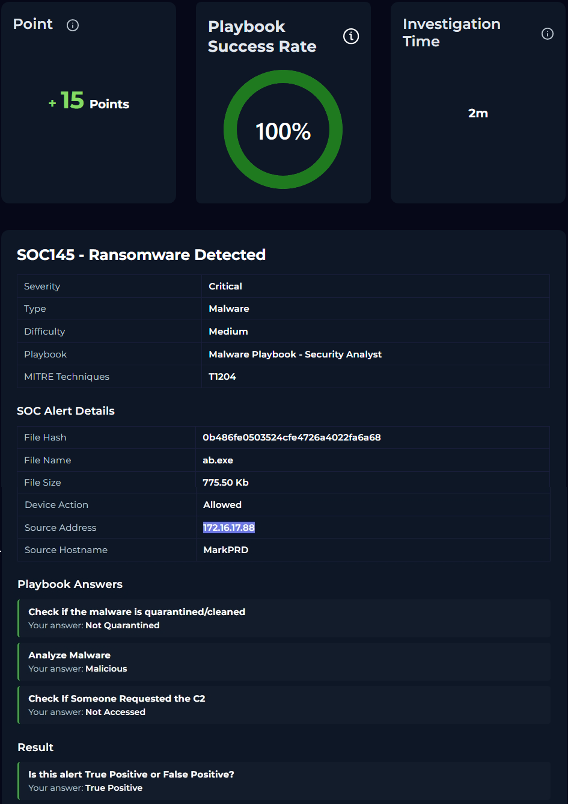

# SOC145 – Ransomware Detected (ab.exe on MarkPRD)

| Field | Value |
|---|---|
| **Platform** | LetsDefend (Security Analyst role) |
| **Alert rule** | SOC145 – Ransomware Detected |
| **EventID** | 92 |
| **Alert time** | 2021-05-23T19:32:16+03:00 (16:32:16 UTC) |
| **Severity / Type / Difficulty** | Critical / Malware / Medium |
| **Affected host** | MarkPRD (172.16.17.88), Windows 10 64-bit, domain LetsDefend, primary user MarkGuna |
| **Malicious file** | ab.exe, 775.50 KB |
| **Device action** | Allowed (not blocked by the security product) |
| **Playbook** | Malware Playbook – Security Analyst |
| **Verdict** | **True Positive** |
| **Analyst** | Nihus-CyberSec |

---

## 1. Summary

At 19:32:16 (+03:00) on 2021-05-23, a critical alert fired for `ab.exe` on workstation MarkPRD (172.16.17.88). The security product's action was **Allowed**, so the file was not blocked or quarantined.

The file hash matches a sample that VirusTotal flags as malicious by 57 of 66 vendors, mostly labelled as the **Avaddon / DelShad ransomware** family. The binary carries Microsoft "taskhost.exe" version information but is unsigned, which indicates masquerading.

The host's process list shows `vssadmin.exe`, `wmic.exe`, `bcdedit.exe` and `wbadmin.exe` running next to `ab.exe`. These are the tools ransomware commonly uses to destroy backups and recovery options. The endpoint data has no timestamps or command lines, so this cannot be tied directly to `ab.exe`.

I contained the host. The alert is a **True Positive**.

**What could not be established:** how `ab.exe` reached the host (initial access), and the process that launched it. No email, proxy or endpoint evidence was available for either. No command-and-control (C2) communication was observed in the available logs.

---

## 2. Alert details

*Figure 1 – The SOC145 alert in the LetsDefend queue, expanded. It shows severity Critical, EventID 92, event time 2021-05-23T19:32:16+03:00, alert type Malware, difficulty Medium and MITRE tag T1204. The file hash 0b486fe0503524cfe4726a4022fa6a68 is highlighted. The file name is ab.exe, size 775.50 KB, device action Allowed, source address 172.16.17.88 and source hostname MarkPRD.*

---

## 3. Investigation

### 3.1 File reputation (VirusTotal)

I searched the alert's MD5 hash on VirusTotal. It resolves to the SHA-256 `1228d0f04f0ba82569fc1c0609f9fd6c377a91b9ea44c1e7f9f84b2b90552da2`, and the MD5 in the Details tab matches the one in the alert, so the results apply to this exact file.

*Figure 2 – VirusTotal Detection tab for the file. The score shows 57 of 66 security vendors flagging it as malicious. The popular threat label is ransomware.avaddon/delshad, the threat categories are ransomware, trojan and adware, and the family labels are avaddon, delshad and smtha. Most vendors list a ransomware or trojan signature (for example Microsoft: Ransom:Win32/Avaddon, Kaspersky: HEUR:Trojan-Ransom.Win32.Generic, CrowdStrike: win/malicious_confidence_100%). A few engines report the file as undetected.*

### 3.2 File properties

*Figure 3 – VirusTotal Details tab. It lists the MD5 (0b486fe0503524cfe4726a4022fa6a68), SHA-1 and SHA-256 hashes, the file type (Win32 EXE, 794,112 bytes) and the compiler (Microsoft Visual C/C++, Visual Studio 2019). The History section shows a compilation timestamp of 2021-04-03 16:35:19 UTC, first seen in the wild 2021-05-19 10:13:52 UTC and first submission 2021-05-17 15:28:59 UTC. The Names section includes executable.exe, taskhost.exe, ab.bin, ransom.exe and ab.exe. Signature Verification reports "File is not signed", while the version information claims Microsoft Windows "Host Process for Windows Tasks" (taskhost.exe, version 10.0.17763.831). The imports include ADVAPI32.dll, NETAPI32.dll, MPR.dll, WS2_32.dll and RstrtMgr.dll.*

Key observations:

- The version information impersonates a Microsoft Windows component, but the file is **not signed**. This is consistent with masquerading.
- The sample was first seen publicly on 2021-05-19, four days before the alert. The compile timestamp can be forged, so it is not used as evidence.
- Of the file names VirusTotal lists, `ransom.exe` and `ab.bin` match the sample under investigation.

### 3.3 Relations (execution parents, dropped files, network)

*Figure 4 – VirusTotal Relations tab. Contacted Domains (15) and Contacted IP addresses (14) are all at 0 detections and appear to be ordinary services (Microsoft, Google, Sectigo, CDN ranges) plus several in-addr.arpa reverse-DNS lookups. Execution Parents (11) are mostly ZIP and RAR archives, including ab.bin.zip. Bundled Files (6) are listed. Dropped Files (1.9K) include many names ending in the extension .bcebcddcdb, such as mimetypes.py.bcebcddcdb, __init__.pyc.bcebcddcdb and localserver.pyc.bcebcddcdb.*

Key observations:

- **Delivery:** the sample is usually seen inside ZIP/RAR archives, which fits user execution (T1204). It does not prove how it reached MarkPRD.
- **Encryption behavior (sandbox):** many dropped files carry the same appended extension (`.bcebcddcdb`). That pattern is consistent with files being encrypted with a ransomware-specific extension in the sandbox.
- **Network:** I found no domain or IP in the contacted list that is clearly C2. They are all at 0/92 detections. The reverse-DNS lookups are unusual, but I could not attribute them to anything.

### 3.4 Network / proxy log review

*Figure 5 – LetsDefend Log Management search for source address 172.16.17.88. Two Proxy entries are returned: 2021-04-04 21:10:10 (source port 39483, destination 192.64.119.190, port 80) and 2020-08-29 21:09:22 (source port 23477, destination 81.169.145.105, port 80). Destination addresses are truncated in the view.*

- Neither entry is near the alert time of 2021-05-23. Both are also earlier than the sample's first-seen date (2021-05-19), so I cannot link either of them to this file.
- There is **no proxy activity from this host around the alert time**. This does not prove there was none: malware can use direct connections or non-HTTP protocols that never touch the proxy.

### 3.5 Endpoint review (MarkPRD)

*Figure 6 – Endpoint Information panel for MarkPRD. Host information: hostname MarkPRD, domain LetsDefend, IP 172.16.17.88, 64-bit, Windows 10, primary user MarkGuna, client, last login 2020-08-29 18:12:36. The Containment toggle is on ("Host Contained"). The Processes tab lists 16 entries: ab.exe, smss.exe, wmic.exe, csrss.exe, chrome.exe, OUTLOOK.exe, bcdedit.exe, svchost.exe, wbadmin.exe, AcroRd32.exe, TiWorker.exe, explorer.exe, vssadmin.exe, winlogon.exe, taskhostw.exe and OfficeClickToRun.exe. Every row shows "No Event Time", "No Process ID" and "No Command".*

I expanded several entries to look for parent-process information:

*Figure 7 – Expanded process rows. ab.exe shows only its MD5 (0b486fe0503524cfe4726a4022fa6a68). wmic.exe and bcdedit.exe show no extra details. svchost.exe shows MD5 f586835082f632dc8d9404d83bc16316, path C:/Windows/System32/svchost.exe, size 56.02 KB and parent C:/Windows/System32/services.exe. taskhostw.exe shows MD5 564e4806ab18f93b93d551cd10c1598e, path C:/Windows/System32/taskhostw.exe and size 96.0 KB. None of the rows has a timestamp, PID or command line.*

Key observations:

- The endpoint data has **no parent process for `ab.exe`**, no timestamps and no command lines. This is a telemetry limitation, not evidence either way.
- `svchost.exe` and `taskhostw.exe` are in their normal System32 locations with the expected parent (services.exe, for svchost), so nothing here suggests they are fake.
- The presence of `vssadmin.exe`, `wmic.exe`, `bcdedit.exe` and `wbadmin.exe` is notable, because ransomware commonly uses them to delete shadow copies, disable recovery and remove backups. Without command lines and times I cannot confirm what they were doing or that `ab.exe` launched them.
- `chrome.exe`, `OUTLOOK.exe`, `AcroRd32.exe` and `OfficeClickToRun.exe` are listed, but with no parent/child data I cannot link any of them to `ab.exe`, so I am not speculating on a delivery vector from them.
- **Last login anomaly:** the host lists a last login of 2020-08-29, nine months before the alert. I treat this as a data-quality caveat, not evidence of anything. The field can be stale, and a long-lived session, cached credentials or a service/scheduled task would not update it. In a real case I would verify with Windows logon events (4624 / 4648).

### 3.6 Initial access

**Undetermined.** No related email, proxy or endpoint telemetry was found, and the parent process of `ab.exe` is not recorded. The sample is commonly distributed in ZIP/RAR archives, and the alert's T1204 tag suggests user execution, but this is not confirmed.

### 3.7 Command and control

**No C2 communication was observed in the available logs.** Proxy logs show nothing near the alert time, and the VirusTotal contacted domains/IPs show no clear C2 infrastructure. This is a statement about the evidence available, not proof that no communication occurred.

---

## 4. Timeline

| Time | Event | Source |
|---|---|---|
| 2020-08-29 18:12:36 | Last login recorded for MarkPRD | Endpoint info |
| 2021-04-03 16:35:19 UTC | Compilation timestamp of the sample (can be forged) | VirusTotal |
| 2021-05-17 15:28:59 UTC | First submission to VirusTotal | VirusTotal |
| 2021-05-19 10:13:52 UTC | Sample first seen in the wild | VirusTotal |
| 2021-05-23 19:32:16 (+03:00) | SOC145 alert fires for `ab.exe` on MarkPRD, device action Allowed | Alert |
| After alert | Host contained by analyst | Endpoint info |

---

## 5. MITRE ATT&CK mapping

| Technique | Name | Status | Basis |
|---|---|---|---|
| T1204 | User Execution | Suspected | Tag on the alert. The sample is usually delivered in archives, but execution was not observed directly. |
| T1486 | Data Encrypted for Impact | Assessed, not confirmed on the host | The file is classified as Avaddon ransomware by 57/66 vendors, and the sandbox shows dropped files with an appended extension. No encrypted files were seen on MarkPRD in the available data. |
| T1490 | Inhibit System Recovery | Suspected | `vssadmin.exe`, `wmic.exe`, `bcdedit.exe` and `wbadmin.exe` appear in the process list. Command lines and timing are missing, so this is not tied to `ab.exe`. |
| T1036 | Masquerading | Supported | Microsoft taskhost.exe version information on an unsigned binary. |

---

## 6. Indicators of compromise

| Type | Value |
|---|---|
| MD5 | `0b486fe0503524cfe4726a4022fa6a68` |
| SHA-1 | `297dea71d489768ce45d23b0f8a45424b469ab00` |
| SHA-256 | `1228d0f04f0ba82569fc1c0609f9fd6c377a91b9ea44c1e7f9f84b2b90552da2` |
| File name | `ab.exe` (also seen as `executable.exe`, `ab.bin`, `ransom.exe`) |
| File size | 794,112 bytes (775.50 KB) |
| Appended extension (sandbox) | `.bcebcddcdb` |
| Affected host | MarkPRD / 172.16.17.88 |

---

## 7. Response actions

- Confirmed the alert as a **True Positive** (known ransomware family, 57/66 detections).
- **Contained MarkPRD** from the endpoint console to stop further execution and spread.
- The malware was **not quarantined** by the security product (device action Allowed).

---

## 8. Limitations

- No parent process, timestamps or command lines in the endpoint data, so process relationships cannot be reconstructed.
- No email or proxy evidence for delivery, so initial access is unknown.
- Encryption of files on MarkPRD is inferred from the malware family and sandbox behavior, not seen on the host.
- The last-login value (2020-08-29) conflicts with the alert date and was not verified against logon events.
- VirusTotal is a third-party source. I did not find this hash on Hybrid Analysis, which only means nobody has submitted it there.

---

## 9. Recommendations

1. Keep MarkPRD isolated and preserve a disk and memory image before any cleanup.
2. Search the environment (EDR, SIEM, email gateway) for the SHA-256/MD5 and for the `.bcebcddcdb` extension to find other affected hosts.
3. Review email gateway logs for ZIP/RAR attachments sent to MarkGuna, and review web downloads, to find the delivery vector.
4. Collect file-origin artifacts from the host (download path, Zone.Identifier, Amcache, Prefetch) to establish when and how `ab.exe` arrived.
5. Pull process creation logs (Sysmon Event ID 1 or Windows 4688) to see the parent of `ab.exe` and the command lines of `vssadmin.exe`, `wmic.exe`, `bcdedit.exe` and `wbadmin.exe`.
6. Check logon events (4624/4648) for MarkGuna and look for lateral movement from 172.16.17.88.
7. Reset the credentials of MarkGuna and any account used on the host.
8. Check whether shadow copies and backups survived, and confirm backups are intact and offline before restoring.
9. Assess possible data theft. Avaddon operators were known for double extortion, so exfiltration should be considered.
10. Block the hash on the endpoint protection platform and add detection for shadow-copy deletion (vssadmin / wbadmin / bcdedit / wmic).

---

## 10. Playbook answers

*Figure 8 – LetsDefend result page for SOC145. It shows +15 points, a playbook success rate of 100% and an investigation time of 2 minutes. The summary table repeats the alert details (Critical, Malware, Medium, Malware Playbook – Security Analyst, T1204, hash, ab.exe, 775.50 Kb, Allowed, 172.16.17.88, MarkPRD). The playbook answers are: malware quarantined/cleaned – Not Quarantined; analyze malware – Malicious; someone requested the C2 – Not Accessed. The final answer is True Positive.*

The C2 question offers only Accessed or Not Accessed. I chose **Not Accessed** because no communication with a known C2 address was observed. See section 3.7 for the caveat.

---

## 11. Conclusion

`ab.exe` on MarkPRD is Avaddon ransomware. It was allowed to run, and the host's process list shows recovery-inhibiting tools (`vssadmin`, `wbadmin`, `bcdedit`, `wmic`) alongside it. The host has been contained.

Initial access and the launching process could not be determined from the available data, and encryption on the host is assessed rather than confirmed. The next steps are to find the delivery vector, hunt for the same hash elsewhere, and confirm the state of backups.
