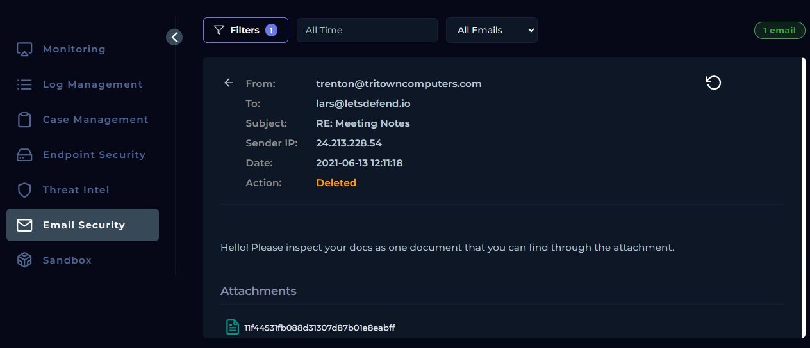
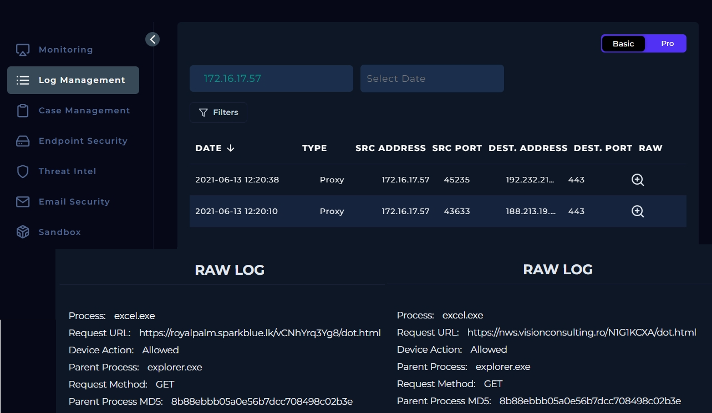
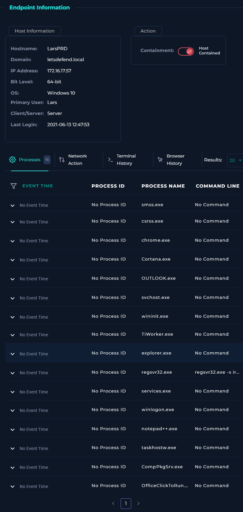
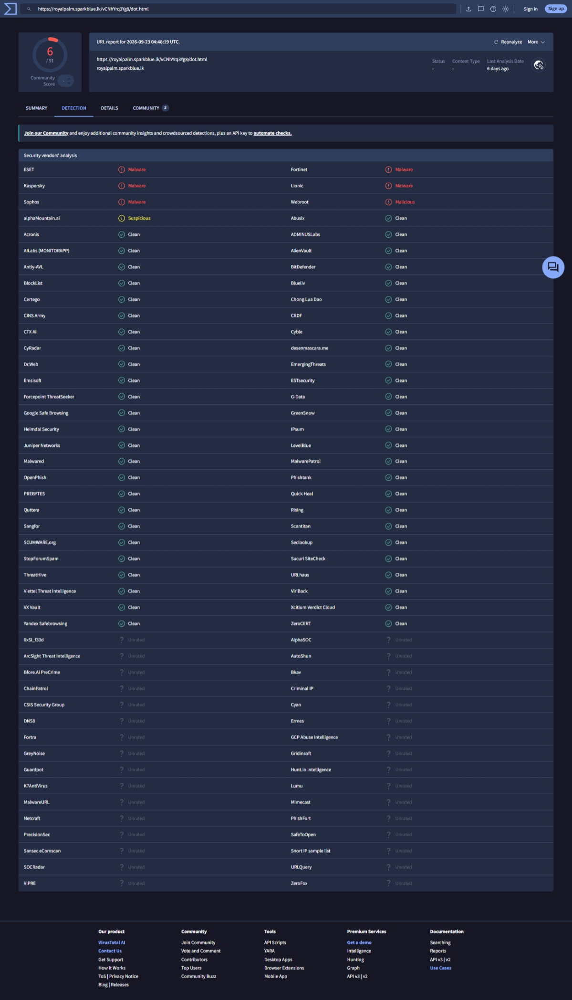
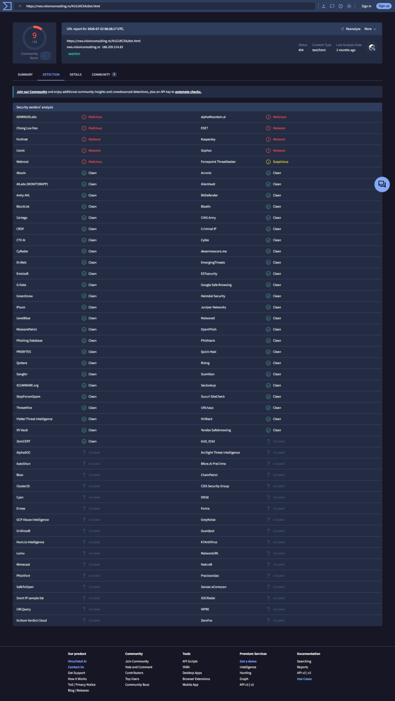

# SOC146: Phishing Mail Detected - Excel 4.0 Macros

**Platform:** LetsDefend | **Severity:** High | **Type:** Exchange | **Result:** True Positive | **Playbook:** 20 (100%)
**MITRE ATT&CK:** T1566.001, T1204.002, T1105, T1218.010 (see mapping below)

## Summary

A phishing email with an Excel attachment was delivered to `lars@letsdefend.io`. Proxy logs show `excel.exe` on LarsPRD requesting two external URLs, both flagged malicious on VirusTotal. The host's terminal history shows `regsvr32.exe -s iroto.dll`, consistent with Excel 4.0 macro malware. The host was contained.

## Alert details

| Field | Value |
|---|---|
| Sender | trenton@tritowncomputers.com (24.213.228.54) |
| Recipient | lars@letsdefend.io |
| Subject | RE: Meeting Notes |
| Email time | 2021-06-13 12:11:18 |
| Attachment MD5 | 11f44531fb088d31307d87b01e8eabff |

## Investigation

1. **Email:** unknown external sender, fake "RE:" subject with no prior thread, generic lure, attachment present.
2. **Attachment hash:** searching the MD5 on VirusTotal and Hybrid Analysis returned no results. An unknown hash means "not seen before", not "clean", so the verdict had to rest on other evidence.
3. **Proxy logs:** `excel.exe` (parent `explorer.exe`) sent GET requests to two external URLs at 12:20. An Office process fetching from the web is abnormal. It shows the attachment was opened.
4. **URL reputation:** both URLs are flagged malicious on VirusTotal (screenshots below).
5. **Endpoint (LarsPRD, 172.16.17.57):** terminal history shows `regsvr32.exe -s iroto.dll`.

### VirusTotal results

| URL | Detections | Notes |
|---|---|---|
| `https://royalpalm.sparkblue.lk/vCNhYrq3Yg8/dot.html` | 6 / 91 | ESET, Fortinet, Kaspersky, Lionic, Sophos, Webroot |
| `https://nws.visionconsulting.ro/N1G1KCXA/dot.html` | 9 / 92 | Same vendors plus ADMINUSLabs, Chong Lua Dao, alphaMountain. Now returns 404 |

These reports reflect vendor verdicts at the time of checking, not at the time of the incident.

### The regsvr32 command

`regsvr32.exe -s iroto.dll`

- `regsvr32.exe` is a legitimate Windows tool that attackers abuse to run code through a trusted binary.
- `-s` runs it silently, so the user sees nothing.
- `iroto.dll` is a randomly named DLL, which is how a dropped payload usually looks.

This is consistent with the usual Excel 4.0 macro pattern: the macro downloads a file disguised as `dot.html`, saves it as a DLL, and runs it with `regsvr32`. I did not confirm that `iroto.dll` is the file downloaded from those URLs.

`excel.exe` was not in LarsPRD's process list, so it is evidenced by the proxy logs only.

## MITRE ATT&CK mapping

The alert itself lists only T1566. The mapping below is based on the evidence I gathered.

| Tactic | Technique | Evidence | Confidence |
|---|---|---|---|
| Initial Access | T1566.001 Spearphishing Attachment | Unknown sender, fake "RE:" subject, attachment delivered to Lars | Confirmed |
| Execution | T1204.002 User Execution: Malicious File | `excel.exe` made web requests at 12:20, so the attachment was opened | Confirmed |
| Command and Control | T1105 Ingress Tool Transfer | `excel.exe` GET requests to two URLs flagged malicious on VirusTotal | Likely: I did not see the downloaded file |
| Defense Evasion | T1218.010 Regsvr32 | `regsvr32.exe -s iroto.dll` in LarsPRD terminal history | Confirmed |

## Triage

| Question | Answer |
|---|---|
| Is it real? | Yes. True Positive: the attachment was opened, the host contacted malicious URLs, and a suspicious `regsvr32` command ran. |
| Severity | High. Code execution on a host (listed as a Server), not just a delivered email. |
| Stage reached | Installation. The user opened the attachment, a payload was likely fetched, and a DLL was run through `regsvr32`. |
| Confirmed scope | One host: LarsPRD (172.16.17.57), one user: Lars. |
| Unknown scope | Lateral movement and data theft were not checked. Other recipients of the email were not checked. |
| Immediate action | Contain LarsPRD. |

### Next priorities

1. Search proxy logs for other hosts contacting the two URLs and IPs.
2. Check whether the email reached other mailboxes and delete it.
3. Look for LarsPRD connecting to other internal hosts on ports 445, 3389, 5985 and 135.
4. Reset Lars's credentials.
5. Block the sender, URLs and IPs.
6. Reimage LarsPRD after investigation.

## Indicators of compromise

| Type | Value |
|---|---|
| Sender | trenton@tritowncomputers.com |
| Sender IP | 24.213.228.54 |
| Attachment MD5 | 11f44531fb088d31307d87b01e8eabff |
| Payload URL | https://royalpalm.sparkblue.lk/vCNhYrq3Yg8/dot.html |
| Payload URL | https://nws.visionconsulting.ro/N1G1KCXA/dot.html |
| Destination IPs (proxy logs) | 192.232.219.67, 188.213.19.81 |
| Command | `regsvr32.exe -s iroto.dll` |

## Actions taken

- Contained LarsPRD.

## Lessons learned

- An unknown file hash is not evidence of safety. Pivot to behaviour: proxy logs, URLs and endpoint commands.
- `excel.exe` making web requests is a strong detection opportunity.
- `regsvr32` with `-s` and an unusual DLL name is a red flag.