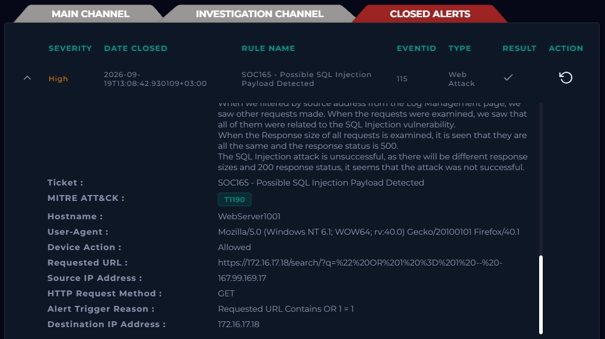
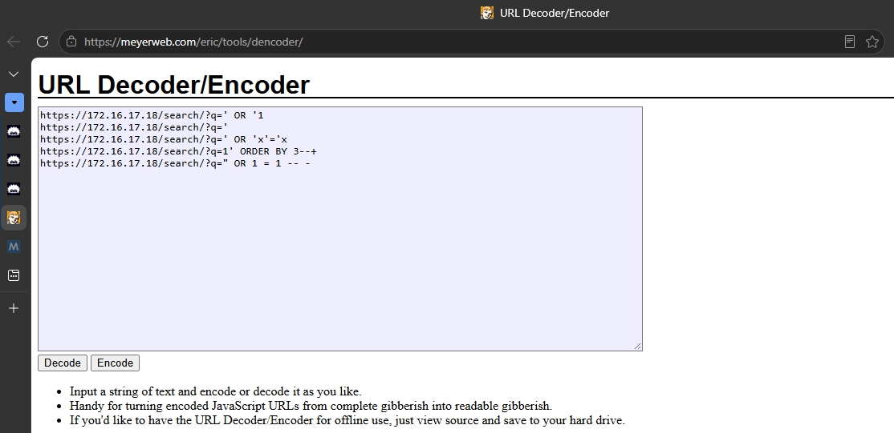
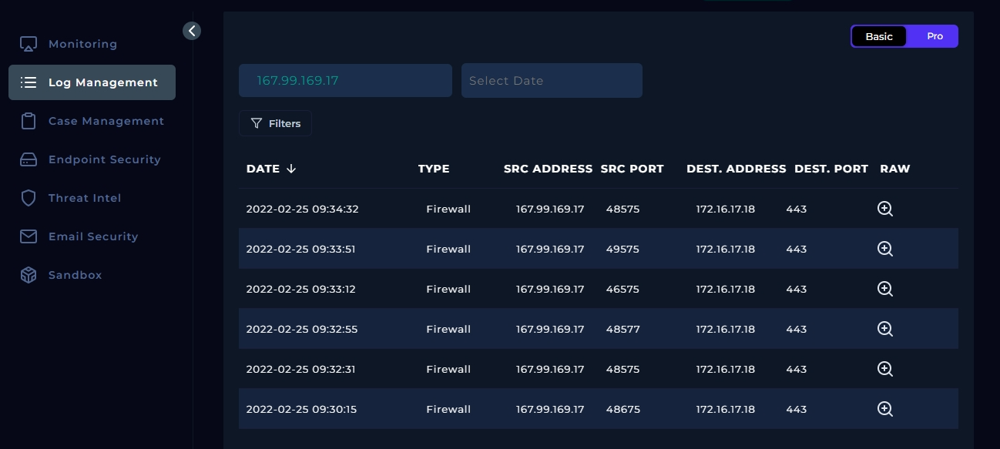
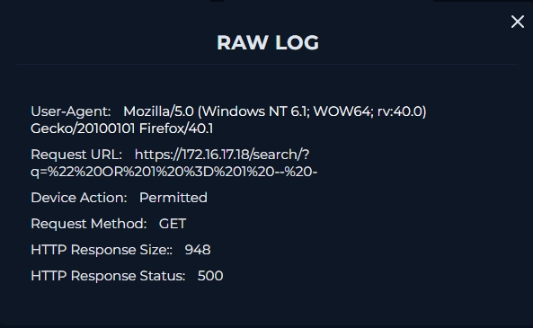

# SOC165 — Possible SQL Injection Payload Detected

**Platform:** LetsDefend (SOC Simulator)
**Role:** Security Analyst
**Severity:** High
**Difficulty:** Medium
**Result:** True Positive
**MITRE ATT&CK:** [T1190 — Exploit Public-Facing Application](https://attack.mitre.org/techniques/T1190/)

## Summary

An alert fired on `WebServer1001` after a GET request to the `/search/` endpoint was flagged for containing a classic SQL injection pattern (`OR 1 = 1`). Investigation confirmed the request — and four further requests from the same source — were genuine SQL injection attempts, but none succeeded. The server returned a consistent error state (HTTP 500, identical response size) across every request rather than the varied, 200-status responses that would indicate the injection actually altered query behavior.

## Alert Details

| Field | Value |
|---|---|
| Event ID | 115 |
| Rule | SOC165 - Possible SQL Injection Payload Detected |
| Event Time | 2022-02-25 11:34:32 +03:00 |
| Type | Web Attack |
| Device Action | Allowed |
| Source IP | 167.99.169.17 |
| Destination IP | 172.16.17.18 (WebServer1001) |
| HTTP Method | GET |
| User-Agent | Mozilla/5.0 (Windows NT 6.1; WOW64; rv:40.0) Gecko/20100101 Firefox/40.1 |
| Trigger Reason | Requested URL contains `OR 1 = 1` |

**Requested URL (raw):**
```
https://172.16.17.18/search/?q=%22%20OR%201%20%3D%201%20--%20-
```



## Investigation Steps

### 1. Decode the requested URL

Percent-encoded characters (`%20`, `%22`, `%3D`, etc.) in a URL are a direct signal to decode before trying to interpret it — reading it raw hides the actual payload. Decoding the `q` parameter reveals:

```
" OR 1 = 1 -- -
```

This is a textbook authentication/query-bypass SQL injection payload:
- `"` closes out the expected string value in the original query
- `OR 1 = 1` is always true, so it forces the query's WHERE clause to match every row
- `-- -` comments out the rest of the original SQL statement, neutralizing any trailing syntax that would otherwise break the query

If this had landed against an unsanitized query, it could return every record in the target table instead of just the intended search results — or, on a login form, bypass authentication entirely.



### 2. Pivot on source IP

Filtering the Log Management page by the source IP (`167.99.169.17`) surfaced five total requests from the same attacker, all variations on SQL injection payloads submitted through the search query parameter.



### 3. Check response size and status across the requests

This is the step that determines success vs. failure. Across all five requests from this source IP:
- **Response status:** consistently `500` (Internal Server Error)
- **Response size:** consistently identical across all requests

A **successful** SQL injection against this kind of endpoint would typically show **varying response sizes and a `200` status** — evidence that different payloads were returning different (attacker-influenced) data back from the database. Instead, every request errored out identically, meaning the application's error handling (or an input filter) caught the malformed query before it could execute meaningfully.



### 4. Determine traffic direction and intent

- **Direction:** Internet → Company Network (external attacker against a public-facing web server)
- **Planned test:** No — this was not an authorized pentest or scan
- **Traffic verdict:** Malicious

### 5. Attack tooling assessment

The User-Agent string (Mozilla/5.0 (Windows NT 6.1; WOW64; rv:40.0) Gecko/20100101 Firefox/40.1) is a standard, unmodified browser string, not the blank, scripted, or tool-specific signature typically seen from automated scanners (e.g. sqlmap, custom Python/curl scripts, or headless fuzzing tools). 
Combined with the low request volume — only 5 total requests from this source, rather than the rapid, high-count bursts characteristic of automated fuzzing or scanning — this suggests the payloads were submitted manually by a human tester probing the endpoint, rather than an automated tool sweeping it.

## MITRE ATT&CK Mapping — Methodology

Rather than just citing the tag, here's the reasoning process for assigning **T1190 — Exploit Public-Facing Application**:

1. **Identify the tactic (the "why").** Asks what the attacker was trying to achieve. An external actor hitting a public web app they don't already have access to, attempting to manipulate its backend query, maps to the **Initial Access** tactic — they're trying to get in or extract data, not operate from a foothold they already hold.
2. **Identify the technique (the "how").** Within Initial Access, the mechanism observed — injection into an input field on an internet-facing web server — matches **T1190**, which explicitly covers exploitation of public-facing applications via injection vulnerabilities (SQLi, XXE, deserialization, command injection, etc.).
3. **Check sub-techniques.** T1190 currently has none, so the parent technique is the correct level of granularity.

## Playbook Answers

| Question | Answer |
|---|---|
| Attack Type | SQL Injection |
| Is Traffic Malicious? | Yes |
| Was the Attack Successful? | No |
| Direction of Traffic | Internet → Company Network |
| Planned Test? | No |
| Tier 2 Escalation Needed? | No |

## Verdict

**True Positive — Attack Unsuccessful.** The alert correctly identified a genuine SQL injection attempt against the `/search/` endpoint. The identical 500-status, identical-size responses across all five requests from the source IP indicate the payloads were rejected/errored rather than executed, so no data was exposed and no escalation was required.

## Why This Matters (Analyst Takeaway)

The key differentiator in this case wasn't spotting the payload — the alert already did that. It was:

- **Knowing to decode encoded URLs** before attempting to read them, since percent-encoding hides the actual payload from a raw glance.
- **Reading response behavior** to separate a blocked/failed injection attempt from a successful one — uniform status/size across payload variations means failure; *changing* status/size as different payloads are tried means the underlying query is actually being manipulated.
- **Mapping technique deliberately, not by pattern-matching a keyword** — working from tactic (attacker's goal) down to technique (the specific mechanism).

This same technique — decode first, pivot on source IP, then compare response size/status across a burst of requests, then reason through the ATT&CK mapping rather than copying a tag — generalizes to fuzzing detection, brute-force confirmation, and most "did this actually work" questions in web attack triage.

## Evidence

| Screenshot | Description |
|---|---|
| `01-alert-overview.png` | SOC165 alert detail page — Event ID, rule, severity, raw requested URL |
| `02-url-decoded.png` | The decoded payload |
| `03-log-management-pivot.png` | Log Management filtered by source IP — all 5 related requests |
| `04-response-status.png` | Response status/size consistent 500s across all 5 requests |

---
*Part of my [SOC Analyst homelab prep](../README.md) — investigations documented as part of the [LetsDefend SOC Fundamentals path](https://letsdefend.io/).*
