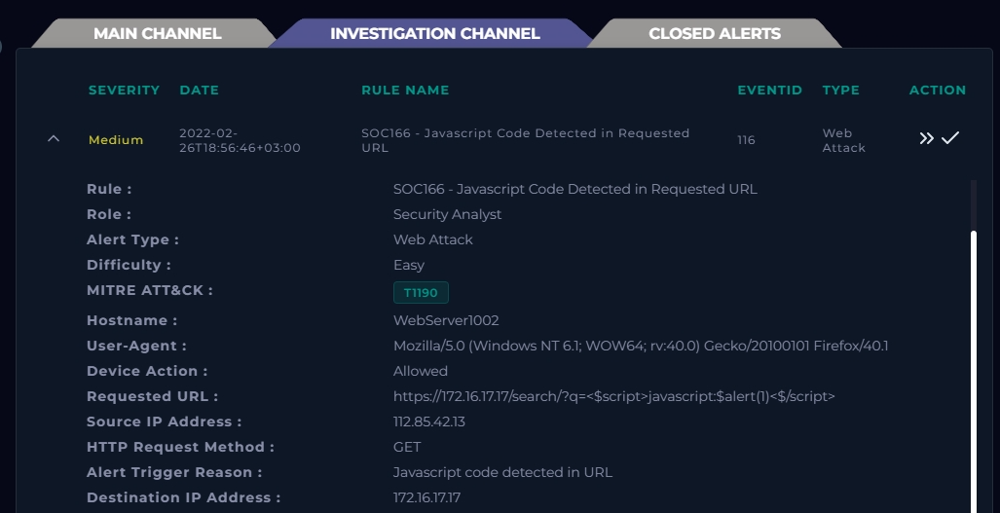
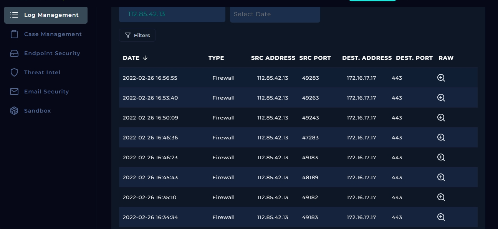
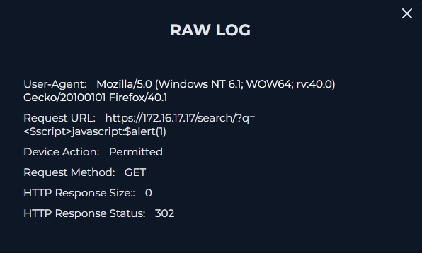
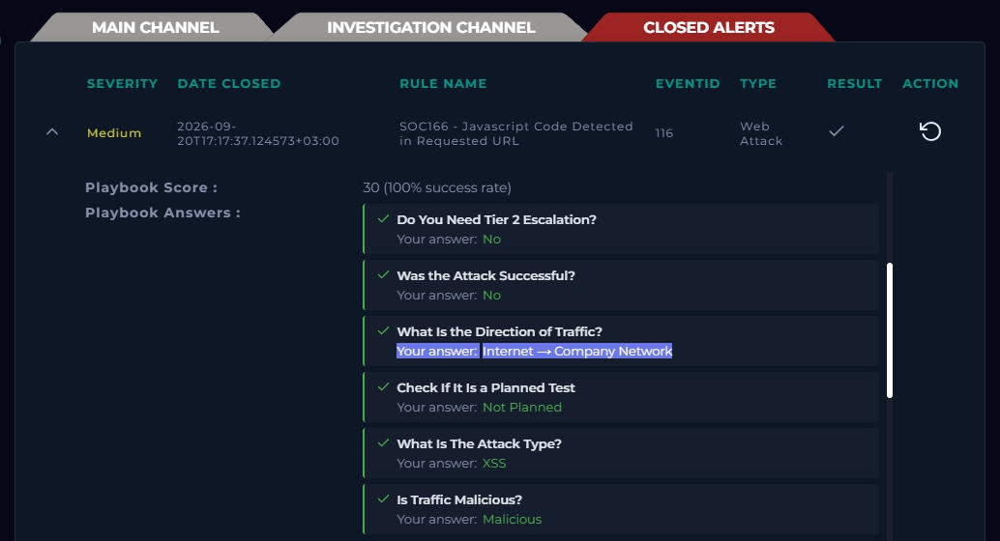

# SOC166 - Cross-Site Scripting (XSS / "CSS Scripting") Attack Investigation

## Alert Summary

| Field | Value |
|---|---|
| Event ID | 116 |
| Rule Name | SOC166 - Javascript Code Detected in Requested URL |
| Severity | Medium |
| Type | Web Attack |
| Event Time | 2022-02-26 18:56:46 +03:00 |
| Closed At | 2026-09-20 17:17:37 +03:00 |
| SLA | 29.81 |
| Source IP | 112.85.42.13 |
| Destination IP | 172.16.17.17 |
| Hostname | WebServer1002 |
| HTTP Method | GET |
| Device Action | Allowed |
| User-Agent | Mozilla/5.0 (Windows NT 6.1; WOW64; rv:40.0) Gecko/20100101 Firefox/40.1 |
| MITRE ATT&CK | T1190 - Exploit Public-Facing Application |
| Result | True Positive |



## Requested URL

```
https://172.16.17.17/search/?q=<$script>javascript:$alert(1)<$/script>
```

## 1. Initial Triage

The alert fired because the `q` (search) parameter of the request contained raw JavaScript syntax (`<script>` tags plus a `javascript:` URI/`alert()` call). This pattern is a classic **Cross-Site Scripting (XSS)** signature — an attacker attempting to get client-side script reflected back and executed in a victim's browser.

**Traffic direction:** Internet → Company Network (external source hitting an internet-facing web server), so this was treated as a real external attack attempt, not internal/test traffic.

**Planned test check:** No maintenance window, pentest engagement, or scanning activity was scheduled against WebServer1002 at this time — confirmed not a planned/authorized test.

## 2. Payload Analysis

Decoding/reading the `q` parameter:

```
<$script>javascript:$alert(1)<$/script>
```

This is an attempt to inject an inline `<script>` block that calls `alert(1)` — a textbook **proof-of-concept XSS payload** used to confirm whether input is reflected unsanitized into the page. The `$` characters are almost certainly a WAF/IPS artifact (or evasion attempt) breaking up the tag so it isn't blocked by simple signature matching — the underlying intent is still `<script>javascript:alert(1)</script>`.

Because the payload rides entirely in the URL query string (GET request), and would only execute if reflected back into the HTTP response body, this is classified as a **Reflected XSS** attempt (as opposed to Stored/Persistent XSS, which would be saved server-side and served to other users later).

## 3. User-Agent & Attack Frequency Analysis

**User-Agent string:**
```
Mozilla/5.0 (Windows NT 6.1; WOW64; rv:40.0) Gecko/20100101 Firefox/40.1
```

This maps to Firefox 40.1 on 64-bit Windows 7 (NT 6.1). Firefox 40 shipped in 2015 and Windows 7 mainstream support ended years ago — a legitimate analyst/user is unlikely to be running this exact combination today. An outdated, fixed UA string like this is commonly seen with **scripted tools and scanners** (attackers often leave a stale default UA, or deliberately spoof an old one to blend in with legacy traffic), rather than a real browser session. This supports the "scanner/automated testing" read from the payload-pivot step, not a one-off manual attempt.

**Attack frequency:** Filtering Log Management by source IP `112.85.42.13` over the surrounding window showed **repeated requests in quick succession**, each carrying a different XSS payload variant against the same `/search/?q=` endpoint. That request cadence (many payloads, same endpoint, short time span) is consistent with automated payload fuzzing rather than a single human trying one thing manually — reinforcing that this is likely a scanning tool (e.g. XSStrike, Burp Intruder, or a custom script) rather than opportunistic manual probing.

## 4. Pivot: Source IP Investigation

Filtering logs by the source IP (`112.85.42.13`) in Log Management surfaced additional requests from the same attacker using **different XSS payload variations** against the same search endpoint — consistent with an attacker/scanner iterating through a payload list to find one that isn't filtered (manual testing or an automated tool like XSStrike/Burp Intruder).



## 5. Determining Success/Failure

Checked the server's response to the malicious request:

- **HTTP status:** `302` (redirect)
- **Response body:** 0 bytes

A `302` redirect with an empty body means the application never rendered the injected payload back into an HTML page — the request was redirected away instead of being reflected and executed. No script execution occurred in a browser context.

**Conclusion: Attack NOT successful.** The application (or a WAF/filter in front of it) handled the malicious input safely by redirecting the request rather than reflecting it.



## 6. Playbook Answers

| Question | Answer |
|---|---|
| Is traffic malicious? | Yes |
| What is the attack type? | XSS |
| Direction of traffic? | Internet → Company Network |
| Planned test? | Not planned |
| Was the attack successful? | No |
| Tier 2 escalation needed? | No |



## 7. Disposition

- **Verdict:** True Positive (malicious activity confirmed) but **unsuccessful** — no impact.
- **Escalation:** Not required, since the payload was neutralized (302 redirect, no reflection).
- **Action taken:** Closed as True Positive / Benign-Impact.

## 8. Analyst Notes

- The 302-with-zero-byte response is the key artifact proving the attack failed — always check the *response*, not just the request, before ruling on success/failure of a reflected XSS attempt.
- The same source IP tried multiple payload variants — worth a longer lookback / threat-intel check on `112.85.42.13` in case it reappears against other endpoints, and worth confirming the WAF/filter rule that is catching this pattern is still active and hasn't been weakened.
- `<$script>` / `$alert` style fragmenting is a known WAF-evasion technique; the fact it still triggered the redirect suggests the control here is filtering on decoded/normalized content rather than a naive string match, which is good — but it's worth verifying that assumption rather than taking it for granted.

## 9. Recommendations

- Confirm output encoding/escaping is correctly applied on the search results page for the `q` parameter (defense-in-depth, independent of whatever blocked this specific payload).
- Add a watchlist/alert rule for repeated XSS-pattern requests from the same source IP within a short window, to catch payload-fuzzing behavior earlier.
- Periodically test the search endpoint with updated XSS payload lists (e.g., via OWASP ZAP) to ensure the filtering in front of it hasn't regressed.