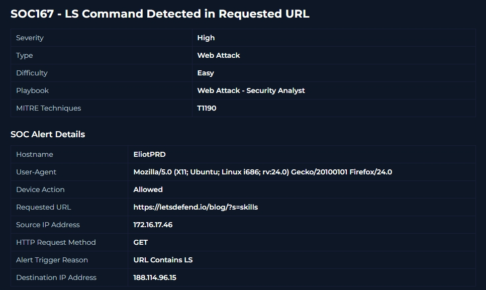
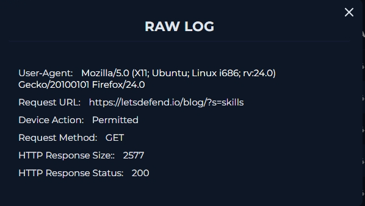
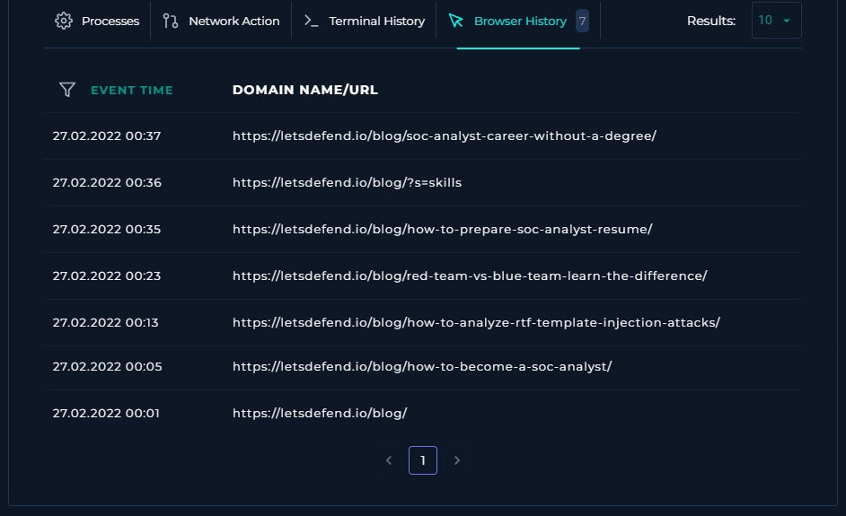
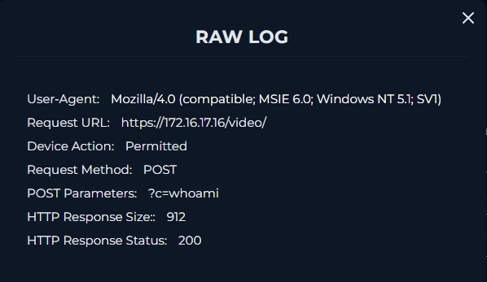
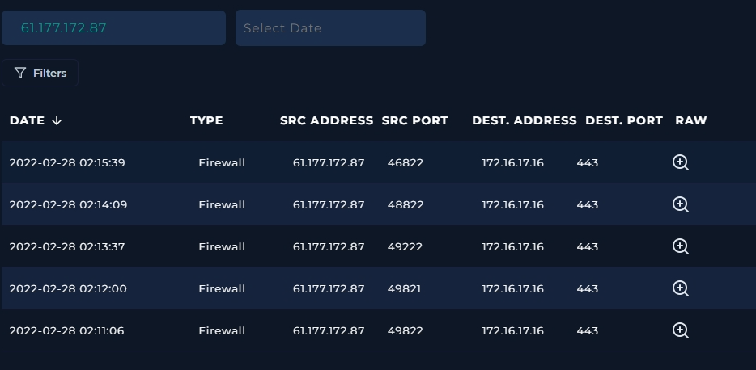
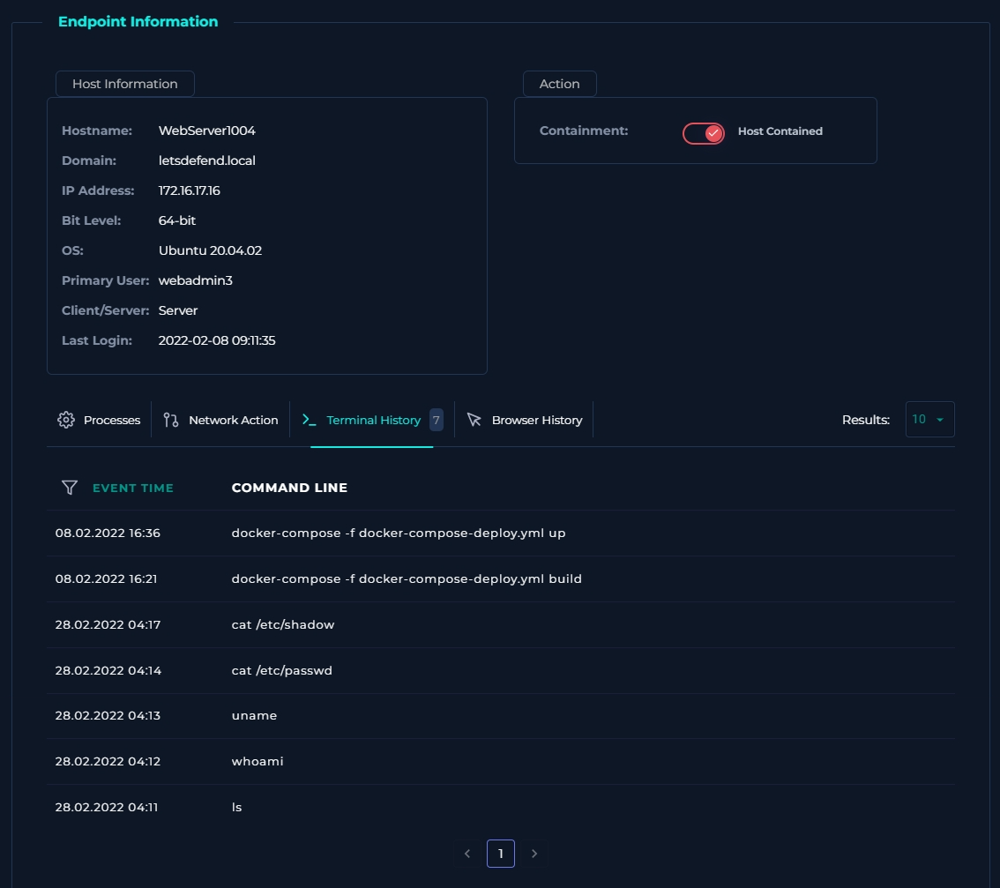
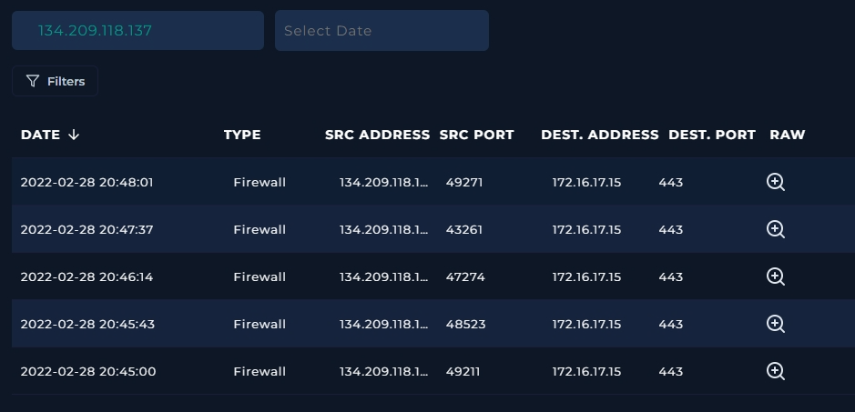
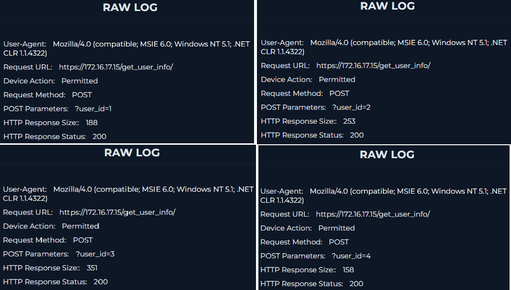
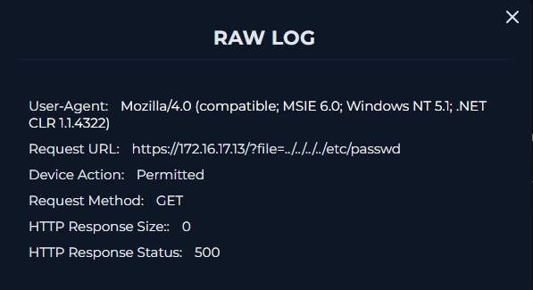

# Detecting Web Attacks — Part 2 (SOC167–SOC170)

**Platform:** LetsDefend  
**Category:** Web Attacks  
**Role:** Security Analyst

This continues the "Detecting Web Attacks" series from [SOC166](https://github.com/Nihus-CyberSec/Homelab-Journal/blob/main/investigations/soc166-reflected-XSS-investigation/SOC166-Reflected-XSS-Investigation.md), covering four more alerts: a false-positive command injection trigger, a real command injection compromise, an IDOR attack, and an attempted LFI.

---

## SOC167 — LS Command Detected in Requested URL

| Field | Value |
|---|---|
| Severity | High |
| Type | Web Attack |
| MITRE ATT&CK | T1190 – Exploit Public-Facing Application |
| Hostname | EliotPRD |
| Requested URL | `https://letsdefend.io/blog/?s=skills` |
| Source IP | 172.16.17.46 |
| Method | GET |
| Trigger Reason | URL contains "ls" |
| Result | **False Positive** |

### Investigation
The alert fired because the search query `skills` contains the substring `ls` at the end — the detection rule matched on the string pattern, not actual command syntax.

Reviewing the full request on the Log Management page confirmed this was a normal blog search on LetsDefend's own site (`?s=skills`), not a Linux `ls` command being smuggled into a URL.

To be thorough, I checked the Browser History on the Endpoint Security page for the source device, which showed no signs of malicious browsing activity or attack tooling.

### Verdict
**False Positive.** The rule matched a substring ("ls") inside an unrelated word ("skills"), not an actual command injection attempt. No further action required.

### Takeaway
Substring-based detection rules are prone to false positives on common words. This is a good example of why string matching should be paired with context (e.g., request structure, parameter names) rather than naive `contains()` logic. Something to keep in mind when I write custom Sigma rules later.

---

## SOC168 — Whoami Command Detected in Request Body

| Field | Value |
|---|---|
| Severity | High |
| Type | Web Attack |
| MITRE ATT&CK | T1190 – Exploit Public-Facing Application |
| Hostname | WebServer1004 |
| Requested URL | `https://172.16.17.16/video/` |
| Source IP | 61.177.172.87 |
| Method | POST |
| Trigger Reason | Request body contains "whoami" |
| Result | **True Positive** |

### Investigation
Filtering Log Management by the source IP surfaced the full request. The Request Body contained the literal `whoami` command being submitted to the server — a classic OS command injection probe.

### User-Agent Analysis
The request's User-Agent string reads: Mozilla/4.0 (compatible; MSIE 6.0; Windows NT 5.1; SV1) — a signature identifying Internet Explorer 6 on Windows XP. This alert fired in 2022, and by that point IE6/XP was already roughly two decades old and effectively extinct in real-world traffic. It's highly unlikely an attacker was genuinely running IE6 on XP; far more likely, this is a spoofed User-Agent. Attackers commonly fake old or generic browser strings like this to disguise automated tools — custom scripts, vulnerability scanners, exploitation frameworks — as ordinary, low-suspicion web traffic, hoping the request blends in and slips past simple signature- or heuristic-based detections.

Reviewing other requests from the same source IP showed the attacker had run multiple additional commands, not just a single probe — indicating an active exploitation attempt rather than a one-off scan.

To confirm whether the commands actually executed, I checked the Command History for WebServer1004 on the Endpoint Security page. It showed the attacker's commands had run successfully on the host.

### Verdict
**True Positive — server compromised.** Command injection via the request body allowed the attacker to execute arbitrary commands on WebServer1004, confirmed by matching command history on the endpoint. Escalated to Tier 2, direction Internet → Company Network, attack type Command Injection.

### Response
Device contained. This is a full compromise requiring isolation and further forensic review of the host.

### Takeaway
This is the difference between a suspicious string in a log and confirmed exploitation — correlating the web log with endpoint command history is what turns "the request looked bad" into "the attack succeeded." That correlation step is the core SOC skill here.

---

## SOC169 — Possible IDOR Attack Detected

| Field | Value |
|---|---|
| Severity | Medium |
| Type | Web Attack |
| MITRE ATT&CK | T1190 – Exploit Public-Facing Application |
| Hostname | WebServer1005 |
| Requested URL | `https://172.16.17.15/get_user_info/` |
| Source IP | 134.209.118.137 |
| Method | POST |
| Trigger Reason | Consecutive requests to the same page |
| Result | **True Positive** |

### Investigation
Filtering Log Management by source IP revealed a sequence of requests to `get_user_info/`, each with a different ID/user reference parameter — the attacker was systematically incrementing or swapping the ID value to pull other users' records. This was revealed when I examined the HTTP body of each request.

Checking their individual response sizes showed a distinct, non-zero response size per request along with a `200 OK` status — meaning each request returned real user data rather than an error or empty response.

### User-Agent Analysis
The User-Agent string, Mozilla/4.0 (compatible; MSIE 6.0; Windows NT 5.1; .NET CLR 1.1.4322), again signals IE6 on Windows XP — the same outdated, almost certainly spoofed signature seen in SOC168. This supports the IDOR verdict: the attacker was likely using a scripted tool to iterate through ID values, and a fake legacy User-Agent is a simple way to make that automated traffic look like an ordinary, harmless visitor.

### Verdict
**True Positive — attack successful.** The attacker exploited an Insecure Direct Object Reference to access other users' information without authorization. Direction Internet → Company Network, not a planned test, escalated to Tier 2.

### Response
Device contained and escalated, since confirmed successful unauthorized data access (where users/records were exposed) requires deeper review.

### Takeaway
IDOR is detected less by payload content and more by *pattern* — sequential/incrementing parameter values plus consistent `200` responses across requests. This alert didn't look "malicious" from any single request; it only made sense in aggregate.

---

## SOC170 — Passwd Found in Requested URL (Possible LFI)

| Field | Value |
|---|---|
| Severity | High |
| Type | Web Attack |
| MITRE ATT&CK | T1190 – Exploit Public-Facing Application |
| Hostname | WebServer1006 |
| Requested URL | `https://172.16.17.13/?file=../../../../etc/passwd` |
| Source IP | 106.55.45.162 |
| Method | GET |
| Trigger Reason | URL contains "passwd" |
| Result | **True Positive (attack unsuccessful)** |

### Investigation
The request URL shows a classic Local File Inclusion (LFI) path traversal attempt — `../../../../etc/passwd` — trying to read the server's password file via a vulnerable `file` parameter. The server's response status code was `500` with a response size of `0` — the server threw an error and returned no data.

## User-Agent Analysis
Same spoofed IE6/XP User-Agent pattern as SOC168 and SOC169: Mozilla/4.0 (compatible; MSIE 6.0; Windows NT 5.1; .NET CLR 1.1.4322). Combined with the path traversal payload in the URL, this points to an automated LFI scanning tool disguising itself as a legacy browser — consistent with the attack being deliberate and malicious, even though it ultimately failed (500 response).

### Verdict
**True Positive, attack unsuccessful.** The traffic was malicious (deliberate LFI attempt) but did not succeed — the server errored out rather than returning file contents. No containment or Tier 2 escalation needed.

### Takeaway
Malicious ≠ successful. This alert is a good contrast to SOC168 and SOC169 above — same "confirmed malicious" classification, but the outcome (server error vs. data returned) is what determines whether it needs containment/escalation or just logging and monitoring.

---

## Summary

| Alert | Type | Result | Escalated? |
|---|---|---|---|
| SOC167 | Command injection (string match) | False Positive | No |
| SOC168 | Command Injection | True Positive — compromised | Yes |
| SOC169 | IDOR | True Positive — successful | Yes |
| SOC170 | LFI | True Positive — unsuccessful | No |

Across these four alerts, the common thread was **correlating the web request with a second data source** — endpoint history, response codes/sizes, or request sequencing — to move from "the rule fired" to an actual verdict. That's the core SOC triage loop, and it's the same loop from SOC166 and SOC137 before it, just applied to different attack techniques each time.

### A Note on Automated Tooling

Across SOC168, SOC169, and SOC170, the traffic pattern points to automated tools rather than an attacker manually typing payloads by hand. Real intrusions today are rarely someone hand-crafting a request like `whoami` in a browser bar — they're typically scripted scanners (Nikto, Dirbuster, custom Python tooling, etc.) probing at scale. A few signs of that automation showed up in these four alerts:

- **Spoofed/mismatched User-Agent:** SOC168, SOC169, and SOC170 all carried the same outdated `MSIE 6.0 / Windows NT 5.1` signature — a browser that's been extinct for two decades by 2022. Legitimate traffic wouldn't consistently present that header while executing command injection, IDOR, and LFI payloads back to back. A static, recycled User-Agent across otherwise distinct attacks is a strong tell that it's hardcoded into a script or scanner rather than coming from a real browser session.
- **Sequential, mechanical request patterns:** SOC169's IDOR attack showed the attacker stepping through user IDs in a consistent, structured sequence rather than the erratic, non-linear browsing pattern a real user would produce — a hallmark of a script iterating through parameter values.
- **Payload-first requests:** SOC168 and SOC170 both involved the attack payload embedded directly in the first request from that source (a command in the request body, a path traversal string in the URL) with no preceding "normal" browsing activity — consistent with a scanner sending known payloads directly rather than a human exploring the site first.

None of these alerts showed the classic volumetric signature of a full directory-brute-force scan (dozens of requests to `/admin/`, `/backup/`, `/config/` in under a second), but the header reuse and mechanical request structure across three separate attack types on the same lab point the same direction: this traffic was tool-driven, not hand-typed. Recognizing that early — via User-Agent inconsistency, request sequencing, or payload-first behavior — is often the first sign an alert deserves a closer look before assuming it's routine.